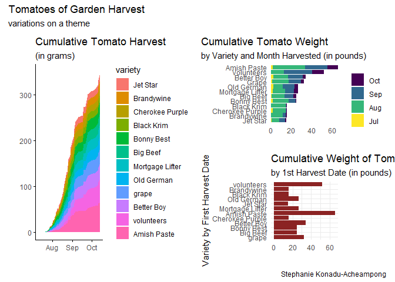

```r
library(tidyverse)     # for data cleaning and plotting
library(gardenR)       # for Lisa's garden data
library(lubridate)     # for date manipulation
library(openintro)     # for the abbr2state() function
library(palmerpenguins)# for Palmer penguin data
library(maps)          # for map data
library(ggmap)         # for mapping points on maps
library(gplots)        # for col2hex() function
library(RColorBrewer)  # for color palettes
library(sf)            # for working with spatial data
library(leaflet)       # for highly customizable mapping
library(ggthemes)      # for more themes (including theme_map())
library(plotly)        # for the ggplotly() - basic interactivity
library(gganimate)     # for adding animation layers to ggplots
library(gifski)        # for creating the gif (don't need to load this library every time,but need it installed)
library(transformr)    # for "tweening" (gganimate)
library(shiny)         # for creating interactive apps
library(patchwork)     # for nicely combining ggplot2 graphs  
library(gt)            # for creating nice tables
library(rvest)         # for scraping data
library(robotstxt)     # for checking if you can scrape data
theme_set(theme_minimal())
```


```r
# Lisa's garden data
data("garden_harvest")

#COVID-19 data from the New York Times
covid19 <- read_csv("https://raw.githubusercontent.com/nytimes/covid-19-data/master/us-states.csv")
```

## Put your homework on GitHub!

Go [here](https://github.com/llendway/github_for_collaboration/blob/master/github_for_collaboration.md) or to previous homework to remind yourself how to get set up. 

Once your repository is created, you should always open your **project** rather than just opening an .Rmd file. You can do that by either clicking on the .Rproj file in your repository folder on your computer. Or, by going to the upper right hand corner in R Studio and clicking the arrow next to where it says Project: (None). You should see your project come up in that list if you've used it recently. You could also go to File --> Open Project and navigate to your .Rproj file. 

## Instructions

* Put your name at the top of the document. 

* **For ALL graphs, you should include appropriate labels.** 

* Feel free to change the default theme, which I currently have set to `theme_minimal()`. 

* Use good coding practice. Read the short sections on good code with [pipes](https://style.tidyverse.org/pipes.html) and [ggplot2](https://style.tidyverse.org/ggplot2.html). **This is part of your grade!**

* **NEW!!** With animated graphs, add `eval=FALSE` to the code chunk that creates the animation and saves it using `anim_save()`. Add another code chunk to reread the gif back into the file. See the [tutorial](https://animation-and-interactivity-in-r.netlify.app/) for help. 

* When you are finished with ALL the exercises, uncomment the options at the top so your document looks nicer. Don't do it before then, or else you might miss some important warnings and messages.

## Your first `shiny` app 

  1. This app will also use the COVID data. Make sure you load that data and all the libraries you need in the `app.R` file you create. Below, you will post a link to the app that you publish on shinyapps.io. You will create an app to compare states' cumulative number of COVID cases over time. The x-axis will be number of days since 20+ cases and the y-axis will be cumulative cases on the log scale (`scale_y_log10()`). We use number of days since 20+ cases on the x-axis so we can make better comparisons of the curve trajectories. You will have an input box where the user can choose which states to compare (`selectInput()`) and have a submit button to click once the user has chosen all states they're interested in comparing. The graph should display a different line for each state, with labels either on the graph or in a legend. Color can be used if needed. 
  

  
  
## Warm-up exercises from tutorial

  2. Read in the fake garden harvest data. Find the data [here](https://github.com/llendway/scraping_etc/blob/main/2020_harvest.csv) and click on the `Raw` button to get a direct link to the data. 
  

```r
library(readr)
fakeharvest <- read_csv("https://raw.githubusercontent.com/skonadua/scraping_etc/main/2020_harvest.csv", 
    col_types = cols(weight = col_number()), na = "MISSING", 
    skip = 2) %>% 
  select(-X1) %>% 
  mutate(date=mdy(date))
View(fakeharvest)
```

  
  3. Read in this [data](https://www.kaggle.com/heeraldedhia/groceries-dataset) from the kaggle website. You will need to download the data first. Save it to your project/repo folder. Do some quick checks of the data to assure it has been read in appropriately.
  

```r
library(readr)
Groceries_dataset_csv <- read_csv("Groceries_dataset.csv.zip", 
    col_types = cols(Date = col_character()))
View(Groceries_dataset_csv)
```


  4. CHALLENGE(not graded): Write code to replicate the table shown below (open the .html file to see it) created from the `garden_harvest` data as best as you can. When you get to coloring the cells, I used the following line of code for the `colors` argument:
  

```r
# colors = scales::col_numeric(
#       palette = paletteer::paletteer_d(
#         palette = "RColorBrewer::YlGn"
#       ) %>% as.character()
```

<!-- {width=600, height=1000} -->


  5. Create a table using `gt` with data from your project or from the `garden_harvest` data if your project data aren't ready.
  

```r
tomato_harvest <- garden_harvest %>% 
  filter(vegetable == "tomatoes")

tab_gard <-
  tomato_harvest %>% 
  gt(
    rowname_col = "row",
    groupname_col = "group"
  ) %>% 
  fmt_date(
    columns = vars(date),
    date_style = 6
  ) %>%
  tab_footnote(
    footnote = "These are harvest weights higher than 2000.",
    locations = cells_data(
      columns = vars(weight),
      rows = weight > 2000
    )
  ) %>%
  tab_footnote(
    footnote = "All values are in grams.",
    locations = cells_column_labels(columns = vars(weight))
  ) %>%
  tab_header(
    title = "Garden Harvest Data",
    subtitle = md("*Tomato Edition*")
  ) %>% 
  tab_options(heading.background.color = "#003300") %>% 
  tab_options(column_labels.background.color = "#99CC00") %>% 
  data_color(
    columns = vars(weight),
    colors = scales::col_numeric(
      palette = paletteer::paletteer_d("ghibli::MarnieLight2") %>% 
        as.character(),
      domain = NULL
    ))

tab_gard
```

```{=html}
<style>html {
  font-family: -apple-system, BlinkMacSystemFont, 'Segoe UI', Roboto, Oxygen, Ubuntu, Cantarell, 'Helvetica Neue', 'Fira Sans', 'Droid Sans', Arial, sans-serif;
}

#gierincars .gt_table {
  display: table;
  border-collapse: collapse;
  margin-left: auto;
  margin-right: auto;
  color: #333333;
  font-size: 16px;
  font-weight: normal;
  font-style: normal;
  background-color: #FFFFFF;
  width: auto;
  border-top-style: solid;
  border-top-width: 2px;
  border-top-color: #A8A8A8;
  border-right-style: none;
  border-right-width: 2px;
  border-right-color: #D3D3D3;
  border-bottom-style: solid;
  border-bottom-width: 2px;
  border-bottom-color: #A8A8A8;
  border-left-style: none;
  border-left-width: 2px;
  border-left-color: #D3D3D3;
}

#gierincars .gt_heading {
  background-color: #003300;
  text-align: center;
  border-bottom-color: #FFFFFF;
  border-left-style: none;
  border-left-width: 1px;
  border-left-color: #D3D3D3;
  border-right-style: none;
  border-right-width: 1px;
  border-right-color: #D3D3D3;
}

#gierincars .gt_title {
  color: #FFFFFF;
  font-size: 125%;
  font-weight: initial;
  padding-top: 4px;
  padding-bottom: 4px;
  border-bottom-color: #FFFFFF;
  border-bottom-width: 0;
}

#gierincars .gt_subtitle {
  color: #FFFFFF;
  font-size: 85%;
  font-weight: initial;
  padding-top: 0;
  padding-bottom: 4px;
  border-top-color: #FFFFFF;
  border-top-width: 0;
}

#gierincars .gt_bottom_border {
  border-bottom-style: solid;
  border-bottom-width: 2px;
  border-bottom-color: #D3D3D3;
}

#gierincars .gt_col_headings {
  border-top-style: solid;
  border-top-width: 2px;
  border-top-color: #D3D3D3;
  border-bottom-style: solid;
  border-bottom-width: 2px;
  border-bottom-color: #D3D3D3;
  border-left-style: none;
  border-left-width: 1px;
  border-left-color: #D3D3D3;
  border-right-style: none;
  border-right-width: 1px;
  border-right-color: #D3D3D3;
}

#gierincars .gt_col_heading {
  color: #FFFFFF;
  background-color: #99CC00;
  font-size: 100%;
  font-weight: normal;
  text-transform: inherit;
  border-left-style: none;
  border-left-width: 1px;
  border-left-color: #D3D3D3;
  border-right-style: none;
  border-right-width: 1px;
  border-right-color: #D3D3D3;
  vertical-align: bottom;
  padding-top: 5px;
  padding-bottom: 6px;
  padding-left: 5px;
  padding-right: 5px;
  overflow-x: hidden;
}

#gierincars .gt_column_spanner_outer {
  color: #FFFFFF;
  background-color: #99CC00;
  font-size: 100%;
  font-weight: normal;
  text-transform: inherit;
  padding-top: 0;
  padding-bottom: 0;
  padding-left: 4px;
  padding-right: 4px;
}

#gierincars .gt_column_spanner_outer:first-child {
  padding-left: 0;
}

#gierincars .gt_column_spanner_outer:last-child {
  padding-right: 0;
}

#gierincars .gt_column_spanner {
  border-bottom-style: solid;
  border-bottom-width: 2px;
  border-bottom-color: #D3D3D3;
  vertical-align: bottom;
  padding-top: 5px;
  padding-bottom: 6px;
  overflow-x: hidden;
  display: inline-block;
  width: 100%;
}

#gierincars .gt_group_heading {
  padding: 8px;
  color: #333333;
  background-color: #FFFFFF;
  font-size: 100%;
  font-weight: initial;
  text-transform: inherit;
  border-top-style: solid;
  border-top-width: 2px;
  border-top-color: #D3D3D3;
  border-bottom-style: solid;
  border-bottom-width: 2px;
  border-bottom-color: #D3D3D3;
  border-left-style: none;
  border-left-width: 1px;
  border-left-color: #D3D3D3;
  border-right-style: none;
  border-right-width: 1px;
  border-right-color: #D3D3D3;
  vertical-align: middle;
}

#gierincars .gt_empty_group_heading {
  padding: 0.5px;
  color: #333333;
  background-color: #FFFFFF;
  font-size: 100%;
  font-weight: initial;
  border-top-style: solid;
  border-top-width: 2px;
  border-top-color: #D3D3D3;
  border-bottom-style: solid;
  border-bottom-width: 2px;
  border-bottom-color: #D3D3D3;
  vertical-align: middle;
}

#gierincars .gt_from_md > :first-child {
  margin-top: 0;
}

#gierincars .gt_from_md > :last-child {
  margin-bottom: 0;
}

#gierincars .gt_row {
  padding-top: 8px;
  padding-bottom: 8px;
  padding-left: 5px;
  padding-right: 5px;
  margin: 10px;
  border-top-style: solid;
  border-top-width: 1px;
  border-top-color: #D3D3D3;
  border-left-style: none;
  border-left-width: 1px;
  border-left-color: #D3D3D3;
  border-right-style: none;
  border-right-width: 1px;
  border-right-color: #D3D3D3;
  vertical-align: middle;
  overflow-x: hidden;
}

#gierincars .gt_stub {
  color: #333333;
  background-color: #FFFFFF;
  font-size: 100%;
  font-weight: initial;
  text-transform: inherit;
  border-right-style: solid;
  border-right-width: 2px;
  border-right-color: #D3D3D3;
  padding-left: 12px;
}

#gierincars .gt_summary_row {
  color: #333333;
  background-color: #FFFFFF;
  text-transform: inherit;
  padding-top: 8px;
  padding-bottom: 8px;
  padding-left: 5px;
  padding-right: 5px;
}

#gierincars .gt_first_summary_row {
  padding-top: 8px;
  padding-bottom: 8px;
  padding-left: 5px;
  padding-right: 5px;
  border-top-style: solid;
  border-top-width: 2px;
  border-top-color: #D3D3D3;
}

#gierincars .gt_grand_summary_row {
  color: #333333;
  background-color: #FFFFFF;
  text-transform: inherit;
  padding-top: 8px;
  padding-bottom: 8px;
  padding-left: 5px;
  padding-right: 5px;
}

#gierincars .gt_first_grand_summary_row {
  padding-top: 8px;
  padding-bottom: 8px;
  padding-left: 5px;
  padding-right: 5px;
  border-top-style: double;
  border-top-width: 6px;
  border-top-color: #D3D3D3;
}

#gierincars .gt_striped {
  background-color: rgba(128, 128, 128, 0.05);
}

#gierincars .gt_table_body {
  border-top-style: solid;
  border-top-width: 2px;
  border-top-color: #D3D3D3;
  border-bottom-style: solid;
  border-bottom-width: 2px;
  border-bottom-color: #D3D3D3;
}

#gierincars .gt_footnotes {
  color: #333333;
  background-color: #FFFFFF;
  border-bottom-style: none;
  border-bottom-width: 2px;
  border-bottom-color: #D3D3D3;
  border-left-style: none;
  border-left-width: 2px;
  border-left-color: #D3D3D3;
  border-right-style: none;
  border-right-width: 2px;
  border-right-color: #D3D3D3;
}

#gierincars .gt_footnote {
  margin: 0px;
  font-size: 90%;
  padding: 4px;
}

#gierincars .gt_sourcenotes {
  color: #333333;
  background-color: #FFFFFF;
  border-bottom-style: none;
  border-bottom-width: 2px;
  border-bottom-color: #D3D3D3;
  border-left-style: none;
  border-left-width: 2px;
  border-left-color: #D3D3D3;
  border-right-style: none;
  border-right-width: 2px;
  border-right-color: #D3D3D3;
}

#gierincars .gt_sourcenote {
  font-size: 90%;
  padding: 4px;
}

#gierincars .gt_left {
  text-align: left;
}

#gierincars .gt_center {
  text-align: center;
}

#gierincars .gt_right {
  text-align: right;
  font-variant-numeric: tabular-nums;
}

#gierincars .gt_font_normal {
  font-weight: normal;
}

#gierincars .gt_font_bold {
  font-weight: bold;
}

#gierincars .gt_font_italic {
  font-style: italic;
}

#gierincars .gt_super {
  font-size: 65%;
}

#gierincars .gt_footnote_marks {
  font-style: italic;
  font-size: 65%;
}
</style>
<div id="gierincars" style="overflow-x:auto;overflow-y:auto;width:auto;height:auto;"><table class="gt_table">
  <thead class="gt_header">
    <tr>
      <th colspan="5" class="gt_heading gt_title gt_font_normal" style>Garden Harvest Data</th>
    </tr>
    <tr>
      <th colspan="5" class="gt_heading gt_subtitle gt_font_normal gt_bottom_border" style><em>Tomato Edition</em></th>
    </tr>
  </thead>
  <thead class="gt_col_headings">
    <tr>
      <th class="gt_col_heading gt_columns_bottom_border gt_left" rowspan="1" colspan="1">vegetable</th>
      <th class="gt_col_heading gt_columns_bottom_border gt_left" rowspan="1" colspan="1">variety</th>
      <th class="gt_col_heading gt_columns_bottom_border gt_left" rowspan="1" colspan="1">date</th>
      <th class="gt_col_heading gt_columns_bottom_border gt_right" rowspan="1" colspan="1">weight<sup class="gt_footnote_marks">1</sup></th>
      <th class="gt_col_heading gt_columns_bottom_border gt_left" rowspan="1" colspan="1">units</th>
    </tr>
  </thead>
  <tbody class="gt_table_body">
    <tr>
      <td class="gt_row gt_left">tomatoes</td>
      <td class="gt_row gt_left">grape</td>
      <td class="gt_row gt_left">Jul 11, 2020</td>
      <td class="gt_row gt_right" style="background-color: #8E938D; color: #000000;">24</td>
      <td class="gt_row gt_left">grams</td>
    </tr>
    <tr>
      <td class="gt_row gt_left">tomatoes</td>
      <td class="gt_row gt_left">grape</td>
      <td class="gt_row gt_left">Jul 21, 2020</td>
      <td class="gt_row gt_right" style="background-color: #8F958F; color: #000000;">86</td>
      <td class="gt_row gt_left">grams</td>
    </tr>
    <tr>
      <td class="gt_row gt_left">tomatoes</td>
      <td class="gt_row gt_left">Big Beef</td>
      <td class="gt_row gt_left">Jul 21, 2020</td>
      <td class="gt_row gt_right" style="background-color: #8F9790; color: #000000;">137</td>
      <td class="gt_row gt_left">grams</td>
    </tr>
    <tr>
      <td class="gt_row gt_left">tomatoes</td>
      <td class="gt_row gt_left">Bonny Best</td>
      <td class="gt_row gt_left">Jul 21, 2020</td>
      <td class="gt_row gt_right" style="background-color: #929D97; color: #000000;">339</td>
      <td class="gt_row gt_left">grams</td>
    </tr>
    <tr>
      <td class="gt_row gt_left">tomatoes</td>
      <td class="gt_row gt_left">grape</td>
      <td class="gt_row gt_left">Jul 24, 2020</td>
      <td class="gt_row gt_right" style="background-color: #8E938D; color: #000000;">31</td>
      <td class="gt_row gt_left">grams</td>
    </tr>
    <tr>
      <td class="gt_row gt_left">tomatoes</td>
      <td class="gt_row gt_left">Bonny Best</td>
      <td class="gt_row gt_left">Jul 24, 2020</td>
      <td class="gt_row gt_right" style="background-color: #8F9791; color: #000000;">140</td>
      <td class="gt_row gt_left">grams</td>
    </tr>
    <tr>
      <td class="gt_row gt_left">tomatoes</td>
      <td class="gt_row gt_left">Cherokee Purple</td>
      <td class="gt_row gt_left">Jul 24, 2020</td>
      <td class="gt_row gt_right" style="background-color: #919A94; color: #000000;">247</td>
      <td class="gt_row gt_left">grams</td>
    </tr>
    <tr>
      <td class="gt_row gt_left">tomatoes</td>
      <td class="gt_row gt_left">Better Boy</td>
      <td class="gt_row gt_left">Jul 24, 2020</td>
      <td class="gt_row gt_right" style="background-color: #909993; color: #000000;">220</td>
      <td class="gt_row gt_left">grams</td>
    </tr>
    <tr>
      <td class="gt_row gt_left">tomatoes</td>
      <td class="gt_row gt_left">Amish Paste</td>
      <td class="gt_row gt_left">Jul 25, 2020</td>
      <td class="gt_row gt_right" style="background-color: #93A19B; color: #000000;">463</td>
      <td class="gt_row gt_left">grams</td>
    </tr>
    <tr>
      <td class="gt_row gt_left">tomatoes</td>
      <td class="gt_row gt_left">grape</td>
      <td class="gt_row gt_left">Jul 25, 2020</td>
      <td class="gt_row gt_right" style="background-color: #8F9690; color: #000000;">106</td>
      <td class="gt_row gt_left">grams</td>
    </tr>
    <tr>
      <td class="gt_row gt_left">tomatoes</td>
      <td class="gt_row gt_left">Bonny Best</td>
      <td class="gt_row gt_left">Jul 26, 2020</td>
      <td class="gt_row gt_right" style="background-color: #909791; color: #000000;">148</td>
      <td class="gt_row gt_left">grams</td>
    </tr>
    <tr>
      <td class="gt_row gt_left">tomatoes</td>
      <td class="gt_row gt_left">Mortgage Lifter</td>
      <td class="gt_row gt_left">Jul 27, 2020</td>
      <td class="gt_row gt_right" style="background-color: #96B0A7; color: #000000;">801</td>
      <td class="gt_row gt_left">grams</td>
    </tr>
    <tr>
      <td class="gt_row gt_left">tomatoes</td>
      <td class="gt_row gt_left">Old German</td>
      <td class="gt_row gt_left">Jul 28, 2020</td>
      <td class="gt_row gt_right" style="background-color: #95A7A0; color: #000000;">611</td>
      <td class="gt_row gt_left">grams</td>
    </tr>
    <tr>
      <td class="gt_row gt_left">tomatoes</td>
      <td class="gt_row gt_left">Big Beef</td>
      <td class="gt_row gt_left">Jul 28, 2020</td>
      <td class="gt_row gt_right" style="background-color: #909993; color: #000000;">203</td>
      <td class="gt_row gt_left">grams</td>
    </tr>
    <tr>
      <td class="gt_row gt_left">tomatoes</td>
      <td class="gt_row gt_left">Better Boy</td>
      <td class="gt_row gt_left">Jul 28, 2020</td>
      <td class="gt_row gt_right" style="background-color: #929C96; color: #000000;">312</td>
      <td class="gt_row gt_left">grams</td>
    </tr>
    <tr>
      <td class="gt_row gt_left">tomatoes</td>
      <td class="gt_row gt_left">Jet Star</td>
      <td class="gt_row gt_left">Jul 28, 2020</td>
      <td class="gt_row gt_right" style="background-color: #929D96; color: #000000;">315</td>
      <td class="gt_row gt_left">grams</td>
    </tr>
    <tr>
      <td class="gt_row gt_left">tomatoes</td>
      <td class="gt_row gt_left">grape</td>
      <td class="gt_row gt_left">Jul 28, 2020</td>
      <td class="gt_row gt_right" style="background-color: #8F9790; color: #000000;">131</td>
      <td class="gt_row gt_left">grams</td>
    </tr>
    <tr>
      <td class="gt_row gt_left">tomatoes</td>
      <td class="gt_row gt_left">Bonny Best</td>
      <td class="gt_row gt_left">Jul 29, 2020</td>
      <td class="gt_row gt_right" style="background-color: #909791; color: #000000;">153</td>
      <td class="gt_row gt_left">grams</td>
    </tr>
    <tr>
      <td class="gt_row gt_left">tomatoes</td>
      <td class="gt_row gt_left">Better Boy</td>
      <td class="gt_row gt_left">Jul 29, 2020</td>
      <td class="gt_row gt_right" style="background-color: #93A19A; color: #000000;">442</td>
      <td class="gt_row gt_left">grams</td>
    </tr>
    <tr>
      <td class="gt_row gt_left">tomatoes</td>
      <td class="gt_row gt_left">Cherokee Purple</td>
      <td class="gt_row gt_left">Jul 29, 2020</td>
      <td class="gt_row gt_right" style="background-color: #919A94; color: #000000;">240</td>
      <td class="gt_row gt_left">grams</td>
    </tr>
    <tr>
      <td class="gt_row gt_left">tomatoes</td>
      <td class="gt_row gt_left">Amish Paste</td>
      <td class="gt_row gt_left">Jul 29, 2020</td>
      <td class="gt_row gt_right" style="background-color: #909993; color: #000000;">209</td>
      <td class="gt_row gt_left">grams</td>
    </tr>
    <tr>
      <td class="gt_row gt_left">tomatoes</td>
      <td class="gt_row gt_left">grape</td>
      <td class="gt_row gt_left">Jul 29, 2020</td>
      <td class="gt_row gt_right" style="background-color: #8E948D; color: #000000;">40</td>
      <td class="gt_row gt_left">grams</td>
    </tr>
    <tr>
      <td class="gt_row gt_left">tomatoes</td>
      <td class="gt_row gt_left">grape</td>
      <td class="gt_row gt_left">Jul 30, 2020</td>
      <td class="gt_row gt_right" style="background-color: #8F958F; color: #000000;">91</td>
      <td class="gt_row gt_left">grams</td>
    </tr>
    <tr>
      <td class="gt_row gt_left">tomatoes</td>
      <td class="gt_row gt_left">Cherokee Purple</td>
      <td class="gt_row gt_left">Jul 31, 2020</td>
      <td class="gt_row gt_right" style="background-color: #929C96; color: #000000;">307</td>
      <td class="gt_row gt_left">grams</td>
    </tr>
    <tr>
      <td class="gt_row gt_left">tomatoes</td>
      <td class="gt_row gt_left">Amish Paste</td>
      <td class="gt_row gt_left">Jul 31, 2020</td>
      <td class="gt_row gt_right" style="background-color: #909992; color: #000000;">197</td>
      <td class="gt_row gt_left">grams</td>
    </tr>
    <tr>
      <td class="gt_row gt_left">tomatoes</td>
      <td class="gt_row gt_left">Old German</td>
      <td class="gt_row gt_left">Jul 31, 2020</td>
      <td class="gt_row gt_right" style="background-color: #95A8A1; color: #000000;">633</td>
      <td class="gt_row gt_left">grams</td>
    </tr>
    <tr>
      <td class="gt_row gt_left">tomatoes</td>
      <td class="gt_row gt_left">Better Boy</td>
      <td class="gt_row gt_left">Jul 31, 2020</td>
      <td class="gt_row gt_right" style="background-color: #919C95; color: #000000;">290</td>
      <td class="gt_row gt_left">grams</td>
    </tr>
    <tr>
      <td class="gt_row gt_left">tomatoes</td>
      <td class="gt_row gt_left">grape</td>
      <td class="gt_row gt_left">Jul 31, 2020</td>
      <td class="gt_row gt_right" style="background-color: #8F958F; color: #000000;">100</td>
      <td class="gt_row gt_left">grams</td>
    </tr>
    <tr>
      <td class="gt_row gt_left">tomatoes</td>
      <td class="gt_row gt_left">Bonny Best</td>
      <td class="gt_row gt_left">Aug 1, 2020</td>
      <td class="gt_row gt_right" style="background-color: #93A19A; color: #000000;">435</td>
      <td class="gt_row gt_left">grams</td>
    </tr>
    <tr>
      <td class="gt_row gt_left">tomatoes</td>
      <td class="gt_row gt_left">Brandywine</td>
      <td class="gt_row gt_left">Aug 1, 2020</td>
      <td class="gt_row gt_right" style="background-color: #929D96; color: #000000;">320</td>
      <td class="gt_row gt_left">grams</td>
    </tr>
    <tr>
      <td class="gt_row gt_left">tomatoes</td>
      <td class="gt_row gt_left">Cherokee Purple</td>
      <td class="gt_row gt_left">Aug 1, 2020</td>
      <td class="gt_row gt_right" style="background-color: #95A8A0; color: #000000;">619</td>
      <td class="gt_row gt_left">grams</td>
    </tr>
    <tr>
      <td class="gt_row gt_left">tomatoes</td>
      <td class="gt_row gt_left">Amish Paste</td>
      <td class="gt_row gt_left">Aug 1, 2020</td>
      <td class="gt_row gt_right" style="background-color: #8F958F; color: #000000;">97</td>
      <td class="gt_row gt_left">grams</td>
    </tr>
    <tr>
      <td class="gt_row gt_left">tomatoes</td>
      <td class="gt_row gt_left">Black Krim</td>
      <td class="gt_row gt_left">Aug 1, 2020</td>
      <td class="gt_row gt_right" style="background-color: #93A19A; color: #000000;">436</td>
      <td class="gt_row gt_left">grams</td>
    </tr>
    <tr>
      <td class="gt_row gt_left">tomatoes</td>
      <td class="gt_row gt_left">grape</td>
      <td class="gt_row gt_left">Aug 1, 2020</td>
      <td class="gt_row gt_right" style="background-color: #909891; color: #000000;">168</td>
      <td class="gt_row gt_left">grams</td>
    </tr>
    <tr>
      <td class="gt_row gt_left">tomatoes</td>
      <td class="gt_row gt_left">Amish Paste</td>
      <td class="gt_row gt_left">Aug 2, 2020</td>
      <td class="gt_row gt_right" style="background-color: #94A39C; color: #000000;">509</td>
      <td class="gt_row gt_left">grams</td>
    </tr>
    <tr>
      <td class="gt_row gt_left">tomatoes</td>
      <td class="gt_row gt_left">Black Krim</td>
      <td class="gt_row gt_left">Aug 2, 2020</td>
      <td class="gt_row gt_right" style="background-color: #96B2AA; color: #000000;">857</td>
      <td class="gt_row gt_left">grams</td>
    </tr>
    <tr>
      <td class="gt_row gt_left">tomatoes</td>
      <td class="gt_row gt_left">Old German</td>
      <td class="gt_row gt_left">Aug 2, 2020</td>
      <td class="gt_row gt_right" style="background-color: #929D97; color: #000000;">336</td>
      <td class="gt_row gt_left">grams</td>
    </tr>
    <tr>
      <td class="gt_row gt_left">tomatoes</td>
      <td class="gt_row gt_left">Bonny Best</td>
      <td class="gt_row gt_left">Aug 2, 2020</td>
      <td class="gt_row gt_right" style="background-color: #909791; color: #000000;">156</td>
      <td class="gt_row gt_left">grams</td>
    </tr>
    <tr>
      <td class="gt_row gt_left">tomatoes</td>
      <td class="gt_row gt_left">Better Boy</td>
      <td class="gt_row gt_left">Aug 2, 2020</td>
      <td class="gt_row gt_right" style="background-color: #909993; color: #000000;">211</td>
      <td class="gt_row gt_left">grams</td>
    </tr>
    <tr>
      <td class="gt_row gt_left">tomatoes</td>
      <td class="gt_row gt_left">grape</td>
      <td class="gt_row gt_left">Aug 2, 2020</td>
      <td class="gt_row gt_right" style="background-color: #8F968F; color: #000000;">102</td>
      <td class="gt_row gt_left">grams</td>
    </tr>
    <tr>
      <td class="gt_row gt_left">tomatoes</td>
      <td class="gt_row gt_left">Better Boy</td>
      <td class="gt_row gt_left">Aug 3, 2020</td>
      <td class="gt_row gt_right" style="background-color: #929C96; color: #000000;">308</td>
      <td class="gt_row gt_left">grams</td>
    </tr>
    <tr>
      <td class="gt_row gt_left">tomatoes</td>
      <td class="gt_row gt_left">Bonny Best</td>
      <td class="gt_row gt_left">Aug 4, 2020</td>
      <td class="gt_row gt_right" style="background-color: #939F98; color: #000000;">387</td>
      <td class="gt_row gt_left">grams</td>
    </tr>
    <tr>
      <td class="gt_row gt_left">tomatoes</td>
      <td class="gt_row gt_left">Brandywine</td>
      <td class="gt_row gt_left">Aug 4, 2020</td>
      <td class="gt_row gt_right" style="background-color: #919A93; color: #000000;">231</td>
      <td class="gt_row gt_left">grams</td>
    </tr>
    <tr>
      <td class="gt_row gt_left">tomatoes</td>
      <td class="gt_row gt_left">volunteers</td>
      <td class="gt_row gt_left">Aug 4, 2020</td>
      <td class="gt_row gt_right" style="background-color: #8F958F; color: #000000;">73</td>
      <td class="gt_row gt_left">grams</td>
    </tr>
    <tr>
      <td class="gt_row gt_left">tomatoes</td>
      <td class="gt_row gt_left">Mortgage Lifter</td>
      <td class="gt_row gt_left">Aug 4, 2020</td>
      <td class="gt_row gt_right" style="background-color: #929D97; color: #000000;">339</td>
      <td class="gt_row gt_left">grams</td>
    </tr>
    <tr>
      <td class="gt_row gt_left">tomatoes</td>
      <td class="gt_row gt_left">grape</td>
      <td class="gt_row gt_left">Aug 4, 2020</td>
      <td class="gt_row gt_right" style="background-color: #8F9690; color: #000000;">118</td>
      <td class="gt_row gt_left">grams</td>
    </tr>
    <tr>
      <td class="gt_row gt_left">tomatoes</td>
      <td class="gt_row gt_left">Bonny Best</td>
      <td class="gt_row gt_left">Aug 5, 2020</td>
      <td class="gt_row gt_right" style="background-color: #94A59E; color: #000000;">563</td>
      <td class="gt_row gt_left">grams</td>
    </tr>
    <tr>
      <td class="gt_row gt_left">tomatoes</td>
      <td class="gt_row gt_left">Brandywine</td>
      <td class="gt_row gt_left">Aug 5, 2020</td>
      <td class="gt_row gt_right" style="background-color: #919C95; color: #000000;">290</td>
      <td class="gt_row gt_left">grams</td>
    </tr>
    <tr>
      <td class="gt_row gt_left">tomatoes</td>
      <td class="gt_row gt_left">Mortgage Lifter</td>
      <td class="gt_row gt_left">Aug 5, 2020</td>
      <td class="gt_row gt_right" style="background-color: #96AFA7; color: #000000;">781</td>
      <td class="gt_row gt_left">grams</td>
    </tr>
    <tr>
      <td class="gt_row gt_left">tomatoes</td>
      <td class="gt_row gt_left">Big Beef</td>
      <td class="gt_row gt_left">Aug 5, 2020</td>
      <td class="gt_row gt_right" style="background-color: #919A93; color: #000000;">223</td>
      <td class="gt_row gt_left">grams</td>
    </tr>
    <tr>
      <td class="gt_row gt_left">tomatoes</td>
      <td class="gt_row gt_left">Amish Paste</td>
      <td class="gt_row gt_left">Aug 5, 2020</td>
      <td class="gt_row gt_right" style="background-color: #929F98; color: #000000;">382</td>
      <td class="gt_row gt_left">grams</td>
    </tr>
    <tr>
      <td class="gt_row gt_left">tomatoes</td>
      <td class="gt_row gt_left">grape</td>
      <td class="gt_row gt_left">Aug 5, 2020</td>
      <td class="gt_row gt_right" style="background-color: #909993; color: #000000;">217</td>
      <td class="gt_row gt_left">grams</td>
    </tr>
    <tr>
      <td class="gt_row gt_left">tomatoes</td>
      <td class="gt_row gt_left">volunteers</td>
      <td class="gt_row gt_left">Aug 5, 2020</td>
      <td class="gt_row gt_right" style="background-color: #8F948E; color: #000000;">67</td>
      <td class="gt_row gt_left">grams</td>
    </tr>
    <tr>
      <td class="gt_row gt_left">tomatoes</td>
      <td class="gt_row gt_left">Black Krim</td>
      <td class="gt_row gt_left">Aug 6, 2020</td>
      <td class="gt_row gt_right" style="background-color: #939F98; color: #000000;">393</td>
      <td class="gt_row gt_left">grams</td>
    </tr>
    <tr>
      <td class="gt_row gt_left">tomatoes</td>
      <td class="gt_row gt_left">Big Beef</td>
      <td class="gt_row gt_left">Aug 6, 2020</td>
      <td class="gt_row gt_right" style="background-color: #929C96; color: #000000;">307</td>
      <td class="gt_row gt_left">grams</td>
    </tr>
    <tr>
      <td class="gt_row gt_left">tomatoes</td>
      <td class="gt_row gt_left">Amish Paste</td>
      <td class="gt_row gt_left">Aug 6, 2020</td>
      <td class="gt_row gt_right" style="background-color: #909892; color: #000000;">175</td>
      <td class="gt_row gt_left">grams</td>
    </tr>
    <tr>
      <td class="gt_row gt_left">tomatoes</td>
      <td class="gt_row gt_left">Cherokee Purple</td>
      <td class="gt_row gt_left">Aug 6, 2020</td>
      <td class="gt_row gt_right" style="background-color: #919C96; color: #000000;">303</td>
      <td class="gt_row gt_left">grams</td>
    </tr>
    <tr>
      <td class="gt_row gt_left">tomatoes</td>
      <td class="gt_row gt_left">Bonny Best</td>
      <td class="gt_row gt_left">Aug 7, 2020</td>
      <td class="gt_row gt_right" style="background-color: #929E97; color: #000000;">359</td>
      <td class="gt_row gt_left">grams</td>
    </tr>
    <tr>
      <td class="gt_row gt_left">tomatoes</td>
      <td class="gt_row gt_left">Brandywine</td>
      <td class="gt_row gt_left">Aug 7, 2020</td>
      <td class="gt_row gt_right" style="background-color: #929E97; color: #000000;">356</td>
      <td class="gt_row gt_left">grams</td>
    </tr>
    <tr>
      <td class="gt_row gt_left">tomatoes</td>
      <td class="gt_row gt_left">Old German</td>
      <td class="gt_row gt_left">Aug 7, 2020</td>
      <td class="gt_row gt_right" style="background-color: #919A93; color: #000000;">233</td>
      <td class="gt_row gt_left">grams</td>
    </tr>
    <tr>
      <td class="gt_row gt_left">tomatoes</td>
      <td class="gt_row gt_left">Mortgage Lifter</td>
      <td class="gt_row gt_left">Aug 7, 2020</td>
      <td class="gt_row gt_right" style="background-color: #929E97; color: #000000;">364</td>
      <td class="gt_row gt_left">grams</td>
    </tr>
    <tr>
      <td class="gt_row gt_left">tomatoes</td>
      <td class="gt_row gt_left">Better Boy</td>
      <td class="gt_row gt_left">Aug 7, 2020</td>
      <td class="gt_row gt_right" style="background-color: #98BBB0; color: #000000;">1045</td>
      <td class="gt_row gt_left">grams</td>
    </tr>
    <tr>
      <td class="gt_row gt_left">tomatoes</td>
      <td class="gt_row gt_left">Jet Star</td>
      <td class="gt_row gt_left">Aug 7, 2020</td>
      <td class="gt_row gt_right" style="background-color: #94A59E; color: #000000;">562</td>
      <td class="gt_row gt_left">grams</td>
    </tr>
    <tr>
      <td class="gt_row gt_left">tomatoes</td>
      <td class="gt_row gt_left">grape</td>
      <td class="gt_row gt_left">Aug 7, 2020</td>
      <td class="gt_row gt_right" style="background-color: #919C95; color: #000000;">292</td>
      <td class="gt_row gt_left">grams</td>
    </tr>
    <tr>
      <td class="gt_row gt_left">tomatoes</td>
      <td class="gt_row gt_left">Big Beef</td>
      <td class="gt_row gt_left">Aug 8, 2020</td>
      <td class="gt_row gt_right" style="background-color: #909891; color: #000000;">162</td>
      <td class="gt_row gt_left">grams</td>
    </tr>
    <tr>
      <td class="gt_row gt_left">tomatoes</td>
      <td class="gt_row gt_left">grape</td>
      <td class="gt_row gt_left">Aug 8, 2020</td>
      <td class="gt_row gt_right" style="background-color: #8F958F; color: #000000;">81</td>
      <td class="gt_row gt_left">grams</td>
    </tr>
    <tr>
      <td class="gt_row gt_left">tomatoes</td>
      <td class="gt_row gt_left">Bonny Best</td>
      <td class="gt_row gt_left">Aug 8, 2020</td>
      <td class="gt_row gt_right" style="background-color: #94A59E; color: #000000;">564</td>
      <td class="gt_row gt_left">grams</td>
    </tr>
    <tr>
      <td class="gt_row gt_left">tomatoes</td>
      <td class="gt_row gt_left">Jet Star</td>
      <td class="gt_row gt_left">Aug 8, 2020</td>
      <td class="gt_row gt_right" style="background-color: #909892; color: #000000;">184</td>
      <td class="gt_row gt_left">grams</td>
    </tr>
    <tr>
      <td class="gt_row gt_left">tomatoes</td>
      <td class="gt_row gt_left">Bonny Best</td>
      <td class="gt_row gt_left">Aug 9, 2020</td>
      <td class="gt_row gt_right" style="background-color: #909892; color: #000000;">179</td>
      <td class="gt_row gt_left">grams</td>
    </tr>
    <tr>
      <td class="gt_row gt_left">tomatoes</td>
      <td class="gt_row gt_left">Jet Star</td>
      <td class="gt_row gt_left">Aug 9, 2020</td>
      <td class="gt_row gt_right" style="background-color: #95A79F; color: #000000;">591</td>
      <td class="gt_row gt_left">grams</td>
    </tr>
    <tr>
      <td class="gt_row gt_left">tomatoes</td>
      <td class="gt_row gt_left">Better Boy</td>
      <td class="gt_row gt_left">Aug 9, 2020</td>
      <td class="gt_row gt_right" style="background-color: #99BEB2; color: #000000;">1102</td>
      <td class="gt_row gt_left">grams</td>
    </tr>
    <tr>
      <td class="gt_row gt_left">tomatoes</td>
      <td class="gt_row gt_left">Cherokee Purple</td>
      <td class="gt_row gt_left">Aug 9, 2020</td>
      <td class="gt_row gt_right" style="background-color: #929C96; color: #000000;">308</td>
      <td class="gt_row gt_left">grams</td>
    </tr>
    <tr>
      <td class="gt_row gt_left">tomatoes</td>
      <td class="gt_row gt_left">volunteers</td>
      <td class="gt_row gt_left">Aug 9, 2020</td>
      <td class="gt_row gt_right" style="background-color: #8E948E; color: #000000;">54</td>
      <td class="gt_row gt_left">grams</td>
    </tr>
    <tr>
      <td class="gt_row gt_left">tomatoes</td>
      <td class="gt_row gt_left">grape</td>
      <td class="gt_row gt_left">Aug 9, 2020</td>
      <td class="gt_row gt_right" style="background-color: #8F948E; color: #000000;">64</td>
      <td class="gt_row gt_left">grams</td>
    </tr>
    <tr>
      <td class="gt_row gt_left">tomatoes</td>
      <td class="gt_row gt_left">Cherokee Purple</td>
      <td class="gt_row gt_left">Aug 10, 2020</td>
      <td class="gt_row gt_right" style="background-color: #909993; color: #000000;">216</td>
      <td class="gt_row gt_left">grams</td>
    </tr>
    <tr>
      <td class="gt_row gt_left">tomatoes</td>
      <td class="gt_row gt_left">Jet Star</td>
      <td class="gt_row gt_left">Aug 10, 2020</td>
      <td class="gt_row gt_right" style="background-color: #919A94; color: #000000;">241</td>
      <td class="gt_row gt_left">grams</td>
    </tr>
    <tr>
      <td class="gt_row gt_left">tomatoes</td>
      <td class="gt_row gt_left">grape</td>
      <td class="gt_row gt_left">Aug 11, 2020</td>
      <td class="gt_row gt_right" style="background-color: #919C96; color: #000000;">302</td>
      <td class="gt_row gt_left">grams</td>
    </tr>
    <tr>
      <td class="gt_row gt_left">tomatoes</td>
      <td class="gt_row gt_left">Bonny Best</td>
      <td class="gt_row gt_left">Aug 11, 2020</td>
      <td class="gt_row gt_right" style="background-color: #929C96; color: #000000;">307</td>
      <td class="gt_row gt_left">grams</td>
    </tr>
    <tr>
      <td class="gt_row gt_left">tomatoes</td>
      <td class="gt_row gt_left">volunteers</td>
      <td class="gt_row gt_left">Aug 11, 2020</td>
      <td class="gt_row gt_right" style="background-color: #909791; color: #000000;">160</td>
      <td class="gt_row gt_left">grams</td>
    </tr>
    <tr>
      <td class="gt_row gt_left">tomatoes</td>
      <td class="gt_row gt_left">Brandywine</td>
      <td class="gt_row gt_left">Aug 11, 2020</td>
      <td class="gt_row gt_right" style="background-color: #909993; color: #000000;">218</td>
      <td class="gt_row gt_left">grams</td>
    </tr>
    <tr>
      <td class="gt_row gt_left">tomatoes</td>
      <td class="gt_row gt_left">Cherokee Purple</td>
      <td class="gt_row gt_left">Aug 11, 2020</td>
      <td class="gt_row gt_right" style="background-color: #96B0A7; color: #000000;">802</td>
      <td class="gt_row gt_left">grams</td>
    </tr>
    <tr>
      <td class="gt_row gt_left">tomatoes</td>
      <td class="gt_row gt_left">Better Boy</td>
      <td class="gt_row gt_left">Aug 11, 2020</td>
      <td class="gt_row gt_right" style="background-color: #929E97; color: #000000;">354</td>
      <td class="gt_row gt_left">grams</td>
    </tr>
    <tr>
      <td class="gt_row gt_left">tomatoes</td>
      <td class="gt_row gt_left">Black Krim</td>
      <td class="gt_row gt_left">Aug 11, 2020</td>
      <td class="gt_row gt_right" style="background-color: #929E97; color: #000000;">359</td>
      <td class="gt_row gt_left">grams</td>
    </tr>
    <tr>
      <td class="gt_row gt_left">tomatoes</td>
      <td class="gt_row gt_left">Amish Paste</td>
      <td class="gt_row gt_left">Aug 11, 2020</td>
      <td class="gt_row gt_right" style="background-color: #94A39C; color: #000000;">506</td>
      <td class="gt_row gt_left">grams</td>
    </tr>
    <tr>
      <td class="gt_row gt_left">tomatoes</td>
      <td class="gt_row gt_left">grape</td>
      <td class="gt_row gt_left">Aug 13, 2020</td>
      <td class="gt_row gt_right" style="background-color: #93A099; color: #000000;">421</td>
      <td class="gt_row gt_left">grams</td>
    </tr>
    <tr>
      <td class="gt_row gt_left">tomatoes</td>
      <td class="gt_row gt_left">Bonny Best</td>
      <td class="gt_row gt_left">Aug 13, 2020</td>
      <td class="gt_row gt_right" style="background-color: #929D96; color: #000000;">332</td>
      <td class="gt_row gt_left">grams</td>
    </tr>
    <tr>
      <td class="gt_row gt_left">tomatoes</td>
      <td class="gt_row gt_left">Better Boy</td>
      <td class="gt_row gt_left">Aug 13, 2020</td>
      <td class="gt_row gt_right" style="background-color: #95ACA4; color: #000000;">727</td>
      <td class="gt_row gt_left">grams</td>
    </tr>
    <tr>
      <td class="gt_row gt_left">tomatoes</td>
      <td class="gt_row gt_left">Amish Paste</td>
      <td class="gt_row gt_left">Aug 13, 2020</td>
      <td class="gt_row gt_right" style="background-color: #95A9A1; color: #000000;">642</td>
      <td class="gt_row gt_left">grams</td>
    </tr>
    <tr>
      <td class="gt_row gt_left">tomatoes</td>
      <td class="gt_row gt_left">Big Beef</td>
      <td class="gt_row gt_left">Aug 13, 2020</td>
      <td class="gt_row gt_right" style="background-color: #93A099; color: #000000;">413</td>
      <td class="gt_row gt_left">grams</td>
    </tr>
    <tr>
      <td class="gt_row gt_left">tomatoes</td>
      <td class="gt_row gt_left">Bonny Best</td>
      <td class="gt_row gt_left">Aug 14, 2020</td>
      <td class="gt_row gt_right" style="background-color: #95ACA4; color: #000000;">711</td>
      <td class="gt_row gt_left">grams</td>
    </tr>
    <tr>
      <td class="gt_row gt_left">tomatoes</td>
      <td class="gt_row gt_left">Old German</td>
      <td class="gt_row gt_left">Aug 14, 2020</td>
      <td class="gt_row gt_right" style="background-color: #919A94; color: #000000;">238</td>
      <td class="gt_row gt_left">grams</td>
    </tr>
    <tr>
      <td class="gt_row gt_left">tomatoes</td>
      <td class="gt_row gt_left">Amish Paste</td>
      <td class="gt_row gt_left">Aug 14, 2020</td>
      <td class="gt_row gt_right" style="background-color: #94A49D; color: #000000;">525</td>
      <td class="gt_row gt_left">grams</td>
    </tr>
    <tr>
      <td class="gt_row gt_left">tomatoes</td>
      <td class="gt_row gt_left">Jet Star</td>
      <td class="gt_row gt_left">Aug 14, 2020</td>
      <td class="gt_row gt_right" style="background-color: #909892; color: #000000;">181</td>
      <td class="gt_row gt_left">grams</td>
    </tr>
    <tr>
      <td class="gt_row gt_left">tomatoes</td>
      <td class="gt_row gt_left">Big Beef</td>
      <td class="gt_row gt_left">Aug 14, 2020</td>
      <td class="gt_row gt_right" style="background-color: #919B94; color: #000000;">266</td>
      <td class="gt_row gt_left">grams</td>
    </tr>
    <tr>
      <td class="gt_row gt_left">tomatoes</td>
      <td class="gt_row gt_left">volunteers</td>
      <td class="gt_row gt_left">Aug 14, 2020</td>
      <td class="gt_row gt_right" style="background-color: #94A29B; color: #000000;">490</td>
      <td class="gt_row gt_left">grams</td>
    </tr>
    <tr>
      <td class="gt_row gt_left">tomatoes</td>
      <td class="gt_row gt_left">grape</td>
      <td class="gt_row gt_left">Aug 14, 2020</td>
      <td class="gt_row gt_right" style="background-color: #8F9690; color: #000000;">126</td>
      <td class="gt_row gt_left">grams</td>
    </tr>
    <tr>
      <td class="gt_row gt_left">tomatoes</td>
      <td class="gt_row gt_left">grape</td>
      <td class="gt_row gt_left">Aug 16, 2020</td>
      <td class="gt_row gt_right" style="background-color: #94A29B; color: #000000;">477</td>
      <td class="gt_row gt_left">grams</td>
    </tr>
    <tr>
      <td class="gt_row gt_left">tomatoes</td>
      <td class="gt_row gt_left">volunteers</td>
      <td class="gt_row gt_left">Aug 16, 2020</td>
      <td class="gt_row gt_right" style="background-color: #929D96; color: #000000;">328</td>
      <td class="gt_row gt_left">grams</td>
    </tr>
    <tr>
      <td class="gt_row gt_left">tomatoes</td>
      <td class="gt_row gt_left">Bonny Best</td>
      <td class="gt_row gt_left">Aug 16, 2020</td>
      <td class="gt_row gt_right" style="background-color: #94A49D; color: #000000;">543</td>
      <td class="gt_row gt_left">grams</td>
    </tr>
    <tr>
      <td class="gt_row gt_left">tomatoes</td>
      <td class="gt_row gt_left">Old German</td>
      <td class="gt_row gt_left">Aug 16, 2020</td>
      <td class="gt_row gt_right" style="background-color: #95A79F; color: #000000;">599</td>
      <td class="gt_row gt_left">grams</td>
    </tr>
    <tr>
      <td class="gt_row gt_left">tomatoes</td>
      <td class="gt_row gt_left">Amish Paste</td>
      <td class="gt_row gt_left">Aug 16, 2020</td>
      <td class="gt_row gt_right" style="background-color: #94A59E; color: #000000;">560</td>
      <td class="gt_row gt_left">grams</td>
    </tr>
    <tr>
      <td class="gt_row gt_left">tomatoes</td>
      <td class="gt_row gt_left">Black Krim</td>
      <td class="gt_row gt_left">Aug 16, 2020</td>
      <td class="gt_row gt_right" style="background-color: #919C95; color: #000000;">291</td>
      <td class="gt_row gt_left">grams</td>
    </tr>
    <tr>
      <td class="gt_row gt_left">tomatoes</td>
      <td class="gt_row gt_left">Better Boy</td>
      <td class="gt_row gt_left">Aug 16, 2020</td>
      <td class="gt_row gt_right" style="background-color: #919A94; color: #000000;">238</td>
      <td class="gt_row gt_left">grams</td>
    </tr>
    <tr>
      <td class="gt_row gt_left">tomatoes</td>
      <td class="gt_row gt_left">Big Beef</td>
      <td class="gt_row gt_left">Aug 16, 2020</td>
      <td class="gt_row gt_right" style="background-color: #939F99; color: #000000;">397</td>
      <td class="gt_row gt_left">grams</td>
    </tr>
    <tr>
      <td class="gt_row gt_left">tomatoes</td>
      <td class="gt_row gt_left">Bonny Best</td>
      <td class="gt_row gt_left">Aug 17, 2020</td>
      <td class="gt_row gt_right" style="background-color: #929E97; color: #000000;">364</td>
      <td class="gt_row gt_left">grams</td>
    </tr>
    <tr>
      <td class="gt_row gt_left">tomatoes</td>
      <td class="gt_row gt_left">Brandywine</td>
      <td class="gt_row gt_left">Aug 17, 2020</td>
      <td class="gt_row gt_right" style="background-color: #929C96; color: #000000;">305</td>
      <td class="gt_row gt_left">grams</td>
    </tr>
    <tr>
      <td class="gt_row gt_left">tomatoes</td>
      <td class="gt_row gt_left">Amish Paste</td>
      <td class="gt_row gt_left">Aug 17, 2020</td>
      <td class="gt_row gt_right" style="background-color: #95A69F; color: #000000;">588</td>
      <td class="gt_row gt_left">grams</td>
    </tr>
    <tr>
      <td class="gt_row gt_left">tomatoes</td>
      <td class="gt_row gt_left">Better Boy</td>
      <td class="gt_row gt_left">Aug 17, 2020</td>
      <td class="gt_row gt_right" style="background-color: #96AEA6; color: #000000;">764</td>
      <td class="gt_row gt_left">grams</td>
    </tr>
    <tr>
      <td class="gt_row gt_left">tomatoes</td>
      <td class="gt_row gt_left">grape</td>
      <td class="gt_row gt_left">Aug 17, 2020</td>
      <td class="gt_row gt_right" style="background-color: #93A19A; color: #000000;">436</td>
      <td class="gt_row gt_left">grams</td>
    </tr>
    <tr>
      <td class="gt_row gt_left">tomatoes</td>
      <td class="gt_row gt_left">volunteers</td>
      <td class="gt_row gt_left">Aug 17, 2020</td>
      <td class="gt_row gt_right" style="background-color: #929C96; color: #000000;">306</td>
      <td class="gt_row gt_left">grams</td>
    </tr>
    <tr>
      <td class="gt_row gt_left">tomatoes</td>
      <td class="gt_row gt_left">Mortgage Lifter</td>
      <td class="gt_row gt_left">Aug 18, 2020</td>
      <td class="gt_row gt_right" style="background-color: #95A7A0; color: #000000;">608</td>
      <td class="gt_row gt_left">grams</td>
    </tr>
    <tr>
      <td class="gt_row gt_left">tomatoes</td>
      <td class="gt_row gt_left">grape</td>
      <td class="gt_row gt_left">Aug 18, 2020</td>
      <td class="gt_row gt_right" style="background-color: #8F9790; color: #000000;">136</td>
      <td class="gt_row gt_left">grams</td>
    </tr>
    <tr>
      <td class="gt_row gt_left">tomatoes</td>
      <td class="gt_row gt_left">volunteers</td>
      <td class="gt_row gt_left">Aug 18, 2020</td>
      <td class="gt_row gt_right" style="background-color: #909791; color: #000000;">148</td>
      <td class="gt_row gt_left">grams</td>
    </tr>
    <tr>
      <td class="gt_row gt_left">tomatoes</td>
      <td class="gt_row gt_left">Black Krim</td>
      <td class="gt_row gt_left">Aug 18, 2020</td>
      <td class="gt_row gt_right" style="background-color: #929D96; color: #000000;">317</td>
      <td class="gt_row gt_left">grams</td>
    </tr>
    <tr>
      <td class="gt_row gt_left">tomatoes</td>
      <td class="gt_row gt_left">Old German</td>
      <td class="gt_row gt_left">Aug 18, 2020</td>
      <td class="gt_row gt_right" style="background-color: #8F968F; color: #000000;">105</td>
      <td class="gt_row gt_left">grams</td>
    </tr>
    <tr>
      <td class="gt_row gt_left">tomatoes</td>
      <td class="gt_row gt_left">Bonny Best</td>
      <td class="gt_row gt_left">Aug 18, 2020</td>
      <td class="gt_row gt_right" style="background-color: #919B95; color: #000000;">271</td>
      <td class="gt_row gt_left">grams</td>
    </tr>
    <tr>
      <td class="gt_row gt_left">tomatoes</td>
      <td class="gt_row gt_left">Cherokee Purple</td>
      <td class="gt_row gt_left">Aug 19, 2020</td>
      <td class="gt_row gt_right" style="background-color: #96B3AA; color: #000000;">872</td>
      <td class="gt_row gt_left">grams</td>
    </tr>
    <tr>
      <td class="gt_row gt_left">tomatoes</td>
      <td class="gt_row gt_left">Black Krim</td>
      <td class="gt_row gt_left">Aug 19, 2020</td>
      <td class="gt_row gt_right" style="background-color: #95A69F; color: #000000;">579</td>
      <td class="gt_row gt_left">grams</td>
    </tr>
    <tr>
      <td class="gt_row gt_left">tomatoes</td>
      <td class="gt_row gt_left">Better Boy</td>
      <td class="gt_row gt_left">Aug 19, 2020</td>
      <td class="gt_row gt_right" style="background-color: #95A8A0; color: #000000;">615</td>
      <td class="gt_row gt_left">grams</td>
    </tr>
    <tr>
      <td class="gt_row gt_left">tomatoes</td>
      <td class="gt_row gt_left">Amish Paste</td>
      <td class="gt_row gt_left">Aug 19, 2020</td>
      <td class="gt_row gt_right" style="background-color: #97B8AF; color: #000000;">997</td>
      <td class="gt_row gt_left">grams</td>
    </tr>
    <tr>
      <td class="gt_row gt_left">tomatoes</td>
      <td class="gt_row gt_left">Brandywine</td>
      <td class="gt_row gt_left">Aug 19, 2020</td>
      <td class="gt_row gt_right" style="background-color: #929D97; color: #000000;">335</td>
      <td class="gt_row gt_left">grams</td>
    </tr>
    <tr>
      <td class="gt_row gt_left">tomatoes</td>
      <td class="gt_row gt_left">Big Beef</td>
      <td class="gt_row gt_left">Aug 19, 2020</td>
      <td class="gt_row gt_right" style="background-color: #919B94; color: #000000;">264</td>
      <td class="gt_row gt_left">grams</td>
    </tr>
    <tr>
      <td class="gt_row gt_left">tomatoes</td>
      <td class="gt_row gt_left">grape</td>
      <td class="gt_row gt_left">Aug 19, 2020</td>
      <td class="gt_row gt_right" style="background-color: #93A19A; color: #000000;">451</td>
      <td class="gt_row gt_left">grams</td>
    </tr>
    <tr>
      <td class="gt_row gt_left">tomatoes</td>
      <td class="gt_row gt_left">volunteers</td>
      <td class="gt_row gt_left">Aug 19, 2020</td>
      <td class="gt_row gt_right" style="background-color: #929C96; color: #000000;">306</td>
      <td class="gt_row gt_left">grams</td>
    </tr>
    <tr>
      <td class="gt_row gt_left">tomatoes</td>
      <td class="gt_row gt_left">volunteers</td>
      <td class="gt_row gt_left">Aug 20, 2020</td>
      <td class="gt_row gt_right" style="background-color: #929D97; color: #000000;">333</td>
      <td class="gt_row gt_left">grams</td>
    </tr>
    <tr>
      <td class="gt_row gt_left">tomatoes</td>
      <td class="gt_row gt_left">Brandywine</td>
      <td class="gt_row gt_left">Aug 20, 2020</td>
      <td class="gt_row gt_right" style="background-color: #94A29B; color: #000000;">483</td>
      <td class="gt_row gt_left">grams</td>
    </tr>
    <tr>
      <td class="gt_row gt_left">tomatoes</td>
      <td class="gt_row gt_left">Bonny Best</td>
      <td class="gt_row gt_left">Aug 20, 2020</td>
      <td class="gt_row gt_right" style="background-color: #95A8A1; color: #000000;">632</td>
      <td class="gt_row gt_left">grams</td>
    </tr>
    <tr>
      <td class="gt_row gt_left">tomatoes</td>
      <td class="gt_row gt_left">Jet Star</td>
      <td class="gt_row gt_left">Aug 20, 2020</td>
      <td class="gt_row gt_right" style="background-color: #929E97; color: #000000;">360</td>
      <td class="gt_row gt_left">grams</td>
    </tr>
    <tr>
      <td class="gt_row gt_left">tomatoes</td>
      <td class="gt_row gt_left">Better Boy</td>
      <td class="gt_row gt_left">Aug 20, 2020</td>
      <td class="gt_row gt_right" style="background-color: #919A93; color: #000000;">230</td>
      <td class="gt_row gt_left">grams</td>
    </tr>
    <tr>
      <td class="gt_row gt_left">tomatoes</td>
      <td class="gt_row gt_left">Big Beef</td>
      <td class="gt_row gt_left">Aug 20, 2020</td>
      <td class="gt_row gt_right" style="background-color: #929E97; color: #000000;">344</td>
      <td class="gt_row gt_left">grams</td>
    </tr>
    <tr>
      <td class="gt_row gt_left">tomatoes</td>
      <td class="gt_row gt_left">Amish Paste</td>
      <td class="gt_row gt_left">Aug 20, 2020</td>
      <td class="gt_row gt_right" style="background-color: #97B9AF; color: #000000;">1010</td>
      <td class="gt_row gt_left">grams</td>
    </tr>
    <tr>
      <td class="gt_row gt_left">tomatoes</td>
      <td class="gt_row gt_left">grape</td>
      <td class="gt_row gt_left">Aug 20, 2020</td>
      <td class="gt_row gt_right" style="background-color: #94A29C; color: #000000;">493</td>
      <td class="gt_row gt_left">grams</td>
    </tr>
    <tr>
      <td class="gt_row gt_left">tomatoes</td>
      <td class="gt_row gt_left">Cherokee Purple</td>
      <td class="gt_row gt_left">Aug 21, 2020</td>
      <td class="gt_row gt_right" style="background-color: #AAD0BD; color: #000000;">1601</td>
      <td class="gt_row gt_left">grams</td>
    </tr>
    <tr>
      <td class="gt_row gt_left">tomatoes</td>
      <td class="gt_row gt_left">Big Beef</td>
      <td class="gt_row gt_left">Aug 21, 2020</td>
      <td class="gt_row gt_right" style="background-color: #96B1A9; color: #000000;">842</td>
      <td class="gt_row gt_left">grams</td>
    </tr>
    <tr>
      <td class="gt_row gt_left">tomatoes</td>
      <td class="gt_row gt_left">Black Krim</td>
      <td class="gt_row gt_left">Aug 21, 2020</td>
      <td class="gt_row gt_right" style="background-color: #A6D1BD; color: #000000;">1538</td>
      <td class="gt_row gt_left">grams</td>
    </tr>
    <tr>
      <td class="gt_row gt_left">tomatoes</td>
      <td class="gt_row gt_left">Amish Paste</td>
      <td class="gt_row gt_left">Aug 21, 2020</td>
      <td class="gt_row gt_right" style="background-color: #93A099; color: #000000;">428</td>
      <td class="gt_row gt_left">grams</td>
    </tr>
    <tr>
      <td class="gt_row gt_left">tomatoes</td>
      <td class="gt_row gt_left">Old German</td>
      <td class="gt_row gt_left">Aug 21, 2020</td>
      <td class="gt_row gt_right" style="background-color: #919A94; color: #000000;">243</td>
      <td class="gt_row gt_left">grams</td>
    </tr>
    <tr>
      <td class="gt_row gt_left">tomatoes</td>
      <td class="gt_row gt_left">Bonny Best</td>
      <td class="gt_row gt_left">Aug 21, 2020</td>
      <td class="gt_row gt_right" style="background-color: #929D96; color: #000000;">330</td>
      <td class="gt_row gt_left">grams</td>
    </tr>
    <tr>
      <td class="gt_row gt_left">tomatoes</td>
      <td class="gt_row gt_left">grape</td>
      <td class="gt_row gt_left">Aug 21, 2020</td>
      <td class="gt_row gt_right" style="background-color: #919B94; color: #000000;">265</td>
      <td class="gt_row gt_left">grams</td>
    </tr>
    <tr>
      <td class="gt_row gt_left">tomatoes</td>
      <td class="gt_row gt_left">volunteers</td>
      <td class="gt_row gt_left">Aug 21, 2020</td>
      <td class="gt_row gt_right" style="background-color: #94A59E; color: #000000;">562</td>
      <td class="gt_row gt_left">grams</td>
    </tr>
    <tr>
      <td class="gt_row gt_left">tomatoes</td>
      <td class="gt_row gt_left">Amish Paste</td>
      <td class="gt_row gt_left">Aug 23, 2020</td>
      <td class="gt_row gt_right" style="background-color: #A6D1BD; color: #000000;">1542</td>
      <td class="gt_row gt_left">grams</td>
    </tr>
    <tr>
      <td class="gt_row gt_left">tomatoes</td>
      <td class="gt_row gt_left">Old German</td>
      <td class="gt_row gt_left">Aug 23, 2020</td>
      <td class="gt_row gt_right" style="background-color: #96B0A7; color: #000000;">801</td>
      <td class="gt_row gt_left">grams</td>
    </tr>
    <tr>
      <td class="gt_row gt_left">tomatoes</td>
      <td class="gt_row gt_left">grape</td>
      <td class="gt_row gt_left">Aug 23, 2020</td>
      <td class="gt_row gt_right" style="background-color: #93A19A; color: #000000;">436</td>
      <td class="gt_row gt_left">grams</td>
    </tr>
    <tr>
      <td class="gt_row gt_left">tomatoes</td>
      <td class="gt_row gt_left">Black Krim</td>
      <td class="gt_row gt_left">Aug 23, 2020</td>
      <td class="gt_row gt_right" style="background-color: #A8D0BD; color: #000000;">1573</td>
      <td class="gt_row gt_left">grams</td>
    </tr>
    <tr>
      <td class="gt_row gt_left">tomatoes</td>
      <td class="gt_row gt_left">Mortgage Lifter</td>
      <td class="gt_row gt_left">Aug 23, 2020</td>
      <td class="gt_row gt_right" style="background-color: #95ABA4; color: #000000;">704</td>
      <td class="gt_row gt_left">grams</td>
    </tr>
    <tr>
      <td class="gt_row gt_left">tomatoes</td>
      <td class="gt_row gt_left">Brandywine</td>
      <td class="gt_row gt_left">Aug 23, 2020</td>
      <td class="gt_row gt_right" style="background-color: #93A19A; color: #000000;">446</td>
      <td class="gt_row gt_left">grams</td>
    </tr>
    <tr>
      <td class="gt_row gt_left">tomatoes</td>
      <td class="gt_row gt_left">Bonny Best</td>
      <td class="gt_row gt_left">Aug 23, 2020</td>
      <td class="gt_row gt_right" style="background-color: #919B95; color: #000000;">269</td>
      <td class="gt_row gt_left">grams</td>
    </tr>
    <tr>
      <td class="gt_row gt_left">tomatoes</td>
      <td class="gt_row gt_left">grape</td>
      <td class="gt_row gt_left">Aug 24, 2020</td>
      <td class="gt_row gt_right" style="background-color: #8F958F; color: #000000;">75</td>
      <td class="gt_row gt_left">grams</td>
    </tr>
    <tr>
      <td class="gt_row gt_left">tomatoes</td>
      <td class="gt_row gt_left">Jet Star</td>
      <td class="gt_row gt_left">Aug 25, 2020</td>
      <td class="gt_row gt_right" style="background-color: #95A69F; color: #000000;">578</td>
      <td class="gt_row gt_left">grams</td>
    </tr>
    <tr>
      <td class="gt_row gt_left">tomatoes</td>
      <td class="gt_row gt_left">Brandywine</td>
      <td class="gt_row gt_left">Aug 25, 2020</td>
      <td class="gt_row gt_right" style="background-color: #96B3AA; color: #000000;">871</td>
      <td class="gt_row gt_left">grams</td>
    </tr>
    <tr>
      <td class="gt_row gt_left">tomatoes</td>
      <td class="gt_row gt_left">Old German</td>
      <td class="gt_row gt_left">Aug 25, 2020</td>
      <td class="gt_row gt_right" style="background-color: #8F9690; color: #000000;">115</td>
      <td class="gt_row gt_left">grams</td>
    </tr>
    <tr>
      <td class="gt_row gt_left">tomatoes</td>
      <td class="gt_row gt_left">Bonny Best</td>
      <td class="gt_row gt_left">Aug 25, 2020</td>
      <td class="gt_row gt_right" style="background-color: #95A8A1; color: #000000;">629</td>
      <td class="gt_row gt_left">grams</td>
    </tr>
    <tr>
      <td class="gt_row gt_left">tomatoes</td>
      <td class="gt_row gt_left">volunteers</td>
      <td class="gt_row gt_left">Aug 25, 2020</td>
      <td class="gt_row gt_right" style="background-color: #94A29B; color: #000000;">488</td>
      <td class="gt_row gt_left">grams</td>
    </tr>
    <tr>
      <td class="gt_row gt_left">tomatoes</td>
      <td class="gt_row gt_left">grape</td>
      <td class="gt_row gt_left">Aug 25, 2020</td>
      <td class="gt_row gt_right" style="background-color: #94A39C; color: #000000;">506</td>
      <td class="gt_row gt_left">grams</td>
    </tr>
    <tr>
      <td class="gt_row gt_left">tomatoes</td>
      <td class="gt_row gt_left">Amish Paste</td>
      <td class="gt_row gt_left">Aug 25, 2020</td>
      <td class="gt_row gt_right" style="background-color: #A0CDBB; color: #000000;">1400</td>
      <td class="gt_row gt_left">grams</td>
    </tr>
    <tr>
      <td class="gt_row gt_left">tomatoes</td>
      <td class="gt_row gt_left">Big Beef</td>
      <td class="gt_row gt_left">Aug 25, 2020</td>
      <td class="gt_row gt_right" style="background-color: #97B8AF; color: #000000;">993</td>
      <td class="gt_row gt_left">grams</td>
    </tr>
    <tr>
      <td class="gt_row gt_left">tomatoes</td>
      <td class="gt_row gt_left">Mortgage Lifter</td>
      <td class="gt_row gt_left">Aug 25, 2020</td>
      <td class="gt_row gt_right" style="background-color: #98BAB0; color: #000000;">1026</td>
      <td class="gt_row gt_left">grams</td>
    </tr>
    <tr>
      <td class="gt_row gt_left">tomatoes</td>
      <td class="gt_row gt_left">Amish Paste</td>
      <td class="gt_row gt_left">Aug 26, 2020</td>
      <td class="gt_row gt_right" style="background-color: #BBCEBC; color: #000000;">1886</td>
      <td class="gt_row gt_left">grams</td>
    </tr>
    <tr>
      <td class="gt_row gt_left">tomatoes</td>
      <td class="gt_row gt_left">Old German</td>
      <td class="gt_row gt_left">Aug 26, 2020</td>
      <td class="gt_row gt_right" style="background-color: #95AAA2; color: #000000;">666</td>
      <td class="gt_row gt_left">grams</td>
    </tr>
    <tr>
      <td class="gt_row gt_left">tomatoes</td>
      <td class="gt_row gt_left">Brandywine</td>
      <td class="gt_row gt_left">Aug 26, 2020</td>
      <td class="gt_row gt_right" style="background-color: #98BAB0; color: #000000;">1042</td>
      <td class="gt_row gt_left">grams</td>
    </tr>
    <tr>
      <td class="gt_row gt_left">tomatoes</td>
      <td class="gt_row gt_left">Cherokee Purple</td>
      <td class="gt_row gt_left">Aug 26, 2020</td>
      <td class="gt_row gt_right" style="background-color: #95A79F; color: #000000;">593</td>
      <td class="gt_row gt_left">grams</td>
    </tr>
    <tr>
      <td class="gt_row gt_left">tomatoes</td>
      <td class="gt_row gt_left">Black Krim</td>
      <td class="gt_row gt_left">Aug 26, 2020</td>
      <td class="gt_row gt_right" style="background-color: #909993; color: #000000;">216</td>
      <td class="gt_row gt_left">grams</td>
    </tr>
    <tr>
      <td class="gt_row gt_left">tomatoes</td>
      <td class="gt_row gt_left">Better Boy</td>
      <td class="gt_row gt_left">Aug 26, 2020</td>
      <td class="gt_row gt_right" style="background-color: #929C96; color: #000000;">309</td>
      <td class="gt_row gt_left">grams</td>
    </tr>
    <tr>
      <td class="gt_row gt_left">tomatoes</td>
      <td class="gt_row gt_left">Big Beef</td>
      <td class="gt_row gt_left">Aug 26, 2020</td>
      <td class="gt_row gt_right" style="background-color: #94A39C; color: #000000;">497</td>
      <td class="gt_row gt_left">grams</td>
    </tr>
    <tr>
      <td class="gt_row gt_left">tomatoes</td>
      <td class="gt_row gt_left">volunteers</td>
      <td class="gt_row gt_left">Aug 26, 2020</td>
      <td class="gt_row gt_right" style="background-color: #919B94; color: #000000;">261</td>
      <td class="gt_row gt_left">grams</td>
    </tr>
    <tr>
      <td class="gt_row gt_left">tomatoes</td>
      <td class="gt_row gt_left">grape</td>
      <td class="gt_row gt_left">Aug 26, 2020</td>
      <td class="gt_row gt_right" style="background-color: #96B0A8; color: #000000;">819</td>
      <td class="gt_row gt_left">grams</td>
    </tr>
    <tr>
      <td class="gt_row gt_left">tomatoes</td>
      <td class="gt_row gt_left">grape</td>
      <td class="gt_row gt_left">Aug 29, 2020</td>
      <td class="gt_row gt_right" style="background-color: #929F98; color: #000000;">380</td>
      <td class="gt_row gt_left">grams</td>
    </tr>
    <tr>
      <td class="gt_row gt_left">tomatoes</td>
      <td class="gt_row gt_left">volunteers</td>
      <td class="gt_row gt_left">Aug 29, 2020</td>
      <td class="gt_row gt_right" style="background-color: #96ADA5; color: #000000;">737</td>
      <td class="gt_row gt_left">grams</td>
    </tr>
    <tr>
      <td class="gt_row gt_left">tomatoes</td>
      <td class="gt_row gt_left">Big Beef</td>
      <td class="gt_row gt_left">Aug 29, 2020</td>
      <td class="gt_row gt_right" style="background-color: #98BAB0; color: #000000;">1033</td>
      <td class="gt_row gt_left">grams</td>
    </tr>
    <tr>
      <td class="gt_row gt_left">tomatoes</td>
      <td class="gt_row gt_left">Mortgage Lifter</td>
      <td class="gt_row gt_left">Aug 29, 2020</td>
      <td class="gt_row gt_right" style="background-color: #99BDB2; color: #000000;">1097</td>
      <td class="gt_row gt_left">grams</td>
    </tr>
    <tr>
      <td class="gt_row gt_left">tomatoes</td>
      <td class="gt_row gt_left">volunteers</td>
      <td class="gt_row gt_left">Aug 29, 2020</td>
      <td class="gt_row gt_right" style="background-color: #94A59E; color: #000000;">566</td>
      <td class="gt_row gt_left">grams</td>
    </tr>
    <tr>
      <td class="gt_row gt_left">tomatoes</td>
      <td class="gt_row gt_left">Old German</td>
      <td class="gt_row gt_left">Aug 30, 2020</td>
      <td class="gt_row gt_right" style="background-color: #96B2AA; color: #000000;">861</td>
      <td class="gt_row gt_left">grams</td>
    </tr>
    <tr>
      <td class="gt_row gt_left">tomatoes</td>
      <td class="gt_row gt_left">Brandywine</td>
      <td class="gt_row gt_left">Aug 30, 2020</td>
      <td class="gt_row gt_right" style="background-color: #93A19A; color: #000000;">460</td>
      <td class="gt_row gt_left">grams</td>
    </tr>
    <tr>
      <td class="gt_row gt_left">tomatoes</td>
      <td class="gt_row gt_left">Amish Paste</td>
      <td class="gt_row gt_left">Aug 30, 2020</td>
      <td class="gt_row gt_right" style="background-color: #E6E58B; color: #000000;">2934<sup class="gt_footnote_marks">2</sup></td>
      <td class="gt_row gt_left">grams</td>
    </tr>
    <tr>
      <td class="gt_row gt_left">tomatoes</td>
      <td class="gt_row gt_left">Cherokee Purple</td>
      <td class="gt_row gt_left">Aug 30, 2020</td>
      <td class="gt_row gt_right" style="background-color: #95A79F; color: #000000;">599</td>
      <td class="gt_row gt_left">grams</td>
    </tr>
    <tr>
      <td class="gt_row gt_left">tomatoes</td>
      <td class="gt_row gt_left">Bonny Best</td>
      <td class="gt_row gt_left">Aug 30, 2020</td>
      <td class="gt_row gt_right" style="background-color: #909791; color: #000000;">155</td>
      <td class="gt_row gt_left">grams</td>
    </tr>
    <tr>
      <td class="gt_row gt_left">tomatoes</td>
      <td class="gt_row gt_left">volunteers</td>
      <td class="gt_row gt_left">Aug 30, 2020</td>
      <td class="gt_row gt_right" style="background-color: #96B1A8; color: #000000;">822</td>
      <td class="gt_row gt_left">grams</td>
    </tr>
    <tr>
      <td class="gt_row gt_left">tomatoes</td>
      <td class="gt_row gt_left">Mortgage Lifter</td>
      <td class="gt_row gt_left">Aug 30, 2020</td>
      <td class="gt_row gt_right" style="background-color: #95A69F; color: #000000;">589</td>
      <td class="gt_row gt_left">grams</td>
    </tr>
    <tr>
      <td class="gt_row gt_left">tomatoes</td>
      <td class="gt_row gt_left">Better Boy</td>
      <td class="gt_row gt_left">Aug 30, 2020</td>
      <td class="gt_row gt_right" style="background-color: #939F98; color: #000000;">393</td>
      <td class="gt_row gt_left">grams</td>
    </tr>
    <tr>
      <td class="gt_row gt_left">tomatoes</td>
      <td class="gt_row gt_left">Jet Star</td>
      <td class="gt_row gt_left">Aug 30, 2020</td>
      <td class="gt_row gt_right" style="background-color: #96ADA5; color: #000000;">752</td>
      <td class="gt_row gt_left">grams</td>
    </tr>
    <tr>
      <td class="gt_row gt_left">tomatoes</td>
      <td class="gt_row gt_left">grape</td>
      <td class="gt_row gt_left">Aug 30, 2020</td>
      <td class="gt_row gt_right" style="background-color: #96B1A9; color: #000000;">833</td>
      <td class="gt_row gt_left">grams</td>
    </tr>
    <tr>
      <td class="gt_row gt_left">tomatoes</td>
      <td class="gt_row gt_left">volunteers</td>
      <td class="gt_row gt_left">Sep 1, 2020</td>
      <td class="gt_row gt_right" style="background-color: #BFCDBC; color: #000000;">1953</td>
      <td class="gt_row gt_left">grams</td>
    </tr>
    <tr>
      <td class="gt_row gt_left">tomatoes</td>
      <td class="gt_row gt_left">Old German</td>
      <td class="gt_row gt_left">Sep 1, 2020</td>
      <td class="gt_row gt_right" style="background-color: #96B0A8; color: #000000;">805</td>
      <td class="gt_row gt_left">grams</td>
    </tr>
    <tr>
      <td class="gt_row gt_left">tomatoes</td>
      <td class="gt_row gt_left">Brandywine</td>
      <td class="gt_row gt_left">Sep 1, 2020</td>
      <td class="gt_row gt_right" style="background-color: #909892; color: #000000;">178</td>
      <td class="gt_row gt_left">grams</td>
    </tr>
    <tr>
      <td class="gt_row gt_left">tomatoes</td>
      <td class="gt_row gt_left">Cherokee Purple</td>
      <td class="gt_row gt_left">Sep 1, 2020</td>
      <td class="gt_row gt_right" style="background-color: #909992; color: #000000;">201</td>
      <td class="gt_row gt_left">grams</td>
    </tr>
    <tr>
      <td class="gt_row gt_left">tomatoes</td>
      <td class="gt_row gt_left">Amish Paste</td>
      <td class="gt_row gt_left">Sep 1, 2020</td>
      <td class="gt_row gt_right" style="background-color: #A6D1BD; color: #000000;">1537</td>
      <td class="gt_row gt_left">grams</td>
    </tr>
    <tr>
      <td class="gt_row gt_left">tomatoes</td>
      <td class="gt_row gt_left">Jet Star</td>
      <td class="gt_row gt_left">Sep 1, 2020</td>
      <td class="gt_row gt_right" style="background-color: #96AEA6; color: #000000;">773</td>
      <td class="gt_row gt_left">grams</td>
    </tr>
    <tr>
      <td class="gt_row gt_left">tomatoes</td>
      <td class="gt_row gt_left">Mortgage Lifter</td>
      <td class="gt_row gt_left">Sep 1, 2020</td>
      <td class="gt_row gt_right" style="background-color: #9CC3B5; color: #000000;">1202</td>
      <td class="gt_row gt_left">grams</td>
    </tr>
    <tr>
      <td class="gt_row gt_left">tomatoes</td>
      <td class="gt_row gt_left">grape</td>
      <td class="gt_row gt_left">Sep 3, 2020</td>
      <td class="gt_row gt_right" style="background-color: #9ABFB3; color: #000000;">1131</td>
      <td class="gt_row gt_left">grams</td>
    </tr>
    <tr>
      <td class="gt_row gt_left">tomatoes</td>
      <td class="gt_row gt_left">volunteers</td>
      <td class="gt_row gt_left">Sep 3, 2020</td>
      <td class="gt_row gt_right" style="background-color: #95A7A0; color: #000000;">610</td>
      <td class="gt_row gt_left">grams</td>
    </tr>
    <tr>
      <td class="gt_row gt_left">tomatoes</td>
      <td class="gt_row gt_left">Big Beef</td>
      <td class="gt_row gt_left">Sep 3, 2020</td>
      <td class="gt_row gt_right" style="background-color: #9DC6B7; color: #000000;">1265</td>
      <td class="gt_row gt_left">grams</td>
    </tr>
    <tr>
      <td class="gt_row gt_left">tomatoes</td>
      <td class="gt_row gt_left">Amish Paste</td>
      <td class="gt_row gt_left">Sep 4, 2020</td>
      <td class="gt_row gt_right" style="background-color: #B8CFB2; color: #000000;">2160<sup class="gt_footnote_marks">2</sup></td>
      <td class="gt_row gt_left">grams</td>
    </tr>
    <tr>
      <td class="gt_row gt_left">tomatoes</td>
      <td class="gt_row gt_left">Better Boy</td>
      <td class="gt_row gt_left">Sep 4, 2020</td>
      <td class="gt_row gt_right" style="background-color: #E2E48D; color: #000000;">2899<sup class="gt_footnote_marks">2</sup></td>
      <td class="gt_row gt_left">grams</td>
    </tr>
    <tr>
      <td class="gt_row gt_left">tomatoes</td>
      <td class="gt_row gt_left">grape</td>
      <td class="gt_row gt_left">Sep 4, 2020</td>
      <td class="gt_row gt_right" style="background-color: #93A19A; color: #000000;">442</td>
      <td class="gt_row gt_left">grams</td>
    </tr>
    <tr>
      <td class="gt_row gt_left">tomatoes</td>
      <td class="gt_row gt_left">volunteers</td>
      <td class="gt_row gt_left">Sep 4, 2020</td>
      <td class="gt_row gt_right" style="background-color: #9CC4B6; color: #000000;">1234</td>
      <td class="gt_row gt_left">grams</td>
    </tr>
    <tr>
      <td class="gt_row gt_left">tomatoes</td>
      <td class="gt_row gt_left">Jet Star</td>
      <td class="gt_row gt_left">Sep 4, 2020</td>
      <td class="gt_row gt_right" style="background-color: #9BC1B4; color: #000000;">1178</td>
      <td class="gt_row gt_left">grams</td>
    </tr>
    <tr>
      <td class="gt_row gt_left">tomatoes</td>
      <td class="gt_row gt_left">Mortgage Lifter</td>
      <td class="gt_row gt_left">Sep 4, 2020</td>
      <td class="gt_row gt_right" style="background-color: #919B94; color: #000000;">255</td>
      <td class="gt_row gt_left">grams</td>
    </tr>
    <tr>
      <td class="gt_row gt_left">tomatoes</td>
      <td class="gt_row gt_left">Brandywine</td>
      <td class="gt_row gt_left">Sep 4, 2020</td>
      <td class="gt_row gt_right" style="background-color: #93A09A; color: #000000;">430</td>
      <td class="gt_row gt_left">grams</td>
    </tr>
    <tr>
      <td class="gt_row gt_left">tomatoes</td>
      <td class="gt_row gt_left">volunteers</td>
      <td class="gt_row gt_left">Sep 6, 2020</td>
      <td class="gt_row gt_right" style="background-color: #AFD1A7; color: #000000;">2377<sup class="gt_footnote_marks">2</sup></td>
      <td class="gt_row gt_left">grams</td>
    </tr>
    <tr>
      <td class="gt_row gt_left">tomatoes</td>
      <td class="gt_row gt_left">Bonny Best</td>
      <td class="gt_row gt_left">Sep 6, 2020</td>
      <td class="gt_row gt_right" style="background-color: #95ACA4; color: #000000;">710</td>
      <td class="gt_row gt_left">grams</td>
    </tr>
    <tr>
      <td class="gt_row gt_left">tomatoes</td>
      <td class="gt_row gt_left">Amish Paste</td>
      <td class="gt_row gt_left">Sep 6, 2020</td>
      <td class="gt_row gt_right" style="background-color: #9EC9B8; color: #000000;">1317</td>
      <td class="gt_row gt_left">grams</td>
    </tr>
    <tr>
      <td class="gt_row gt_left">tomatoes</td>
      <td class="gt_row gt_left">Big Beef</td>
      <td class="gt_row gt_left">Sep 6, 2020</td>
      <td class="gt_row gt_right" style="background-color: #ADD0BD; color: #000000;">1649</td>
      <td class="gt_row gt_left">grams</td>
    </tr>
    <tr>
      <td class="gt_row gt_left">tomatoes</td>
      <td class="gt_row gt_left">grape</td>
      <td class="gt_row gt_left">Sep 6, 2020</td>
      <td class="gt_row gt_right" style="background-color: #95A8A0; color: #000000;">615</td>
      <td class="gt_row gt_left">grams</td>
    </tr>
    <tr>
      <td class="gt_row gt_left">tomatoes</td>
      <td class="gt_row gt_left">Amish Paste</td>
      <td class="gt_row gt_left">Sep 10, 2020</td>
      <td class="gt_row gt_right" style="background-color: #95ABA3; color: #000000;">692</td>
      <td class="gt_row gt_left">grams</td>
    </tr>
    <tr>
      <td class="gt_row gt_left">tomatoes</td>
      <td class="gt_row gt_left">Old German</td>
      <td class="gt_row gt_left">Sep 10, 2020</td>
      <td class="gt_row gt_right" style="background-color: #95AAA2; color: #000000;">674</td>
      <td class="gt_row gt_left">grams</td>
    </tr>
    <tr>
      <td class="gt_row gt_left">tomatoes</td>
      <td class="gt_row gt_left">Better Boy</td>
      <td class="gt_row gt_left">Sep 10, 2020</td>
      <td class="gt_row gt_right" style="background-color: #A0CCBA; color: #000000;">1392</td>
      <td class="gt_row gt_left">grams</td>
    </tr>
    <tr>
      <td class="gt_row gt_left">tomatoes</td>
      <td class="gt_row gt_left">Mortgage Lifter</td>
      <td class="gt_row gt_left">Sep 10, 2020</td>
      <td class="gt_row gt_right" style="background-color: #929D96; color: #000000;">316</td>
      <td class="gt_row gt_left">grams</td>
    </tr>
    <tr>
      <td class="gt_row gt_left">tomatoes</td>
      <td class="gt_row gt_left">Jet Star</td>
      <td class="gt_row gt_left">Sep 10, 2020</td>
      <td class="gt_row gt_right" style="background-color: #96AEA6; color: #000000;">754</td>
      <td class="gt_row gt_left">grams</td>
    </tr>
    <tr>
      <td class="gt_row gt_left">tomatoes</td>
      <td class="gt_row gt_left">volunteers</td>
      <td class="gt_row gt_left">Sep 10, 2020</td>
      <td class="gt_row gt_right" style="background-color: #93A099; color: #000000;">413</td>
      <td class="gt_row gt_left">grams</td>
    </tr>
    <tr>
      <td class="gt_row gt_left">tomatoes</td>
      <td class="gt_row gt_left">grape</td>
      <td class="gt_row gt_left">Sep 10, 2020</td>
      <td class="gt_row gt_right" style="background-color: #94A39C; color: #000000;">509</td>
      <td class="gt_row gt_left">grams</td>
    </tr>
    <tr>
      <td class="gt_row gt_left">tomatoes</td>
      <td class="gt_row gt_left">grape</td>
      <td class="gt_row gt_left">Sep 15, 2020</td>
      <td class="gt_row gt_right" style="background-color: #919B94; color: #000000;">258</td>
      <td class="gt_row gt_left">grams</td>
    </tr>
    <tr>
      <td class="gt_row gt_left">tomatoes</td>
      <td class="gt_row gt_left">volunteers</td>
      <td class="gt_row gt_left">Sep 15, 2020</td>
      <td class="gt_row gt_right" style="background-color: #95ACA4; color: #000000;">725</td>
      <td class="gt_row gt_left">grams</td>
    </tr>
    <tr>
      <td class="gt_row gt_left">tomatoes</td>
      <td class="gt_row gt_left">volunteers</td>
      <td class="gt_row gt_left">Sep 17, 2020</td>
      <td class="gt_row gt_right" style="background-color: #909993; color: #000000;">212</td>
      <td class="gt_row gt_left">grams</td>
    </tr>
    <tr>
      <td class="gt_row gt_left">tomatoes</td>
      <td class="gt_row gt_left">Brandywine</td>
      <td class="gt_row gt_left">Sep 18, 2020</td>
      <td class="gt_row gt_right" style="background-color: #95ACA4; color: #000000;">714</td>
      <td class="gt_row gt_left">grams</td>
    </tr>
    <tr>
      <td class="gt_row gt_left">tomatoes</td>
      <td class="gt_row gt_left">Amish Paste</td>
      <td class="gt_row gt_left">Sep 18, 2020</td>
      <td class="gt_row gt_right" style="background-color: #919A93; color: #000000;">228</td>
      <td class="gt_row gt_left">grams</td>
    </tr>
    <tr>
      <td class="gt_row gt_left">tomatoes</td>
      <td class="gt_row gt_left">Better Boy</td>
      <td class="gt_row gt_left">Sep 18, 2020</td>
      <td class="gt_row gt_right" style="background-color: #95AAA2; color: #000000;">670</td>
      <td class="gt_row gt_left">grams</td>
    </tr>
    <tr>
      <td class="gt_row gt_left">tomatoes</td>
      <td class="gt_row gt_left">Bonny Best</td>
      <td class="gt_row gt_left">Sep 18, 2020</td>
      <td class="gt_row gt_right" style="background-color: #98BBB1; color: #000000;">1052</td>
      <td class="gt_row gt_left">grams</td>
    </tr>
    <tr>
      <td class="gt_row gt_left">tomatoes</td>
      <td class="gt_row gt_left">Old German</td>
      <td class="gt_row gt_left">Sep 18, 2020</td>
      <td class="gt_row gt_right" style="background-color: #ACD0BD; color: #000000;">1631</td>
      <td class="gt_row gt_left">grams</td>
    </tr>
    <tr>
      <td class="gt_row gt_left">tomatoes</td>
      <td class="gt_row gt_left">volunteers</td>
      <td class="gt_row gt_left">Sep 19, 2020</td>
      <td class="gt_row gt_right" style="background-color: #E6E58B; color: #000000;">2934<sup class="gt_footnote_marks">2</sup></td>
      <td class="gt_row gt_left">grams</td>
    </tr>
    <tr>
      <td class="gt_row gt_left">tomatoes</td>
      <td class="gt_row gt_left">Big Beef</td>
      <td class="gt_row gt_left">Sep 19, 2020</td>
      <td class="gt_row gt_right" style="background-color: #929C96; color: #000000;">304</td>
      <td class="gt_row gt_left">grams</td>
    </tr>
    <tr>
      <td class="gt_row gt_left">tomatoes</td>
      <td class="gt_row gt_left">grape</td>
      <td class="gt_row gt_left">Sep 19, 2020</td>
      <td class="gt_row gt_right" style="background-color: #98BBB1; color: #000000;">1058</td>
      <td class="gt_row gt_left">grams</td>
    </tr>
    <tr>
      <td class="gt_row gt_left">tomatoes</td>
      <td class="gt_row gt_left">Bonny Best</td>
      <td class="gt_row gt_left">Sep 21, 2020</td>
      <td class="gt_row gt_right" style="background-color: #95ACA4; color: #000000;">714</td>
      <td class="gt_row gt_left">grams</td>
    </tr>
    <tr>
      <td class="gt_row gt_left">tomatoes</td>
      <td class="gt_row gt_left">volunteers</td>
      <td class="gt_row gt_left">Sep 21, 2020</td>
      <td class="gt_row gt_right" style="background-color: #8F958F; color: #000000;">95</td>
      <td class="gt_row gt_left">grams</td>
    </tr>
    <tr>
      <td class="gt_row gt_left">tomatoes</td>
      <td class="gt_row gt_left">Bonny Best</td>
      <td class="gt_row gt_left">Sep 25, 2020</td>
      <td class="gt_row gt_right" style="background-color: #94A29B; color: #000000;">477</td>
      <td class="gt_row gt_left">grams</td>
    </tr>
    <tr>
      <td class="gt_row gt_left">tomatoes</td>
      <td class="gt_row gt_left">Amish Paste</td>
      <td class="gt_row gt_left">Sep 25, 2020</td>
      <td class="gt_row gt_right" style="background-color: #D0DD95; color: #000000;">2738<sup class="gt_footnote_marks">2</sup></td>
      <td class="gt_row gt_left">grams</td>
    </tr>
    <tr>
      <td class="gt_row gt_left">tomatoes</td>
      <td class="gt_row gt_left">Black Krim</td>
      <td class="gt_row gt_left">Sep 25, 2020</td>
      <td class="gt_row gt_right" style="background-color: #919A94; color: #000000;">236</td>
      <td class="gt_row gt_left">grams</td>
    </tr>
    <tr>
      <td class="gt_row gt_left">tomatoes</td>
      <td class="gt_row gt_left">Old German</td>
      <td class="gt_row gt_left">Sep 25, 2020</td>
      <td class="gt_row gt_right" style="background-color: #B8CEBC; color: #000000;">1823</td>
      <td class="gt_row gt_left">grams</td>
    </tr>
    <tr>
      <td class="gt_row gt_left">tomatoes</td>
      <td class="gt_row gt_left">grape</td>
      <td class="gt_row gt_left">Sep 25, 2020</td>
      <td class="gt_row gt_right" style="background-color: #96B0A8; color: #000000;">819</td>
      <td class="gt_row gt_left">grams</td>
    </tr>
    <tr>
      <td class="gt_row gt_left">tomatoes</td>
      <td class="gt_row gt_left">Mortgage Lifter</td>
      <td class="gt_row gt_left">Sep 25, 2020</td>
      <td class="gt_row gt_right" style="background-color: #BECDBA; color: #000000;">2006<sup class="gt_footnote_marks">2</sup></td>
      <td class="gt_row gt_left">grams</td>
    </tr>
    <tr>
      <td class="gt_row gt_left">tomatoes</td>
      <td class="gt_row gt_left">Big Beef</td>
      <td class="gt_row gt_left">Sep 25, 2020</td>
      <td class="gt_row gt_right" style="background-color: #95A9A2; color: #000000;">659</td>
      <td class="gt_row gt_left">grams</td>
    </tr>
    <tr>
      <td class="gt_row gt_left">tomatoes</td>
      <td class="gt_row gt_left">Better Boy</td>
      <td class="gt_row gt_left">Sep 25, 2020</td>
      <td class="gt_row gt_right" style="background-color: #9DC5B6; color: #000000;">1239</td>
      <td class="gt_row gt_left">grams</td>
    </tr>
    <tr>
      <td class="gt_row gt_left">tomatoes</td>
      <td class="gt_row gt_left">volunteers</td>
      <td class="gt_row gt_left">Sep 25, 2020</td>
      <td class="gt_row gt_right" style="background-color: #BFCDBB; color: #000000;">1978</td>
      <td class="gt_row gt_left">grams</td>
    </tr>
    <tr>
      <td class="gt_row gt_left">tomatoes</td>
      <td class="gt_row gt_left">Amish Paste</td>
      <td class="gt_row gt_left">Sep 30, 2020</td>
      <td class="gt_row gt_right" style="background-color: #A1CFBC; color: #000000;">1447</td>
      <td class="gt_row gt_left">grams</td>
    </tr>
    <tr>
      <td class="gt_row gt_left">tomatoes</td>
      <td class="gt_row gt_left">Better Boy</td>
      <td class="gt_row gt_left">Sep 30, 2020</td>
      <td class="gt_row gt_right" style="background-color: #94A39C; color: #000000;">494</td>
      <td class="gt_row gt_left">grams</td>
    </tr>
    <tr>
      <td class="gt_row gt_left">tomatoes</td>
      <td class="gt_row gt_left">grape</td>
      <td class="gt_row gt_left">Sep 30, 2020</td>
      <td class="gt_row gt_right" style="background-color: #95AAA3; color: #000000;">678</td>
      <td class="gt_row gt_left">grams</td>
    </tr>
    <tr>
      <td class="gt_row gt_left">tomatoes</td>
      <td class="gt_row gt_left">volunteers</td>
      <td class="gt_row gt_left">Sep 30, 2020</td>
      <td class="gt_row gt_right" style="background-color: #8F958E; color: #000000;">70</td>
      <td class="gt_row gt_left">grams</td>
    </tr>
    <tr>
      <td class="gt_row gt_left">tomatoes</td>
      <td class="gt_row gt_left">Mortgage Lifter</td>
      <td class="gt_row gt_left">Sep 30, 2020</td>
      <td class="gt_row gt_right" style="background-color: #929D96; color: #000000;">327</td>
      <td class="gt_row gt_left">grams</td>
    </tr>
    <tr>
      <td class="gt_row gt_left">tomatoes</td>
      <td class="gt_row gt_left">Amish Paste</td>
      <td class="gt_row gt_left">Oct 3, 2020</td>
      <td class="gt_row gt_right" style="background-color: #919A94; color: #000000;">252</td>
      <td class="gt_row gt_left">grams</td>
    </tr>
    <tr>
      <td class="gt_row gt_left">tomatoes</td>
      <td class="gt_row gt_left">Mortgage Lifter</td>
      <td class="gt_row gt_left">Oct 3, 2020</td>
      <td class="gt_row gt_right" style="background-color: #909993; color: #000000;">213</td>
      <td class="gt_row gt_left">grams</td>
    </tr>
    <tr>
      <td class="gt_row gt_left">tomatoes</td>
      <td class="gt_row gt_left">Jet Star</td>
      <td class="gt_row gt_left">Oct 3, 2020</td>
      <td class="gt_row gt_right" style="background-color: #929E97; color: #000000;">346</td>
      <td class="gt_row gt_left">grams</td>
    </tr>
    <tr>
      <td class="gt_row gt_left">tomatoes</td>
      <td class="gt_row gt_left">Mortgage Lifter</td>
      <td class="gt_row gt_left">Oct 7, 2020</td>
      <td class="gt_row gt_right" style="background-color: #919B94; color: #000000;">254</td>
      <td class="gt_row gt_left">grams</td>
    </tr>
    <tr>
      <td class="gt_row gt_left">tomatoes</td>
      <td class="gt_row gt_left">Old German</td>
      <td class="gt_row gt_left">Oct 7, 2020</td>
      <td class="gt_row gt_right" style="background-color: #929E97; color: #000000;">363</td>
      <td class="gt_row gt_left">grams</td>
    </tr>
    <tr>
      <td class="gt_row gt_left">tomatoes</td>
      <td class="gt_row gt_left">Amish Paste</td>
      <td class="gt_row gt_left">Oct 7, 2020</td>
      <td class="gt_row gt_right" style="background-color: #95ACA4; color: #000000;">715</td>
      <td class="gt_row gt_left">grams</td>
    </tr>
    <tr>
      <td class="gt_row gt_left">tomatoes</td>
      <td class="gt_row gt_left">Big Beef</td>
      <td class="gt_row gt_left">Oct 7, 2020</td>
      <td class="gt_row gt_right" style="background-color: #919B95; color: #000000;">272</td>
      <td class="gt_row gt_left">grams</td>
    </tr>
    <tr>
      <td class="gt_row gt_left">tomatoes</td>
      <td class="gt_row gt_left">volunteers</td>
      <td class="gt_row gt_left">Oct 7, 2020</td>
      <td class="gt_row gt_right" style="background-color: #8F948E; color: #000000;">64</td>
      <td class="gt_row gt_left">grams</td>
    </tr>
    <tr>
      <td class="gt_row gt_left">tomatoes</td>
      <td class="gt_row gt_left">grape</td>
      <td class="gt_row gt_left">Oct 10, 2020</td>
      <td class="gt_row gt_right" style="background-color: #A0CCBA; color: #000000;">1377</td>
      <td class="gt_row gt_left">grams</td>
    </tr>
    <tr>
      <td class="gt_row gt_left">tomatoes</td>
      <td class="gt_row gt_left">volunteers</td>
      <td class="gt_row gt_left">Oct 10, 2020</td>
      <td class="gt_row gt_right" style="background-color: #BFCDBB; color: #000000;">1977</td>
      <td class="gt_row gt_left">grams</td>
    </tr>
    <tr>
      <td class="gt_row gt_left">tomatoes</td>
      <td class="gt_row gt_left">Amish Paste</td>
      <td class="gt_row gt_left">Oct 11, 2020</td>
      <td class="gt_row gt_right" style="background-color: #B0D3A2; color: #000000;">2478<sup class="gt_footnote_marks">2</sup></td>
      <td class="gt_row gt_left">grams</td>
    </tr>
    <tr>
      <td class="gt_row gt_left">tomatoes</td>
      <td class="gt_row gt_left">Mortgage Lifter</td>
      <td class="gt_row gt_left">Oct 11, 2020</td>
      <td class="gt_row gt_right" style="background-color: #909992; color: #000000;">200</td>
      <td class="gt_row gt_left">grams</td>
    </tr>
    <tr>
      <td class="gt_row gt_left">tomatoes</td>
      <td class="gt_row gt_left">Black Krim</td>
      <td class="gt_row gt_left">Oct 11, 2020</td>
      <td class="gt_row gt_right" style="background-color: #929F98; color: #000000;">375</td>
      <td class="gt_row gt_left">grams</td>
    </tr>
    <tr>
      <td class="gt_row gt_left">tomatoes</td>
      <td class="gt_row gt_left">Big Beef</td>
      <td class="gt_row gt_left">Oct 11, 2020</td>
      <td class="gt_row gt_right" style="background-color: #929D96; color: #000000;">316</td>
      <td class="gt_row gt_left">grams</td>
    </tr>
    <tr>
      <td class="gt_row gt_left">tomatoes</td>
      <td class="gt_row gt_left">Old German</td>
      <td class="gt_row gt_left">Oct 11, 2020</td>
      <td class="gt_row gt_right" style="background-color: #97B4AB; color: #000000;">898</td>
      <td class="gt_row gt_left">grams</td>
    </tr>
    <tr>
      <td class="gt_row gt_left">tomatoes</td>
      <td class="gt_row gt_left">Better Boy</td>
      <td class="gt_row gt_left">Oct 11, 2020</td>
      <td class="gt_row gt_right" style="background-color: #94A49D; color: #000000;">526</td>
      <td class="gt_row gt_left">grams</td>
    </tr>
    <tr>
      <td class="gt_row gt_left">tomatoes</td>
      <td class="gt_row gt_left">Bonny Best</td>
      <td class="gt_row gt_left">Oct 11, 2020</td>
      <td class="gt_row gt_right" style="background-color: #939F98; color: #000000;">386</td>
      <td class="gt_row gt_left">grams</td>
    </tr>
    <tr>
      <td class="gt_row gt_left">tomatoes</td>
      <td class="gt_row gt_left">volunteers</td>
      <td class="gt_row gt_left">Oct 11, 2020</td>
      <td class="gt_row gt_right" style="background-color: #919A93; color: #000000;">230</td>
      <td class="gt_row gt_left">grams</td>
    </tr>
    <tr>
      <td class="gt_row gt_left">tomatoes</td>
      <td class="gt_row gt_left">Mortgage Lifter</td>
      <td class="gt_row gt_left">Oct 14, 2020</td>
      <td class="gt_row gt_right" style="background-color: #96B2AA; color: #000000;">859</td>
      <td class="gt_row gt_left">grams</td>
    </tr>
    <tr>
      <td class="gt_row gt_left">tomatoes</td>
      <td class="gt_row gt_left">Big Beef</td>
      <td class="gt_row gt_left">Oct 14, 2020</td>
      <td class="gt_row gt_right" style="background-color: #96AFA7; color: #000000;">791</td>
      <td class="gt_row gt_left">grams</td>
    </tr>
    <tr>
      <td class="gt_row gt_left">tomatoes</td>
      <td class="gt_row gt_left">Amish Paste</td>
      <td class="gt_row gt_left">Oct 14, 2020</td>
      <td class="gt_row gt_right" style="background-color: #9BC1B4; color: #000000;">1175</td>
      <td class="gt_row gt_left">grams</td>
    </tr>
    <tr>
      <td class="gt_row gt_left">tomatoes</td>
      <td class="gt_row gt_left">Brandywine</td>
      <td class="gt_row gt_left">Oct 14, 2020</td>
      <td class="gt_row gt_right" style="background-color: #93A099; color: #000000;">418</td>
      <td class="gt_row gt_left">grams</td>
    </tr>
    <tr>
      <td class="gt_row gt_left">tomatoes</td>
      <td class="gt_row gt_left">Old German</td>
      <td class="gt_row gt_left">Oct 14, 2020</td>
      <td class="gt_row gt_right" style="background-color: #94A29B; color: #000000;">484</td>
      <td class="gt_row gt_left">grams</td>
    </tr>
    <tr>
      <td class="gt_row gt_left">tomatoes</td>
      <td class="gt_row gt_left">Cherokee Purple</td>
      <td class="gt_row gt_left">Oct 14, 2020</td>
      <td class="gt_row gt_right" style="background-color: #909993; color: #000000;">219</td>
      <td class="gt_row gt_left">grams</td>
    </tr>
    <tr>
      <td class="gt_row gt_left">tomatoes</td>
      <td class="gt_row gt_left">Better Boy</td>
      <td class="gt_row gt_left">Oct 14, 2020</td>
      <td class="gt_row gt_right" style="background-color: #95A9A1; color: #000000;">646</td>
      <td class="gt_row gt_left">grams</td>
    </tr>
    <tr>
      <td class="gt_row gt_left">tomatoes</td>
      <td class="gt_row gt_left">volunteers</td>
      <td class="gt_row gt_left">Oct 14, 2020</td>
      <td class="gt_row gt_right" style="background-color: #DBE190; color: #000000;">2838<sup class="gt_footnote_marks">2</sup></td>
      <td class="gt_row gt_left">grams</td>
    </tr>
  </tbody>
  
  <tfoot>
    <tr class="gt_footnotes">
      <td colspan="5">
        <p class="gt_footnote">
          <sup class="gt_footnote_marks">
            <em>1</em>
          </sup>
           
          All values are in grams.
          <br />
        </p>
        <p class="gt_footnote">
          <sup class="gt_footnote_marks">
            <em>2</em>
          </sup>
           
          These are harvest weights higher than 2000.
          <br />
        </p>
      </td>
    </tr>
  </tfoot>
</table></div>
```

```r
#how to limit to 20 rows ?
```

  
  6. Use `patchwork` operators and functions to combine at least two graphs using your project data or `garden_harvest` data if your project data aren't read.
  

```r
garden_cum <- garden_harvest %>% 
  filter(vegetable == "tomatoes") %>% 
  group_by(date, variety) %>% 
  summarize(daily_harvest_lb = sum(weight)*0.00220462) %>% 
  ungroup() %>% 
  complete(variety, date, fill = list(daily_harvest_lb = 0)) %>% 
  group_by(variety) %>% 
  mutate(cum_harvest_lb = cumsum(daily_harvest_lb)) %>%
  ungroup() %>% 
  mutate(variety = fct_reorder(variety, daily_harvest_lb, sum))

g1 <- garden_cum %>% 
  ggplot(aes(x = date, 
             y = cum_harvest_lb,  
             fill = variety)) +
  geom_area(position = "stack") +
  labs(title = "Cumulative Tomato Harvest",
       subtitle = "(in grams)", 
       x = "", 
       y = "", 
       color = "variety") +
  theme(panel.grid.major = element_blank(),
        panel.grid.minor = element_blank(),
        axis.line = element_line(color = "black",
                                 linetype = "solid"), 
        axis.ticks = element_line(color = "black")) 

  
gardengraph2 <- garden_harvest %>%
  filter(vegetable == "tomatoes") %>% 
  group_by(variety) %>% 
  mutate(pounds = (weight * .0022046)) %>% 
  mutate(medweight = sum(pounds))
  

g2 <- gardengraph2 %>%
  mutate(uppercase = str_to_title(variety))%>%
  arrange(medweight.by_group = variety) %>%
  ggplot(mapping = aes(x = pounds, 
                       y = fct_reorder(uppercase, medweight))) +
  geom_bar(stat="identity", 
           aes(fill = fct_rev(month(date, label = TRUE)))) +
  ggtitle("Cumulative Tomato Weight") +
  labs(subtitle= "by Variety and Month Harvested (in pounds)",
       x = "" ,
       y = "", 
       fill = "") +
  theme_minimal() + 
  scale_fill_viridis_d() +
  scale_x_continuous(expand = c(0,0)) +
  theme(plot.title.position= "plot", 
        panel.grid.major = element_blank(), 
        panel.grid.minor = element_blank())
  
g3 <- garden_harvest %>% 
  filter(vegetable == "tomatoes") %>% 
  group_by(variety) %>% 
  summarize(pounds = sum(weight * 0.00220462), 
            harvest1 = min(date)) %>%
  ggplot(aes(x = pounds, 
             y = fct_reorder(variety, harvest1))) +
  geom_bar(stat = "identity", 
           fill = "brown4") +
  labs(title = "Cumulative Weight of Tomatoes", 
       subtitle = "by 1st Harvest Date (in pounds)",
       x = "", 
       y = "Variety by First Harvest Date")
```


```r
myplot <- g1 | (g2/g3) 

myplot + plot_annotation(title = "Tomatoes of Garden Harvest", 
                         subtitle = "variations on a theme", 
                         caption = "Stephanie Konadu-Acheampong")
```

<!-- -->

