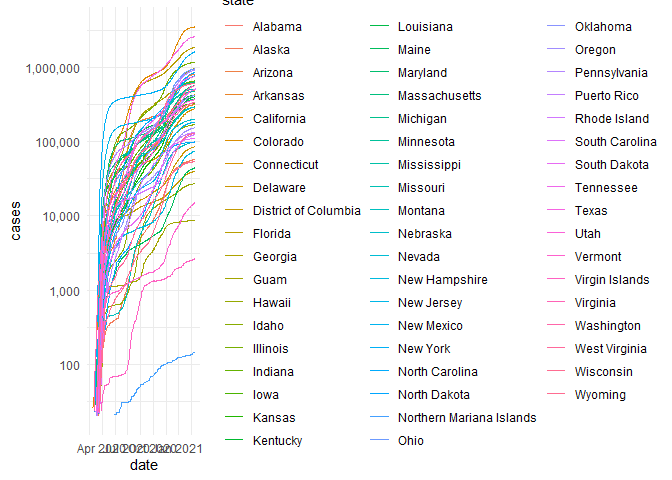

```r
library(tidyverse)     # for data cleaning and plotting
```

```
## -- Attaching packages --------------------------------------- tidyverse 1.3.0 --
```

```
## v ggplot2 3.3.3     v purrr   0.3.4
## v tibble  3.0.5     v dplyr   1.0.3
## v tidyr   1.1.2     v stringr 1.4.0
## v readr   1.4.0     v forcats 0.5.0
```

```
## -- Conflicts ------------------------------------------ tidyverse_conflicts() --
## x dplyr::filter() masks stats::filter()
## x dplyr::lag()    masks stats::lag()
```

```r
library(gardenR)       # for Lisa's garden data
library(lubridate)     # for date manipulation
```

```
## 
## Attaching package: 'lubridate'
```

```
## The following objects are masked from 'package:base':
## 
##     date, intersect, setdiff, union
```

```r
library(openintro)     # for the abbr2state() function
```

```
## Loading required package: airports
```

```
## Loading required package: cherryblossom
```

```
## Loading required package: usdata
```

```r
library(palmerpenguins)# for Palmer penguin data
library(maps)          # for map data
```

```
## 
## Attaching package: 'maps'
```

```
## The following object is masked from 'package:purrr':
## 
##     map
```

```r
library(ggmap)         # for mapping points on maps
```

```
## Google's Terms of Service: https://cloud.google.com/maps-platform/terms/.
```

```
## Please cite ggmap if you use it! See citation("ggmap") for details.
```

```r
library(gplots)        # for col2hex() function
```

```
## 
## Attaching package: 'gplots'
```

```
## The following object is masked from 'package:stats':
## 
##     lowess
```

```r
library(RColorBrewer)  # for color palettes
library(sf)            # for working with spatial data
```

```
## Linking to GEOS 3.8.0, GDAL 3.0.4, PROJ 6.3.1
```

```r
library(leaflet)       # for highly customizable mapping
library(ggthemes)      # for more themes (including theme_map())
library(plotly)        # for the ggplotly() - basic interactivity
```

```
## 
## Attaching package: 'plotly'
```

```
## The following object is masked from 'package:ggmap':
## 
##     wind
```

```
## The following object is masked from 'package:ggplot2':
## 
##     last_plot
```

```
## The following object is masked from 'package:stats':
## 
##     filter
```

```
## The following object is masked from 'package:graphics':
## 
##     layout
```

```r
library(gganimate)     # for adding animation layers to ggplots
library(gifski)        # for creating the gif (don't need to load this library every time,but need it installed)
library(transformr)    # for "tweening" (gganimate)
```

```
## 
## Attaching package: 'transformr'
```

```
## The following object is masked from 'package:sf':
## 
##     st_normalize
```

```r
library(shiny)         # for creating interactive apps
library(patchwork)     # for nicely combining ggplot2 graphs  
library(gt)            # for creating nice tables
```

```
## 
## Attaching package: 'gt'
```

```
## The following object is masked from 'package:openintro':
## 
##     sp500
```

```r
library(rvest)         # for scraping data
```

```
## Loading required package: xml2
```

```
## 
## Attaching package: 'rvest'
```

```
## The following object is masked from 'package:gt':
## 
##     html
```

```
## The following object is masked from 'package:purrr':
## 
##     pluck
```

```
## The following object is masked from 'package:readr':
## 
##     guess_encoding
```

```r
library(robotstxt)     # for checking if you can scrape data
theme_set(theme_minimal())
```


```r
# Lisa's garden data
data("garden_harvest")

#COVID-19 data from the New York Times
covid19 <- read_csv("https://raw.githubusercontent.com/nytimes/covid-19-data/master/us-states.csv")
```

```
## 
## -- Column specification --------------------------------------------------------
## cols(
##   date = col_date(format = ""),
##   state = col_character(),
##   fips = col_character(),
##   cases = col_double(),
##   deaths = col_double()
## )
```

## Put your homework on GitHub!

Go [here](https://github.com/llendway/github_for_collaboration/blob/master/github_for_collaboration.md) or to previous homework to remind yourself how to get set up. 

Once your repository is created, you should always open your **project** rather than just opening an .Rmd file. You can do that by either clicking on the .Rproj file in your repository folder on your computer. Or, by going to the upper right hand corner in R Studio and clicking the arrow next to where it says Project: (None). You should see your project come up in that list if you've used it recently. You could also go to File --> Open Project and navigate to your .Rproj file. 

## Instructions

* Put your name at the top of the document. 

* **For ALL graphs, you should include appropriate labels.** 

* Feel free to change the default theme, which I currently have set to `theme_minimal()`. 

* Use good coding practice. Read the short sections on good code with [pipes](https://style.tidyverse.org/pipes.html) and [ggplot2](https://style.tidyverse.org/ggplot2.html). **This is part of your grade!**

* **NEW!!** With animated graphs, add `eval=FALSE` to the code chunk that creates the animation and saves it using `anim_save()`. Add another code chunk to reread the gif back into the file. See the [tutorial](https://animation-and-interactivity-in-r.netlify.app/) for help. 

* When you are finished with ALL the exercises, uncomment the options at the top so your document looks nicer. Don't do it before then, or else you might miss some important warnings and messages.

## Your first `shiny` app 

  1. This app will also use the COVID data. Make sure you load that data and all the libraries you need in the `app.R` file you create. Below, you will post a link to the app that you publish on shinyapps.io. You will create an app to compare states' cumulative number of COVID cases over time. The x-axis will be number of days since 20+ cases and the y-axis will be cumulative cases on the log scale (`scale_y_log10()`). We use number of days since 20+ cases on the x-axis so we can make better comparisons of the curve trajectories. You will have an input box where the user can choose which states to compare (`selectInput()`) and have a submit button to click once the user has chosen all states they're interested in comparing. The graph should display a different line for each state, with labels either on the graph or in a legend. Color can be used if needed. 
  

```r
covid19 <- read_csv("https://raw.githubusercontent.com/nytimes/covid-19-data/master/us-states.csv")
```

```
## 
## -- Column specification --------------------------------------------------------
## cols(
##   date = col_date(format = ""),
##   state = col_character(),
##   fips = col_character(),
##   cases = col_double(),
##   deaths = col_double()
## )
```

```r
covid19 %>% 
  filter(cases >= 20) %>% 
  ggplot() +
  geom_line(aes(x = date, y = cases, color = state)) +
  theme_minimal() +
scale_y_log10(breaks = 
                  scales::trans_breaks(
                    "log10", function(x)10^x),
                labels = scales::comma) 
```

<!-- -->

```r
#just do date 
```
  
  
## Warm-up exercises from tutorial

  2. Read in the fake garden harvest data. Find the data [here](https://github.com/llendway/scraping_etc/blob/main/2020_harvest.csv) and click on the `Raw` button to get a direct link to the data. 
  

```r
library(readr)
fakeharvest <- read_csv("https://raw.githubusercontent.com/skonadua/scraping_etc/main/2020_harvest.csv", 
    col_types = cols(weight = col_number()), na = "MISSING", 
    skip = 2) %>% 
  select(-X1)
```

```
## Warning: Missing column names filled in: 'X1' [1]
```

```
## Warning: 4 parsing failures.
## row    col expected actual                                                                            file
##  13 weight a number      - 'https://raw.githubusercontent.com/skonadua/scraping_etc/main/2020_harvest.csv'
##  25 weight a number      - 'https://raw.githubusercontent.com/skonadua/scraping_etc/main/2020_harvest.csv'
##  87 weight a number      - 'https://raw.githubusercontent.com/skonadua/scraping_etc/main/2020_harvest.csv'
##  88 weight a number      - 'https://raw.githubusercontent.com/skonadua/scraping_etc/main/2020_harvest.csv'
```

```r
View(fakeharvest)
```

  
  3. Read in this [data](https://www.kaggle.com/heeraldedhia/groceries-dataset) from the kaggle website. You will need to download the data first. Save it to your project/repo folder. Do some quick checks of the data to assure it has been read in appropriately.
  

```r
library(readr)
Groceries_dataset_csv <- read_csv("Groceries_dataset.csv.zip", 
    col_types = cols(Date = col_character()))
View(Groceries_dataset_csv)
```


  4. CHALLENGE(not graded): Write code to replicate the table shown below (open the .html file to see it) created from the `garden_harvest` data as best as you can. When you get to coloring the cells, I used the following line of code for the `colors` argument:
  

```r
# colors = scales::col_numeric(
#       palette = paletteer::paletteer_d(
#         palette = "RColorBrewer::YlGn"
#       ) %>% as.character()
```

<!-- {width=600, height=1000} -->


  5. Create a table using `gt` with data from your project or from the `garden_harvest` data if your project data aren't ready.
  

```r
tab_gard <-
  garden_harvest %>% 
  gt(
    rowname_col = "row",
    groupname_col = "group"
  ) %>% 
  fmt_date(
    columns = vars(date),
    date_style = 6
  ) %>%
    # rows_delete(c(rows > 20)) %>%  #how to keep it to 20 rows? 
  tab_footnote(
    footnote = "These are harvest weights higher than 2000.",
    locations = cells_data(
      columns = vars(weight),
      rows = weight > 2000
    )
  ) %>%
  tab_footnote(
    footnote = "All values are in grams.",
    locations = cells_column_labels(columns = vars(weight))
  ) %>%
  tab_header(
    title = "Garden Harvest Data",
    subtitle = md("")
  ) %>% 
  tab_options(heading.background.color = "#003300") %>% 
  tab_options(column_labels.background.color = "#99CC00") %>% 
  data_color(
    columns = vars(weight),
    colors = scales::col_numeric(
      palette = paletteer::paletteer_d("ghibli::MarnieLight2") %>% 
        as.character(),
      domain = NULL
    ))
```

```
## Warning: The `cells_data()` function is deprecated and will soon be removed
##  * Use the `cells_body()` function instead
```

```r
tab_gard
```

```
## Warning: The `.dots` argument of `group_by()` is deprecated as of dplyr 1.0.0.
## This warning is displayed once every 8 hours.
## Call `lifecycle::last_warnings()` to see where this warning was generated.
```

```{=html}
<style>html {
  font-family: -apple-system, BlinkMacSystemFont, 'Segoe UI', Roboto, Oxygen, Ubuntu, Cantarell, 'Helvetica Neue', 'Fira Sans', 'Droid Sans', Arial, sans-serif;
}

#ctfnjdbgka .gt_table {
  display: table;
  border-collapse: collapse;
  margin-left: auto;
  margin-right: auto;
  color: #333333;
  font-size: 16px;
  font-weight: normal;
  font-style: normal;
  background-color: #FFFFFF;
  width: auto;
  border-top-style: solid;
  border-top-width: 2px;
  border-top-color: #A8A8A8;
  border-right-style: none;
  border-right-width: 2px;
  border-right-color: #D3D3D3;
  border-bottom-style: solid;
  border-bottom-width: 2px;
  border-bottom-color: #A8A8A8;
  border-left-style: none;
  border-left-width: 2px;
  border-left-color: #D3D3D3;
}

#ctfnjdbgka .gt_heading {
  background-color: #003300;
  text-align: center;
  border-bottom-color: #FFFFFF;
  border-left-style: none;
  border-left-width: 1px;
  border-left-color: #D3D3D3;
  border-right-style: none;
  border-right-width: 1px;
  border-right-color: #D3D3D3;
}

#ctfnjdbgka .gt_title {
  color: #FFFFFF;
  font-size: 125%;
  font-weight: initial;
  padding-top: 4px;
  padding-bottom: 4px;
  border-bottom-color: #FFFFFF;
  border-bottom-width: 0;
}

#ctfnjdbgka .gt_subtitle {
  color: #FFFFFF;
  font-size: 85%;
  font-weight: initial;
  padding-top: 0;
  padding-bottom: 4px;
  border-top-color: #FFFFFF;
  border-top-width: 0;
}

#ctfnjdbgka .gt_bottom_border {
  border-bottom-style: solid;
  border-bottom-width: 2px;
  border-bottom-color: #D3D3D3;
}

#ctfnjdbgka .gt_col_headings {
  border-top-style: solid;
  border-top-width: 2px;
  border-top-color: #D3D3D3;
  border-bottom-style: solid;
  border-bottom-width: 2px;
  border-bottom-color: #D3D3D3;
  border-left-style: none;
  border-left-width: 1px;
  border-left-color: #D3D3D3;
  border-right-style: none;
  border-right-width: 1px;
  border-right-color: #D3D3D3;
}

#ctfnjdbgka .gt_col_heading {
  color: #FFFFFF;
  background-color: #99CC00;
  font-size: 100%;
  font-weight: normal;
  text-transform: inherit;
  border-left-style: none;
  border-left-width: 1px;
  border-left-color: #D3D3D3;
  border-right-style: none;
  border-right-width: 1px;
  border-right-color: #D3D3D3;
  vertical-align: bottom;
  padding-top: 5px;
  padding-bottom: 6px;
  padding-left: 5px;
  padding-right: 5px;
  overflow-x: hidden;
}

#ctfnjdbgka .gt_column_spanner_outer {
  color: #FFFFFF;
  background-color: #99CC00;
  font-size: 100%;
  font-weight: normal;
  text-transform: inherit;
  padding-top: 0;
  padding-bottom: 0;
  padding-left: 4px;
  padding-right: 4px;
}

#ctfnjdbgka .gt_column_spanner_outer:first-child {
  padding-left: 0;
}

#ctfnjdbgka .gt_column_spanner_outer:last-child {
  padding-right: 0;
}

#ctfnjdbgka .gt_column_spanner {
  border-bottom-style: solid;
  border-bottom-width: 2px;
  border-bottom-color: #D3D3D3;
  vertical-align: bottom;
  padding-top: 5px;
  padding-bottom: 6px;
  overflow-x: hidden;
  display: inline-block;
  width: 100%;
}

#ctfnjdbgka .gt_group_heading {
  padding: 8px;
  color: #333333;
  background-color: #FFFFFF;
  font-size: 100%;
  font-weight: initial;
  text-transform: inherit;
  border-top-style: solid;
  border-top-width: 2px;
  border-top-color: #D3D3D3;
  border-bottom-style: solid;
  border-bottom-width: 2px;
  border-bottom-color: #D3D3D3;
  border-left-style: none;
  border-left-width: 1px;
  border-left-color: #D3D3D3;
  border-right-style: none;
  border-right-width: 1px;
  border-right-color: #D3D3D3;
  vertical-align: middle;
}

#ctfnjdbgka .gt_empty_group_heading {
  padding: 0.5px;
  color: #333333;
  background-color: #FFFFFF;
  font-size: 100%;
  font-weight: initial;
  border-top-style: solid;
  border-top-width: 2px;
  border-top-color: #D3D3D3;
  border-bottom-style: solid;
  border-bottom-width: 2px;
  border-bottom-color: #D3D3D3;
  vertical-align: middle;
}

#ctfnjdbgka .gt_from_md > :first-child {
  margin-top: 0;
}

#ctfnjdbgka .gt_from_md > :last-child {
  margin-bottom: 0;
}

#ctfnjdbgka .gt_row {
  padding-top: 8px;
  padding-bottom: 8px;
  padding-left: 5px;
  padding-right: 5px;
  margin: 10px;
  border-top-style: solid;
  border-top-width: 1px;
  border-top-color: #D3D3D3;
  border-left-style: none;
  border-left-width: 1px;
  border-left-color: #D3D3D3;
  border-right-style: none;
  border-right-width: 1px;
  border-right-color: #D3D3D3;
  vertical-align: middle;
  overflow-x: hidden;
}

#ctfnjdbgka .gt_stub {
  color: #333333;
  background-color: #FFFFFF;
  font-size: 100%;
  font-weight: initial;
  text-transform: inherit;
  border-right-style: solid;
  border-right-width: 2px;
  border-right-color: #D3D3D3;
  padding-left: 12px;
}

#ctfnjdbgka .gt_summary_row {
  color: #333333;
  background-color: #FFFFFF;
  text-transform: inherit;
  padding-top: 8px;
  padding-bottom: 8px;
  padding-left: 5px;
  padding-right: 5px;
}

#ctfnjdbgka .gt_first_summary_row {
  padding-top: 8px;
  padding-bottom: 8px;
  padding-left: 5px;
  padding-right: 5px;
  border-top-style: solid;
  border-top-width: 2px;
  border-top-color: #D3D3D3;
}

#ctfnjdbgka .gt_grand_summary_row {
  color: #333333;
  background-color: #FFFFFF;
  text-transform: inherit;
  padding-top: 8px;
  padding-bottom: 8px;
  padding-left: 5px;
  padding-right: 5px;
}

#ctfnjdbgka .gt_first_grand_summary_row {
  padding-top: 8px;
  padding-bottom: 8px;
  padding-left: 5px;
  padding-right: 5px;
  border-top-style: double;
  border-top-width: 6px;
  border-top-color: #D3D3D3;
}

#ctfnjdbgka .gt_striped {
  background-color: rgba(128, 128, 128, 0.05);
}

#ctfnjdbgka .gt_table_body {
  border-top-style: solid;
  border-top-width: 2px;
  border-top-color: #D3D3D3;
  border-bottom-style: solid;
  border-bottom-width: 2px;
  border-bottom-color: #D3D3D3;
}

#ctfnjdbgka .gt_footnotes {
  color: #333333;
  background-color: #FFFFFF;
  border-bottom-style: none;
  border-bottom-width: 2px;
  border-bottom-color: #D3D3D3;
  border-left-style: none;
  border-left-width: 2px;
  border-left-color: #D3D3D3;
  border-right-style: none;
  border-right-width: 2px;
  border-right-color: #D3D3D3;
}

#ctfnjdbgka .gt_footnote {
  margin: 0px;
  font-size: 90%;
  padding: 4px;
}

#ctfnjdbgka .gt_sourcenotes {
  color: #333333;
  background-color: #FFFFFF;
  border-bottom-style: none;
  border-bottom-width: 2px;
  border-bottom-color: #D3D3D3;
  border-left-style: none;
  border-left-width: 2px;
  border-left-color: #D3D3D3;
  border-right-style: none;
  border-right-width: 2px;
  border-right-color: #D3D3D3;
}

#ctfnjdbgka .gt_sourcenote {
  font-size: 90%;
  padding: 4px;
}

#ctfnjdbgka .gt_left {
  text-align: left;
}

#ctfnjdbgka .gt_center {
  text-align: center;
}

#ctfnjdbgka .gt_right {
  text-align: right;
  font-variant-numeric: tabular-nums;
}

#ctfnjdbgka .gt_font_normal {
  font-weight: normal;
}

#ctfnjdbgka .gt_font_bold {
  font-weight: bold;
}

#ctfnjdbgka .gt_font_italic {
  font-style: italic;
}

#ctfnjdbgka .gt_super {
  font-size: 65%;
}

#ctfnjdbgka .gt_footnote_marks {
  font-style: italic;
  font-size: 65%;
}
</style>
<div id="ctfnjdbgka" style="overflow-x:auto;overflow-y:auto;width:auto;height:auto;"><table class="gt_table">
  <thead class="gt_header">
    <tr>
      <th colspan="5" class="gt_heading gt_title gt_font_normal" style>Garden Harvest Data</th>
    </tr>
    <tr>
      <th colspan="5" class="gt_heading gt_subtitle gt_font_normal gt_bottom_border" style></th>
    </tr>
  </thead>
  <thead class="gt_col_headings">
    <tr>
      <th class="gt_col_heading gt_columns_bottom_border gt_left" rowspan="1" colspan="1">vegetable</th>
      <th class="gt_col_heading gt_columns_bottom_border gt_left" rowspan="1" colspan="1">variety</th>
      <th class="gt_col_heading gt_columns_bottom_border gt_left" rowspan="1" colspan="1">date</th>
      <th class="gt_col_heading gt_columns_bottom_border gt_right" rowspan="1" colspan="1">weight<sup class="gt_footnote_marks">1</sup></th>
      <th class="gt_col_heading gt_columns_bottom_border gt_left" rowspan="1" colspan="1">units</th>
    </tr>
  </thead>
  <tbody class="gt_table_body">
    <tr>
      <td class="gt_row gt_left">lettuce</td>
      <td class="gt_row gt_left">reseed</td>
      <td class="gt_row gt_left">Jun 6, 2020</td>
      <td class="gt_row gt_right" style="background-color: #8E938D; color: #000000;">20</td>
      <td class="gt_row gt_left">grams</td>
    </tr>
    <tr>
      <td class="gt_row gt_left">radish</td>
      <td class="gt_row gt_left">Garden Party Mix</td>
      <td class="gt_row gt_left">Jun 6, 2020</td>
      <td class="gt_row gt_right" style="background-color: #8E938D; color: #000000;">36</td>
      <td class="gt_row gt_left">grams</td>
    </tr>
    <tr>
      <td class="gt_row gt_left">lettuce</td>
      <td class="gt_row gt_left">reseed</td>
      <td class="gt_row gt_left">Jun 8, 2020</td>
      <td class="gt_row gt_right" style="background-color: #8E938D; color: #000000;">15</td>
      <td class="gt_row gt_left">grams</td>
    </tr>
    <tr>
      <td class="gt_row gt_left">lettuce</td>
      <td class="gt_row gt_left">reseed</td>
      <td class="gt_row gt_left">Jun 9, 2020</td>
      <td class="gt_row gt_right" style="background-color: #8E938D; color: #000000;">10</td>
      <td class="gt_row gt_left">grams</td>
    </tr>
    <tr>
      <td class="gt_row gt_left">radish</td>
      <td class="gt_row gt_left">Garden Party Mix</td>
      <td class="gt_row gt_left">Jun 11, 2020</td>
      <td class="gt_row gt_right" style="background-color: #8E948E; color: #000000;">67</td>
      <td class="gt_row gt_left">grams</td>
    </tr>
    <tr>
      <td class="gt_row gt_left">lettuce</td>
      <td class="gt_row gt_left">Farmer's Market Blend</td>
      <td class="gt_row gt_left">Jun 11, 2020</td>
      <td class="gt_row gt_right" style="background-color: #8E938D; color: #000000;">12</td>
      <td class="gt_row gt_left">grams</td>
    </tr>
    <tr>
      <td class="gt_row gt_left">spinach</td>
      <td class="gt_row gt_left">Catalina</td>
      <td class="gt_row gt_left">Jun 11, 2020</td>
      <td class="gt_row gt_right" style="background-color: #8E938D; color: #000000;">9</td>
      <td class="gt_row gt_left">grams</td>
    </tr>
    <tr>
      <td class="gt_row gt_left">beets</td>
      <td class="gt_row gt_left">leaves</td>
      <td class="gt_row gt_left">Jun 11, 2020</td>
      <td class="gt_row gt_right" style="background-color: #8E938D; color: #000000;">8</td>
      <td class="gt_row gt_left">grams</td>
    </tr>
    <tr>
      <td class="gt_row gt_left">radish</td>
      <td class="gt_row gt_left">Garden Party Mix</td>
      <td class="gt_row gt_left">Jun 13, 2020</td>
      <td class="gt_row gt_right" style="background-color: #8E948E; color: #000000;">53</td>
      <td class="gt_row gt_left">grams</td>
    </tr>
    <tr>
      <td class="gt_row gt_left">lettuce</td>
      <td class="gt_row gt_left">Farmer's Market Blend</td>
      <td class="gt_row gt_left">Jun 13, 2020</td>
      <td class="gt_row gt_right" style="background-color: #8E938D; color: #000000;">19</td>
      <td class="gt_row gt_left">grams</td>
    </tr>
    <tr>
      <td class="gt_row gt_left">spinach</td>
      <td class="gt_row gt_left">Catalina</td>
      <td class="gt_row gt_left">Jun 13, 2020</td>
      <td class="gt_row gt_right" style="background-color: #8E938D; color: #000000;">14</td>
      <td class="gt_row gt_left">grams</td>
    </tr>
    <tr>
      <td class="gt_row gt_left">kale</td>
      <td class="gt_row gt_left">Heirloom Lacinto</td>
      <td class="gt_row gt_left">Jun 13, 2020</td>
      <td class="gt_row gt_right" style="background-color: #8E938D; color: #000000;">10</td>
      <td class="gt_row gt_left">grams</td>
    </tr>
    <tr>
      <td class="gt_row gt_left">lettuce</td>
      <td class="gt_row gt_left">Farmer's Market Blend</td>
      <td class="gt_row gt_left">Jun 17, 2020</td>
      <td class="gt_row gt_right" style="background-color: #8E948E; color: #000000;">48</td>
      <td class="gt_row gt_left">grams</td>
    </tr>
    <tr>
      <td class="gt_row gt_left">spinach</td>
      <td class="gt_row gt_left">Catalina</td>
      <td class="gt_row gt_left">Jun 17, 2020</td>
      <td class="gt_row gt_right" style="background-color: #8E948E; color: #000000;">58</td>
      <td class="gt_row gt_left">grams</td>
    </tr>
    <tr>
      <td class="gt_row gt_left">peas</td>
      <td class="gt_row gt_left">Magnolia Blossom</td>
      <td class="gt_row gt_left">Jun 17, 2020</td>
      <td class="gt_row gt_right" style="background-color: #8E938D; color: #000000;">8</td>
      <td class="gt_row gt_left">grams</td>
    </tr>
    <tr>
      <td class="gt_row gt_left">peas</td>
      <td class="gt_row gt_left">Super Sugar Snap</td>
      <td class="gt_row gt_left">Jun 17, 2020</td>
      <td class="gt_row gt_right" style="background-color: #8F958E; color: #000000;">121</td>
      <td class="gt_row gt_left">grams</td>
    </tr>
    <tr>
      <td class="gt_row gt_left">chives</td>
      <td class="gt_row gt_left">perrenial</td>
      <td class="gt_row gt_left">Jun 17, 2020</td>
      <td class="gt_row gt_right" style="background-color: #8E938D; color: #000000;">8</td>
      <td class="gt_row gt_left">grams</td>
    </tr>
    <tr>
      <td class="gt_row gt_left">strawberries</td>
      <td class="gt_row gt_left">perrenial</td>
      <td class="gt_row gt_left">Jun 18, 2020</td>
      <td class="gt_row gt_right" style="background-color: #8E938D; color: #000000;">40</td>
      <td class="gt_row gt_left">grams</td>
    </tr>
    <tr>
      <td class="gt_row gt_left">lettuce</td>
      <td class="gt_row gt_left">Farmer's Market Blend</td>
      <td class="gt_row gt_left">Jun 18, 2020</td>
      <td class="gt_row gt_right" style="background-color: #8E948E; color: #000000;">47</td>
      <td class="gt_row gt_left">grams</td>
    </tr>
    <tr>
      <td class="gt_row gt_left">spinach</td>
      <td class="gt_row gt_left">Catalina</td>
      <td class="gt_row gt_left">Jun 18, 2020</td>
      <td class="gt_row gt_right" style="background-color: #8E948E; color: #000000;">59</td>
      <td class="gt_row gt_left">grams</td>
    </tr>
    <tr>
      <td class="gt_row gt_left">beets</td>
      <td class="gt_row gt_left">leaves</td>
      <td class="gt_row gt_left">Jun 18, 2020</td>
      <td class="gt_row gt_right" style="background-color: #8E938D; color: #000000;">25</td>
      <td class="gt_row gt_left">grams</td>
    </tr>
    <tr>
      <td class="gt_row gt_left">spinach</td>
      <td class="gt_row gt_left">Catalina</td>
      <td class="gt_row gt_left">Jun 19, 2020</td>
      <td class="gt_row gt_right" style="background-color: #8E948E; color: #000000;">58</td>
      <td class="gt_row gt_left">grams</td>
    </tr>
    <tr>
      <td class="gt_row gt_left">lettuce</td>
      <td class="gt_row gt_left">Farmer's Market Blend</td>
      <td class="gt_row gt_left">Jun 19, 2020</td>
      <td class="gt_row gt_right" style="background-color: #8E938D; color: #000000;">39</td>
      <td class="gt_row gt_left">grams</td>
    </tr>
    <tr>
      <td class="gt_row gt_left">beets</td>
      <td class="gt_row gt_left">leaves</td>
      <td class="gt_row gt_left">Jun 19, 2020</td>
      <td class="gt_row gt_right" style="background-color: #8E938D; color: #000000;">11</td>
      <td class="gt_row gt_left">grams</td>
    </tr>
    <tr>
      <td class="gt_row gt_left">lettuce</td>
      <td class="gt_row gt_left">Farmer's Market Blend</td>
      <td class="gt_row gt_left">Jun 19, 2020</td>
      <td class="gt_row gt_right" style="background-color: #8E938D; color: #000000;">38</td>
      <td class="gt_row gt_left">grams</td>
    </tr>
    <tr>
      <td class="gt_row gt_left">lettuce</td>
      <td class="gt_row gt_left">Farmer's Market Blend</td>
      <td class="gt_row gt_left">Jun 20, 2020</td>
      <td class="gt_row gt_right" style="background-color: #8E938D; color: #000000;">22</td>
      <td class="gt_row gt_left">grams</td>
    </tr>
    <tr>
      <td class="gt_row gt_left">spinach</td>
      <td class="gt_row gt_left">Catalina</td>
      <td class="gt_row gt_left">Jun 20, 2020</td>
      <td class="gt_row gt_right" style="background-color: #8E938D; color: #000000;">25</td>
      <td class="gt_row gt_left">grams</td>
    </tr>
    <tr>
      <td class="gt_row gt_left">lettuce</td>
      <td class="gt_row gt_left">Tatsoi</td>
      <td class="gt_row gt_left">Jun 20, 2020</td>
      <td class="gt_row gt_right" style="background-color: #8E938D; color: #000000;">18</td>
      <td class="gt_row gt_left">grams</td>
    </tr>
    <tr>
      <td class="gt_row gt_left">radish</td>
      <td class="gt_row gt_left">Garden Party Mix</td>
      <td class="gt_row gt_left">Jun 20, 2020</td>
      <td class="gt_row gt_right" style="background-color: #8E938D; color: #000000;">16</td>
      <td class="gt_row gt_left">grams</td>
    </tr>
    <tr>
      <td class="gt_row gt_left">peas</td>
      <td class="gt_row gt_left">Magnolia Blossom</td>
      <td class="gt_row gt_left">Jun 20, 2020</td>
      <td class="gt_row gt_right" style="background-color: #8E948E; color: #000000;">71</td>
      <td class="gt_row gt_left">grams</td>
    </tr>
    <tr>
      <td class="gt_row gt_left">peas</td>
      <td class="gt_row gt_left">Super Sugar Snap</td>
      <td class="gt_row gt_left">Jun 20, 2020</td>
      <td class="gt_row gt_right" style="background-color: #8F958F; color: #000000;">148</td>
      <td class="gt_row gt_left">grams</td>
    </tr>
    <tr>
      <td class="gt_row gt_left">asparagus</td>
      <td class="gt_row gt_left">asparagus</td>
      <td class="gt_row gt_left">Jun 20, 2020</td>
      <td class="gt_row gt_right" style="background-color: #8E938D; color: #000000;">20</td>
      <td class="gt_row gt_left">grams</td>
    </tr>
    <tr>
      <td class="gt_row gt_left">radish</td>
      <td class="gt_row gt_left">Garden Party Mix</td>
      <td class="gt_row gt_left">Jun 21, 2020</td>
      <td class="gt_row gt_right" style="background-color: #8E938D; color: #000000;">37</td>
      <td class="gt_row gt_left">grams</td>
    </tr>
    <tr>
      <td class="gt_row gt_left">Swiss chard</td>
      <td class="gt_row gt_left">Neon Glow</td>
      <td class="gt_row gt_left">Jun 21, 2020</td>
      <td class="gt_row gt_right" style="background-color: #8E938D; color: #000000;">19</td>
      <td class="gt_row gt_left">grams</td>
    </tr>
    <tr>
      <td class="gt_row gt_left">spinach</td>
      <td class="gt_row gt_left">Catalina</td>
      <td class="gt_row gt_left">Jun 21, 2020</td>
      <td class="gt_row gt_right" style="background-color: #8E948E; color: #000000;">71</td>
      <td class="gt_row gt_left">grams</td>
    </tr>
    <tr>
      <td class="gt_row gt_left">lettuce</td>
      <td class="gt_row gt_left">Farmer's Market Blend</td>
      <td class="gt_row gt_left">Jun 21, 2020</td>
      <td class="gt_row gt_right" style="background-color: #8E948E; color: #000000;">95</td>
      <td class="gt_row gt_left">grams</td>
    </tr>
    <tr>
      <td class="gt_row gt_left">spinach</td>
      <td class="gt_row gt_left">Catalina</td>
      <td class="gt_row gt_left">Jun 21, 2020</td>
      <td class="gt_row gt_right" style="background-color: #8E948E; color: #000000;">51</td>
      <td class="gt_row gt_left">grams</td>
    </tr>
    <tr>
      <td class="gt_row gt_left">Swiss chard</td>
      <td class="gt_row gt_left">Neon Glow</td>
      <td class="gt_row gt_left">Jun 21, 2020</td>
      <td class="gt_row gt_right" style="background-color: #8E938D; color: #000000;">13</td>
      <td class="gt_row gt_left">grams</td>
    </tr>
    <tr>
      <td class="gt_row gt_left">beets</td>
      <td class="gt_row gt_left">leaves</td>
      <td class="gt_row gt_left">Jun 21, 2020</td>
      <td class="gt_row gt_right" style="background-color: #8E948E; color: #000000;">57</td>
      <td class="gt_row gt_left">grams</td>
    </tr>
    <tr>
      <td class="gt_row gt_left">kale</td>
      <td class="gt_row gt_left">Heirloom Lacinto</td>
      <td class="gt_row gt_left">Jun 21, 2020</td>
      <td class="gt_row gt_right" style="background-color: #8E948E; color: #000000;">60</td>
      <td class="gt_row gt_left">grams</td>
    </tr>
    <tr>
      <td class="gt_row gt_left">spinach</td>
      <td class="gt_row gt_left">Catalina</td>
      <td class="gt_row gt_left">Jun 22, 2020</td>
      <td class="gt_row gt_right" style="background-color: #8E938D; color: #000000;">37</td>
      <td class="gt_row gt_left">grams</td>
    </tr>
    <tr>
      <td class="gt_row gt_left">lettuce</td>
      <td class="gt_row gt_left">Farmer's Market Blend</td>
      <td class="gt_row gt_left">Jun 22, 2020</td>
      <td class="gt_row gt_right" style="background-color: #8E948E; color: #000000;">52</td>
      <td class="gt_row gt_left">grams</td>
    </tr>
    <tr>
      <td class="gt_row gt_left">peas</td>
      <td class="gt_row gt_left">Super Sugar Snap</td>
      <td class="gt_row gt_left">Jun 22, 2020</td>
      <td class="gt_row gt_right" style="background-color: #8E938D; color: #000000;">40</td>
      <td class="gt_row gt_left">grams</td>
    </tr>
    <tr>
      <td class="gt_row gt_left">peas</td>
      <td class="gt_row gt_left">Magnolia Blossom</td>
      <td class="gt_row gt_left">Jun 22, 2020</td>
      <td class="gt_row gt_right" style="background-color: #8E938D; color: #000000;">19</td>
      <td class="gt_row gt_left">grams</td>
    </tr>
    <tr>
      <td class="gt_row gt_left">strawberries</td>
      <td class="gt_row gt_left">perrenial</td>
      <td class="gt_row gt_left">Jun 22, 2020</td>
      <td class="gt_row gt_right" style="background-color: #8E938D; color: #000000;">19</td>
      <td class="gt_row gt_left">grams</td>
    </tr>
    <tr>
      <td class="gt_row gt_left">lettuce</td>
      <td class="gt_row gt_left">Farmer's Market Blend</td>
      <td class="gt_row gt_left">Jun 22, 2020</td>
      <td class="gt_row gt_right" style="background-color: #8E938D; color: #000000;">18</td>
      <td class="gt_row gt_left">grams</td>
    </tr>
    <tr>
      <td class="gt_row gt_left">peas</td>
      <td class="gt_row gt_left">Magnolia Blossom</td>
      <td class="gt_row gt_left">Jun 23, 2020</td>
      <td class="gt_row gt_right" style="background-color: #8E938D; color: #000000;">40</td>
      <td class="gt_row gt_left">grams</td>
    </tr>
    <tr>
      <td class="gt_row gt_left">peas</td>
      <td class="gt_row gt_left">Super Sugar Snap</td>
      <td class="gt_row gt_left">Jun 23, 2020</td>
      <td class="gt_row gt_right" style="background-color: #8F958F; color: #000000;">165</td>
      <td class="gt_row gt_left">grams</td>
    </tr>
    <tr>
      <td class="gt_row gt_left">spinach</td>
      <td class="gt_row gt_left">Catalina</td>
      <td class="gt_row gt_left">Jun 23, 2020</td>
      <td class="gt_row gt_right" style="background-color: #8E948D; color: #000000;">41</td>
      <td class="gt_row gt_left">grams</td>
    </tr>
    <tr>
      <td class="gt_row gt_left">cilantro</td>
      <td class="gt_row gt_left">cilantro</td>
      <td class="gt_row gt_left">Jun 23, 2020</td>
      <td class="gt_row gt_right" style="background-color: #8E938D; color: #000000;">2</td>
      <td class="gt_row gt_left">grams</td>
    </tr>
    <tr>
      <td class="gt_row gt_left">basil</td>
      <td class="gt_row gt_left">Isle of Naxos</td>
      <td class="gt_row gt_left">Jun 23, 2020</td>
      <td class="gt_row gt_right" style="background-color: #8E938D; color: #000000;">5</td>
      <td class="gt_row gt_left">grams</td>
    </tr>
    <tr>
      <td class="gt_row gt_left">peas</td>
      <td class="gt_row gt_left">Super Sugar Snap</td>
      <td class="gt_row gt_left">Jun 24, 2020</td>
      <td class="gt_row gt_right" style="background-color: #8E938D; color: #000000;">34</td>
      <td class="gt_row gt_left">grams</td>
    </tr>
    <tr>
      <td class="gt_row gt_left">lettuce</td>
      <td class="gt_row gt_left">Farmer's Market Blend</td>
      <td class="gt_row gt_left">Jun 24, 2020</td>
      <td class="gt_row gt_right" style="background-color: #8F958E; color: #000000;">122</td>
      <td class="gt_row gt_left">grams</td>
    </tr>
    <tr>
      <td class="gt_row gt_left">spinach</td>
      <td class="gt_row gt_left">Catalina</td>
      <td class="gt_row gt_left">Jun 25, 2020</td>
      <td class="gt_row gt_right" style="background-color: #8E938D; color: #000000;">22</td>
      <td class="gt_row gt_left">grams</td>
    </tr>
    <tr>
      <td class="gt_row gt_left">lettuce</td>
      <td class="gt_row gt_left">Farmer's Market Blend</td>
      <td class="gt_row gt_left">Jun 25, 2020</td>
      <td class="gt_row gt_right" style="background-color: #8E938D; color: #000000;">30</td>
      <td class="gt_row gt_left">grams</td>
    </tr>
    <tr>
      <td class="gt_row gt_left">strawberries</td>
      <td class="gt_row gt_left">perrenial</td>
      <td class="gt_row gt_left">Jun 26, 2020</td>
      <td class="gt_row gt_right" style="background-color: #8E938D; color: #000000;">17</td>
      <td class="gt_row gt_left">grams</td>
    </tr>
    <tr>
      <td class="gt_row gt_left">peas</td>
      <td class="gt_row gt_left">Super Sugar Snap</td>
      <td class="gt_row gt_left">Jun 26, 2020</td>
      <td class="gt_row gt_right" style="background-color: #909892; color: #000000;">425</td>
      <td class="gt_row gt_left">grams</td>
    </tr>
    <tr>
      <td class="gt_row gt_left">lettuce</td>
      <td class="gt_row gt_left">Farmer's Market Blend</td>
      <td class="gt_row gt_left">Jun 27, 2020</td>
      <td class="gt_row gt_right" style="background-color: #8E948E; color: #000000;">52</td>
      <td class="gt_row gt_left">grams</td>
    </tr>
    <tr>
      <td class="gt_row gt_left">lettuce</td>
      <td class="gt_row gt_left">Tatsoi</td>
      <td class="gt_row gt_left">Jun 27, 2020</td>
      <td class="gt_row gt_right" style="background-color: #8E948E; color: #000000;">89</td>
      <td class="gt_row gt_left">grams</td>
    </tr>
    <tr>
      <td class="gt_row gt_left">spinach</td>
      <td class="gt_row gt_left">Catalina</td>
      <td class="gt_row gt_left">Jun 27, 2020</td>
      <td class="gt_row gt_right" style="background-color: #8E948E; color: #000000;">60</td>
      <td class="gt_row gt_left">grams</td>
    </tr>
    <tr>
      <td class="gt_row gt_left">peas</td>
      <td class="gt_row gt_left">Magnolia Blossom</td>
      <td class="gt_row gt_left">Jun 27, 2020</td>
      <td class="gt_row gt_right" style="background-color: #909791; color: #000000;">333</td>
      <td class="gt_row gt_left">grams</td>
    </tr>
    <tr>
      <td class="gt_row gt_left">peas</td>
      <td class="gt_row gt_left">Super Sugar Snap</td>
      <td class="gt_row gt_left">Jun 28, 2020</td>
      <td class="gt_row gt_right" style="background-color: #929D97; color: #000000;">793</td>
      <td class="gt_row gt_left">grams</td>
    </tr>
    <tr>
      <td class="gt_row gt_left">spinach</td>
      <td class="gt_row gt_left">Catalina</td>
      <td class="gt_row gt_left">Jun 28, 2020</td>
      <td class="gt_row gt_right" style="background-color: #8E948E; color: #000000;">99</td>
      <td class="gt_row gt_left">grams</td>
    </tr>
    <tr>
      <td class="gt_row gt_left">lettuce</td>
      <td class="gt_row gt_left">Farmer's Market Blend</td>
      <td class="gt_row gt_left">Jun 28, 2020</td>
      <td class="gt_row gt_right" style="background-color: #8F948E; color: #000000;">111</td>
      <td class="gt_row gt_left">grams</td>
    </tr>
    <tr>
      <td class="gt_row gt_left">lettuce</td>
      <td class="gt_row gt_left">Farmer's Market Blend</td>
      <td class="gt_row gt_left">Jun 29, 2020</td>
      <td class="gt_row gt_right" style="background-color: #8E948E; color: #000000;">58</td>
      <td class="gt_row gt_left">grams</td>
    </tr>
    <tr>
      <td class="gt_row gt_left">lettuce</td>
      <td class="gt_row gt_left">mustard greens</td>
      <td class="gt_row gt_left">Jun 29, 2020</td>
      <td class="gt_row gt_right" style="background-color: #8E938D; color: #000000;">23</td>
      <td class="gt_row gt_left">grams</td>
    </tr>
    <tr>
      <td class="gt_row gt_left">peas</td>
      <td class="gt_row gt_left">Magnolia Blossom</td>
      <td class="gt_row gt_left">Jun 29, 2020</td>
      <td class="gt_row gt_right" style="background-color: #919B95; color: #000000;">625</td>
      <td class="gt_row gt_left">grams</td>
    </tr>
    <tr>
      <td class="gt_row gt_left">peas</td>
      <td class="gt_row gt_left">Super Sugar Snap</td>
      <td class="gt_row gt_left">Jun 29, 2020</td>
      <td class="gt_row gt_right" style="background-color: #919A94; color: #000000;">561</td>
      <td class="gt_row gt_left">grams</td>
    </tr>
    <tr>
      <td class="gt_row gt_left">raspberries</td>
      <td class="gt_row gt_left">perrenial</td>
      <td class="gt_row gt_left">Jun 29, 2020</td>
      <td class="gt_row gt_right" style="background-color: #8E938D; color: #000000;">30</td>
      <td class="gt_row gt_left">grams</td>
    </tr>
    <tr>
      <td class="gt_row gt_left">lettuce</td>
      <td class="gt_row gt_left">Farmer's Market Blend</td>
      <td class="gt_row gt_left">Jun 29, 2020</td>
      <td class="gt_row gt_right" style="background-color: #8E948E; color: #000000;">82</td>
      <td class="gt_row gt_left">grams</td>
    </tr>
    <tr>
      <td class="gt_row gt_left">Swiss chard</td>
      <td class="gt_row gt_left">Neon Glow</td>
      <td class="gt_row gt_left">Jun 30, 2020</td>
      <td class="gt_row gt_right" style="background-color: #8E938D; color: #000000;">32</td>
      <td class="gt_row gt_left">grams</td>
    </tr>
    <tr>
      <td class="gt_row gt_left">spinach</td>
      <td class="gt_row gt_left">Catalina</td>
      <td class="gt_row gt_left">Jun 30, 2020</td>
      <td class="gt_row gt_right" style="background-color: #8E948E; color: #000000;">80</td>
      <td class="gt_row gt_left">grams</td>
    </tr>
    <tr>
      <td class="gt_row gt_left">lettuce</td>
      <td class="gt_row gt_left">Farmer's Market Blend</td>
      <td class="gt_row gt_left">Jul 1, 2020</td>
      <td class="gt_row gt_right" style="background-color: #8E948E; color: #000000;">60</td>
      <td class="gt_row gt_left">grams</td>
    </tr>
    <tr>
      <td class="gt_row gt_left">lettuce</td>
      <td class="gt_row gt_left">Tatsoi</td>
      <td class="gt_row gt_left">Jul 2, 2020</td>
      <td class="gt_row gt_right" style="background-color: #8F958F; color: #000000;">144</td>
      <td class="gt_row gt_left">grams</td>
    </tr>
    <tr>
      <td class="gt_row gt_left">spinach</td>
      <td class="gt_row gt_left">Catalina</td>
      <td class="gt_row gt_left">Jul 2, 2020</td>
      <td class="gt_row gt_right" style="background-color: #8E938D; color: #000000;">16</td>
      <td class="gt_row gt_left">grams</td>
    </tr>
    <tr>
      <td class="gt_row gt_left">peas</td>
      <td class="gt_row gt_left">Magnolia Blossom</td>
      <td class="gt_row gt_left">Jul 2, 2020</td>
      <td class="gt_row gt_right" style="background-color: #929D97; color: #000000;">798</td>
      <td class="gt_row gt_left">grams</td>
    </tr>
    <tr>
      <td class="gt_row gt_left">peas</td>
      <td class="gt_row gt_left">Super Sugar Snap</td>
      <td class="gt_row gt_left">Jul 2, 2020</td>
      <td class="gt_row gt_right" style="background-color: #929D96; color: #000000;">743</td>
      <td class="gt_row gt_left">grams</td>
    </tr>
    <tr>
      <td class="gt_row gt_left">lettuce</td>
      <td class="gt_row gt_left">Farmer's Market Blend</td>
      <td class="gt_row gt_left">Jul 3, 2020</td>
      <td class="gt_row gt_right" style="background-color: #8F9690; color: #000000;">217</td>
      <td class="gt_row gt_left">grams</td>
    </tr>
    <tr>
      <td class="gt_row gt_left">lettuce</td>
      <td class="gt_row gt_left">Tatsoi</td>
      <td class="gt_row gt_left">Jul 3, 2020</td>
      <td class="gt_row gt_right" style="background-color: #8F9690; color: #000000;">216</td>
      <td class="gt_row gt_left">grams</td>
    </tr>
    <tr>
      <td class="gt_row gt_left">radish</td>
      <td class="gt_row gt_left">Garden Party Mix</td>
      <td class="gt_row gt_left">Jul 3, 2020</td>
      <td class="gt_row gt_right" style="background-color: #8E948E; color: #000000;">88</td>
      <td class="gt_row gt_left">grams</td>
    </tr>
    <tr>
      <td class="gt_row gt_left">basil</td>
      <td class="gt_row gt_left">Isle of Naxos</td>
      <td class="gt_row gt_left">Jul 3, 2020</td>
      <td class="gt_row gt_right" style="background-color: #8E938D; color: #000000;">9</td>
      <td class="gt_row gt_left">grams</td>
    </tr>
    <tr>
      <td class="gt_row gt_left">peas</td>
      <td class="gt_row gt_left">Super Sugar Snap</td>
      <td class="gt_row gt_left">Jul 4, 2020</td>
      <td class="gt_row gt_right" style="background-color: #8F9790; color: #000000;">285</td>
      <td class="gt_row gt_left">grams</td>
    </tr>
    <tr>
      <td class="gt_row gt_left">peas</td>
      <td class="gt_row gt_left">Magnolia Blossom</td>
      <td class="gt_row gt_left">Jul 4, 2020</td>
      <td class="gt_row gt_right" style="background-color: #909993; color: #000000;">457</td>
      <td class="gt_row gt_left">grams</td>
    </tr>
    <tr>
      <td class="gt_row gt_left">lettuce</td>
      <td class="gt_row gt_left">Farmer's Market Blend</td>
      <td class="gt_row gt_left">Jul 4, 2020</td>
      <td class="gt_row gt_right" style="background-color: #8F958F; color: #000000;">147</td>
      <td class="gt_row gt_left">grams</td>
    </tr>
    <tr>
      <td class="gt_row gt_left">basil</td>
      <td class="gt_row gt_left">Isle of Naxos</td>
      <td class="gt_row gt_left">Jul 6, 2020</td>
      <td class="gt_row gt_right" style="background-color: #8E938D; color: #000000;">17</td>
      <td class="gt_row gt_left">grams</td>
    </tr>
    <tr>
      <td class="gt_row gt_left">zucchini</td>
      <td class="gt_row gt_left">Romanesco</td>
      <td class="gt_row gt_left">Jul 6, 2020</td>
      <td class="gt_row gt_right" style="background-color: #8F958F; color: #000000;">175</td>
      <td class="gt_row gt_left">grams</td>
    </tr>
    <tr>
      <td class="gt_row gt_left">beans</td>
      <td class="gt_row gt_left">Bush Bush Slender</td>
      <td class="gt_row gt_left">Jul 6, 2020</td>
      <td class="gt_row gt_right" style="background-color: #8F9690; color: #000000;">235</td>
      <td class="gt_row gt_left">grams</td>
    </tr>
    <tr>
      <td class="gt_row gt_left">lettuce</td>
      <td class="gt_row gt_left">Tatsoi</td>
      <td class="gt_row gt_left">Jul 6, 2020</td>
      <td class="gt_row gt_right" style="background-color: #8F958F; color: #000000;">189</td>
      <td class="gt_row gt_left">grams</td>
    </tr>
    <tr>
      <td class="gt_row gt_left">peas</td>
      <td class="gt_row gt_left">Magnolia Blossom</td>
      <td class="gt_row gt_left">Jul 6, 2020</td>
      <td class="gt_row gt_right" style="background-color: #909992; color: #000000;">433</td>
      <td class="gt_row gt_left">grams</td>
    </tr>
    <tr>
      <td class="gt_row gt_left">peas</td>
      <td class="gt_row gt_left">Super Sugar Snap</td>
      <td class="gt_row gt_left">Jul 6, 2020</td>
      <td class="gt_row gt_right" style="background-color: #8E948E; color: #000000;">48</td>
      <td class="gt_row gt_left">grams</td>
    </tr>
    <tr>
      <td class="gt_row gt_left">lettuce</td>
      <td class="gt_row gt_left">Farmer's Market Blend</td>
      <td class="gt_row gt_left">Jul 7, 2020</td>
      <td class="gt_row gt_right" style="background-color: #8E948E; color: #000000;">67</td>
      <td class="gt_row gt_left">grams</td>
    </tr>
    <tr>
      <td class="gt_row gt_left">beets</td>
      <td class="gt_row gt_left">Gourmet Golden</td>
      <td class="gt_row gt_left">Jul 7, 2020</td>
      <td class="gt_row gt_right" style="background-color: #8E948E; color: #000000;">62</td>
      <td class="gt_row gt_left">grams</td>
    </tr>
    <tr>
      <td class="gt_row gt_left">beets</td>
      <td class="gt_row gt_left">Sweet Merlin</td>
      <td class="gt_row gt_left">Jul 7, 2020</td>
      <td class="gt_row gt_right" style="background-color: #8E938D; color: #000000;">10</td>
      <td class="gt_row gt_left">grams</td>
    </tr>
    <tr>
      <td class="gt_row gt_left">radish</td>
      <td class="gt_row gt_left">Garden Party Mix</td>
      <td class="gt_row gt_left">Jul 7, 2020</td>
      <td class="gt_row gt_right" style="background-color: #8E948D; color: #000000;">43</td>
      <td class="gt_row gt_left">grams</td>
    </tr>
    <tr>
      <td class="gt_row gt_left">basil</td>
      <td class="gt_row gt_left">Isle of Naxos</td>
      <td class="gt_row gt_left">Jul 7, 2020</td>
      <td class="gt_row gt_right" style="background-color: #8E938D; color: #000000;">11</td>
      <td class="gt_row gt_left">grams</td>
    </tr>
    <tr>
      <td class="gt_row gt_left">lettuce</td>
      <td class="gt_row gt_left">Farmer's Market Blend</td>
      <td class="gt_row gt_left">Jul 7, 2020</td>
      <td class="gt_row gt_right" style="background-color: #8E938D; color: #000000;">13</td>
      <td class="gt_row gt_left">grams</td>
    </tr>
    <tr>
      <td class="gt_row gt_left">peas</td>
      <td class="gt_row gt_left">Super Sugar Snap</td>
      <td class="gt_row gt_left">Jul 8, 2020</td>
      <td class="gt_row gt_right" style="background-color: #8E948E; color: #000000;">75</td>
      <td class="gt_row gt_left">grams</td>
    </tr>
    <tr>
      <td class="gt_row gt_left">peas</td>
      <td class="gt_row gt_left">Magnolia Blossom</td>
      <td class="gt_row gt_left">Jul 8, 2020</td>
      <td class="gt_row gt_right" style="background-color: #8F9690; color: #000000;">252</td>
      <td class="gt_row gt_left">grams</td>
    </tr>
    <tr>
      <td class="gt_row gt_left">beans</td>
      <td class="gt_row gt_left">Bush Bush Slender</td>
      <td class="gt_row gt_left">Jul 8, 2020</td>
      <td class="gt_row gt_right" style="background-color: #8F958F; color: #000000;">178</td>
      <td class="gt_row gt_left">grams</td>
    </tr>
    <tr>
      <td class="gt_row gt_left">lettuce</td>
      <td class="gt_row gt_left">Farmer's Market Blend</td>
      <td class="gt_row gt_left">Jul 8, 2020</td>
      <td class="gt_row gt_right" style="background-color: #8E938D; color: #000000;">39</td>
      <td class="gt_row gt_left">grams</td>
    </tr>
    <tr>
      <td class="gt_row gt_left">cucumbers</td>
      <td class="gt_row gt_left">pickling</td>
      <td class="gt_row gt_left">Jul 8, 2020</td>
      <td class="gt_row gt_right" style="background-color: #8F958F; color: #000000;">181</td>
      <td class="gt_row gt_left">grams</td>
    </tr>
    <tr>
      <td class="gt_row gt_left">beets</td>
      <td class="gt_row gt_left">Gourmet Golden</td>
      <td class="gt_row gt_left">Jul 8, 2020</td>
      <td class="gt_row gt_right" style="background-color: #8E948E; color: #000000;">83</td>
      <td class="gt_row gt_left">grams</td>
    </tr>
    <tr>
      <td class="gt_row gt_left">Swiss chard</td>
      <td class="gt_row gt_left">Neon Glow</td>
      <td class="gt_row gt_left">Jul 8, 2020</td>
      <td class="gt_row gt_right" style="background-color: #8E948E; color: #000000;">96</td>
      <td class="gt_row gt_left">grams</td>
    </tr>
    <tr>
      <td class="gt_row gt_left">lettuce</td>
      <td class="gt_row gt_left">Tatsoi</td>
      <td class="gt_row gt_left">Jul 8, 2020</td>
      <td class="gt_row gt_right" style="background-color: #8E948E; color: #000000;">75</td>
      <td class="gt_row gt_left">grams</td>
    </tr>
    <tr>
      <td class="gt_row gt_left">lettuce</td>
      <td class="gt_row gt_left">Farmer's Market Blend</td>
      <td class="gt_row gt_left">Jul 9, 2020</td>
      <td class="gt_row gt_right" style="background-color: #8E948E; color: #000000;">61</td>
      <td class="gt_row gt_left">grams</td>
    </tr>
    <tr>
      <td class="gt_row gt_left">raspberries</td>
      <td class="gt_row gt_left">perrenial</td>
      <td class="gt_row gt_left">Jul 9, 2020</td>
      <td class="gt_row gt_right" style="background-color: #8F958F; color: #000000;">131</td>
      <td class="gt_row gt_left">grams</td>
    </tr>
    <tr>
      <td class="gt_row gt_left">beans</td>
      <td class="gt_row gt_left">Bush Bush Slender</td>
      <td class="gt_row gt_left">Jul 9, 2020</td>
      <td class="gt_row gt_right" style="background-color: #8F958F; color: #000000;">140</td>
      <td class="gt_row gt_left">grams</td>
    </tr>
    <tr>
      <td class="gt_row gt_left">beets</td>
      <td class="gt_row gt_left">Sweet Merlin</td>
      <td class="gt_row gt_left">Jul 9, 2020</td>
      <td class="gt_row gt_right" style="background-color: #8E948E; color: #000000;">69</td>
      <td class="gt_row gt_left">grams</td>
    </tr>
    <tr>
      <td class="gt_row gt_left">cucumbers</td>
      <td class="gt_row gt_left">pickling</td>
      <td class="gt_row gt_left">Jul 9, 2020</td>
      <td class="gt_row gt_right" style="background-color: #8E948E; color: #000000;">78</td>
      <td class="gt_row gt_left">grams</td>
    </tr>
    <tr>
      <td class="gt_row gt_left">raspberries</td>
      <td class="gt_row gt_left">perrenial</td>
      <td class="gt_row gt_left">Jul 10, 2020</td>
      <td class="gt_row gt_right" style="background-color: #8E948E; color: #000000;">61</td>
      <td class="gt_row gt_left">grams</td>
    </tr>
    <tr>
      <td class="gt_row gt_left">basil</td>
      <td class="gt_row gt_left">Isle of Naxos</td>
      <td class="gt_row gt_left">Jul 10, 2020</td>
      <td class="gt_row gt_right" style="background-color: #8F958F; color: #000000;">150</td>
      <td class="gt_row gt_left">grams</td>
    </tr>
    <tr>
      <td class="gt_row gt_left">raspberries</td>
      <td class="gt_row gt_left">perrenial</td>
      <td class="gt_row gt_left">Jul 11, 2020</td>
      <td class="gt_row gt_right" style="background-color: #8E948E; color: #000000;">60</td>
      <td class="gt_row gt_left">grams</td>
    </tr>
    <tr>
      <td class="gt_row gt_left">strawberries</td>
      <td class="gt_row gt_left">perrenial</td>
      <td class="gt_row gt_left">Jul 11, 2020</td>
      <td class="gt_row gt_right" style="background-color: #8E948E; color: #000000;">77</td>
      <td class="gt_row gt_left">grams</td>
    </tr>
    <tr>
      <td class="gt_row gt_left">spinach</td>
      <td class="gt_row gt_left">Catalina</td>
      <td class="gt_row gt_left">Jul 11, 2020</td>
      <td class="gt_row gt_right" style="background-color: #8E938D; color: #000000;">19</td>
      <td class="gt_row gt_left">grams</td>
    </tr>
    <tr>
      <td class="gt_row gt_left">lettuce</td>
      <td class="gt_row gt_left">Farmer's Market Blend</td>
      <td class="gt_row gt_left">Jul 11, 2020</td>
      <td class="gt_row gt_right" style="background-color: #8E948E; color: #000000;">79</td>
      <td class="gt_row gt_left">grams</td>
    </tr>
    <tr>
      <td class="gt_row gt_left">raspberries</td>
      <td class="gt_row gt_left">perrenial</td>
      <td class="gt_row gt_left">Jul 11, 2020</td>
      <td class="gt_row gt_right" style="background-color: #8F948E; color: #000000;">105</td>
      <td class="gt_row gt_left">grams</td>
    </tr>
    <tr>
      <td class="gt_row gt_left">beans</td>
      <td class="gt_row gt_left">Bush Bush Slender</td>
      <td class="gt_row gt_left">Jul 11, 2020</td>
      <td class="gt_row gt_right" style="background-color: #919C96; color: #000000;">701</td>
      <td class="gt_row gt_left">grams</td>
    </tr>
    <tr>
      <td class="gt_row gt_left">tomatoes</td>
      <td class="gt_row gt_left">grape</td>
      <td class="gt_row gt_left">Jul 11, 2020</td>
      <td class="gt_row gt_right" style="background-color: #8E938D; color: #000000;">24</td>
      <td class="gt_row gt_left">grams</td>
    </tr>
    <tr>
      <td class="gt_row gt_left">cucumbers</td>
      <td class="gt_row gt_left">pickling</td>
      <td class="gt_row gt_left">Jul 12, 2020</td>
      <td class="gt_row gt_right" style="background-color: #8F958F; color: #000000;">130</td>
      <td class="gt_row gt_left">grams</td>
    </tr>
    <tr>
      <td class="gt_row gt_left">beets</td>
      <td class="gt_row gt_left">Sweet Merlin</td>
      <td class="gt_row gt_left">Jul 12, 2020</td>
      <td class="gt_row gt_right" style="background-color: #8E948E; color: #000000;">89</td>
      <td class="gt_row gt_left">grams</td>
    </tr>
    <tr>
      <td class="gt_row gt_left">zucchini</td>
      <td class="gt_row gt_left">Romanesco</td>
      <td class="gt_row gt_left">Jul 12, 2020</td>
      <td class="gt_row gt_right" style="background-color: #909993; color: #000000;">492</td>
      <td class="gt_row gt_left">grams</td>
    </tr>
    <tr>
      <td class="gt_row gt_left">lettuce</td>
      <td class="gt_row gt_left">Farmer's Market Blend</td>
      <td class="gt_row gt_left">Jul 12, 2020</td>
      <td class="gt_row gt_right" style="background-color: #8E948E; color: #000000;">83</td>
      <td class="gt_row gt_left">grams</td>
    </tr>
    <tr>
      <td class="gt_row gt_left">cucumbers</td>
      <td class="gt_row gt_left">pickling</td>
      <td class="gt_row gt_left">Jul 13, 2020</td>
      <td class="gt_row gt_right" style="background-color: #8E948E; color: #000000;">47</td>
      <td class="gt_row gt_left">grams</td>
    </tr>
    <tr>
      <td class="gt_row gt_left">zucchini</td>
      <td class="gt_row gt_left">Romanesco</td>
      <td class="gt_row gt_left">Jul 13, 2020</td>
      <td class="gt_row gt_right" style="background-color: #8F958F; color: #000000;">145</td>
      <td class="gt_row gt_left">grams</td>
    </tr>
    <tr>
      <td class="gt_row gt_left">radish</td>
      <td class="gt_row gt_left">Garden Party Mix</td>
      <td class="gt_row gt_left">Jul 13, 2020</td>
      <td class="gt_row gt_right" style="background-color: #8E948E; color: #000000;">50</td>
      <td class="gt_row gt_left">grams</td>
    </tr>
    <tr>
      <td class="gt_row gt_left">strawberries</td>
      <td class="gt_row gt_left">perrenial</td>
      <td class="gt_row gt_left">Jul 13, 2020</td>
      <td class="gt_row gt_right" style="background-color: #8E948E; color: #000000;">85</td>
      <td class="gt_row gt_left">grams</td>
    </tr>
    <tr>
      <td class="gt_row gt_left">lettuce</td>
      <td class="gt_row gt_left">Farmer's Market Blend</td>
      <td class="gt_row gt_left">Jul 13, 2020</td>
      <td class="gt_row gt_right" style="background-color: #8E948E; color: #000000;">53</td>
      <td class="gt_row gt_left">grams</td>
    </tr>
    <tr>
      <td class="gt_row gt_left">lettuce</td>
      <td class="gt_row gt_left">Tatsoi</td>
      <td class="gt_row gt_left">Jul 13, 2020</td>
      <td class="gt_row gt_right" style="background-color: #8F958F; color: #000000;">137</td>
      <td class="gt_row gt_left">grams</td>
    </tr>
    <tr>
      <td class="gt_row gt_left">peas</td>
      <td class="gt_row gt_left">Super Sugar Snap</td>
      <td class="gt_row gt_left">Jul 13, 2020</td>
      <td class="gt_row gt_right" style="background-color: #8E938D; color: #000000;">40</td>
      <td class="gt_row gt_left">grams</td>
    </tr>
    <tr>
      <td class="gt_row gt_left">beans</td>
      <td class="gt_row gt_left">Bush Bush Slender</td>
      <td class="gt_row gt_left">Jul 13, 2020</td>
      <td class="gt_row gt_right" style="background-color: #909992; color: #000000;">443</td>
      <td class="gt_row gt_left">grams</td>
    </tr>
    <tr>
      <td class="gt_row gt_left">kale</td>
      <td class="gt_row gt_left">Heirloom Lacinto</td>
      <td class="gt_row gt_left">Jul 14, 2020</td>
      <td class="gt_row gt_right" style="background-color: #8F958F; color: #000000;">128</td>
      <td class="gt_row gt_left">grams</td>
    </tr>
    <tr>
      <td class="gt_row gt_left">cucumbers</td>
      <td class="gt_row gt_left">pickling</td>
      <td class="gt_row gt_left">Jul 14, 2020</td>
      <td class="gt_row gt_right" style="background-color: #8F958F; color: #000000;">152</td>
      <td class="gt_row gt_left">grams</td>
    </tr>
    <tr>
      <td class="gt_row gt_left">peas</td>
      <td class="gt_row gt_left">Magnolia Blossom</td>
      <td class="gt_row gt_left">Jul 14, 2020</td>
      <td class="gt_row gt_right" style="background-color: #8F968F; color: #000000;">207</td>
      <td class="gt_row gt_left">grams</td>
    </tr>
    <tr>
      <td class="gt_row gt_left">peas</td>
      <td class="gt_row gt_left">Super Sugar Snap</td>
      <td class="gt_row gt_left">Jul 14, 2020</td>
      <td class="gt_row gt_right" style="background-color: #919A93; color: #000000;">526</td>
      <td class="gt_row gt_left">grams</td>
    </tr>
    <tr>
      <td class="gt_row gt_left">raspberries</td>
      <td class="gt_row gt_left">perrenial</td>
      <td class="gt_row gt_left">Jul 14, 2020</td>
      <td class="gt_row gt_right" style="background-color: #8F958F; color: #000000;">152</td>
      <td class="gt_row gt_left">grams</td>
    </tr>
    <tr>
      <td class="gt_row gt_left">zucchini</td>
      <td class="gt_row gt_left">Romanesco</td>
      <td class="gt_row gt_left">Jul 15, 2020</td>
      <td class="gt_row gt_right" style="background-color: #909892; color: #000000;">393</td>
      <td class="gt_row gt_left">grams</td>
    </tr>
    <tr>
      <td class="gt_row gt_left">beans</td>
      <td class="gt_row gt_left">Bush Bush Slender</td>
      <td class="gt_row gt_left">Jul 15, 2020</td>
      <td class="gt_row gt_right" style="background-color: #929D96; color: #000000;">743</td>
      <td class="gt_row gt_left">grams</td>
    </tr>
    <tr>
      <td class="gt_row gt_left">cucumbers</td>
      <td class="gt_row gt_left">pickling</td>
      <td class="gt_row gt_left">Jul 15, 2020</td>
      <td class="gt_row gt_right" style="background-color: #93A19A; color: #000000;">1057</td>
      <td class="gt_row gt_left">grams</td>
    </tr>
    <tr>
      <td class="gt_row gt_left">spinach</td>
      <td class="gt_row gt_left">Catalina</td>
      <td class="gt_row gt_left">Jul 15, 2020</td>
      <td class="gt_row gt_right" style="background-color: #8E938D; color: #000000;">39</td>
      <td class="gt_row gt_left">grams</td>
    </tr>
    <tr>
      <td class="gt_row gt_left">Swiss chard</td>
      <td class="gt_row gt_left">Neon Glow</td>
      <td class="gt_row gt_left">Jul 16, 2020</td>
      <td class="gt_row gt_right" style="background-color: #8E938D; color: #000000;">29</td>
      <td class="gt_row gt_left">grams</td>
    </tr>
    <tr>
      <td class="gt_row gt_left">lettuce</td>
      <td class="gt_row gt_left">Farmer's Market Blend</td>
      <td class="gt_row gt_left">Jul 16, 2020</td>
      <td class="gt_row gt_right" style="background-color: #8E948E; color: #000000;">61</td>
      <td class="gt_row gt_left">grams</td>
    </tr>
    <tr>
      <td class="gt_row gt_left">onions</td>
      <td class="gt_row gt_left">Delicious Duo</td>
      <td class="gt_row gt_left">Jul 16, 2020</td>
      <td class="gt_row gt_right" style="background-color: #8E948E; color: #000000;">50</td>
      <td class="gt_row gt_left">grams</td>
    </tr>
    <tr>
      <td class="gt_row gt_left">strawberries</td>
      <td class="gt_row gt_left">perrenial</td>
      <td class="gt_row gt_left">Jul 17, 2020</td>
      <td class="gt_row gt_right" style="background-color: #8E948E; color: #000000;">88</td>
      <td class="gt_row gt_left">grams</td>
    </tr>
    <tr>
      <td class="gt_row gt_left">cilantro</td>
      <td class="gt_row gt_left">cilantro</td>
      <td class="gt_row gt_left">Jul 17, 2020</td>
      <td class="gt_row gt_right" style="background-color: #8E938D; color: #000000;">33</td>
      <td class="gt_row gt_left">grams</td>
    </tr>
    <tr>
      <td class="gt_row gt_left">basil</td>
      <td class="gt_row gt_left">Isle of Naxos</td>
      <td class="gt_row gt_left">Jul 17, 2020</td>
      <td class="gt_row gt_right" style="background-color: #8E938D; color: #000000;">16</td>
      <td class="gt_row gt_left">grams</td>
    </tr>
    <tr>
      <td class="gt_row gt_left">jalapeño</td>
      <td class="gt_row gt_left">giant</td>
      <td class="gt_row gt_left">Jul 17, 2020</td>
      <td class="gt_row gt_right" style="background-color: #8E938D; color: #000000;">20</td>
      <td class="gt_row gt_left">grams</td>
    </tr>
    <tr>
      <td class="gt_row gt_left">cucumbers</td>
      <td class="gt_row gt_left">pickling</td>
      <td class="gt_row gt_left">Jul 17, 2020</td>
      <td class="gt_row gt_right" style="background-color: #909791; color: #000000;">347</td>
      <td class="gt_row gt_left">grams</td>
    </tr>
    <tr>
      <td class="gt_row gt_left">raspberries</td>
      <td class="gt_row gt_left">perrenial</td>
      <td class="gt_row gt_left">Jul 18, 2020</td>
      <td class="gt_row gt_right" style="background-color: #8E948E; color: #000000;">77</td>
      <td class="gt_row gt_left">grams</td>
    </tr>
    <tr>
      <td class="gt_row gt_left">beets</td>
      <td class="gt_row gt_left">Sweet Merlin</td>
      <td class="gt_row gt_left">Jul 18, 2020</td>
      <td class="gt_row gt_right" style="background-color: #8F958F; color: #000000;">172</td>
      <td class="gt_row gt_left">grams</td>
    </tr>
    <tr>
      <td class="gt_row gt_left">kale</td>
      <td class="gt_row gt_left">Heirloom Lacinto</td>
      <td class="gt_row gt_left">Jul 18, 2020</td>
      <td class="gt_row gt_right" style="background-color: #8E948E; color: #000000;">61</td>
      <td class="gt_row gt_left">grams</td>
    </tr>
    <tr>
      <td class="gt_row gt_left">zucchini</td>
      <td class="gt_row gt_left">Romanesco</td>
      <td class="gt_row gt_left">Jul 18, 2020</td>
      <td class="gt_row gt_right" style="background-color: #8E948E; color: #000000;">81</td>
      <td class="gt_row gt_left">grams</td>
    </tr>
    <tr>
      <td class="gt_row gt_left">cucumbers</td>
      <td class="gt_row gt_left">pickling</td>
      <td class="gt_row gt_left">Jul 18, 2020</td>
      <td class="gt_row gt_right" style="background-color: #8F9791; color: #000000;">294</td>
      <td class="gt_row gt_left">grams</td>
    </tr>
    <tr>
      <td class="gt_row gt_left">beans</td>
      <td class="gt_row gt_left">Bush Bush Slender</td>
      <td class="gt_row gt_left">Jul 18, 2020</td>
      <td class="gt_row gt_right" style="background-color: #919C95; color: #000000;">660</td>
      <td class="gt_row gt_left">grams</td>
    </tr>
    <tr>
      <td class="gt_row gt_left">kale</td>
      <td class="gt_row gt_left">Heirloom Lacinto</td>
      <td class="gt_row gt_left">Jul 19, 2020</td>
      <td class="gt_row gt_right" style="background-color: #8F948E; color: #000000;">113</td>
      <td class="gt_row gt_left">grams</td>
    </tr>
    <tr>
      <td class="gt_row gt_left">cucumbers</td>
      <td class="gt_row gt_left">pickling</td>
      <td class="gt_row gt_left">Jul 19, 2020</td>
      <td class="gt_row gt_right" style="background-color: #919A93; color: #000000;">531</td>
      <td class="gt_row gt_left">grams</td>
    </tr>
    <tr>
      <td class="gt_row gt_left">zucchini</td>
      <td class="gt_row gt_left">Romanesco</td>
      <td class="gt_row gt_left">Jul 19, 2020</td>
      <td class="gt_row gt_right" style="background-color: #909791; color: #000000;">344</td>
      <td class="gt_row gt_left">grams</td>
    </tr>
    <tr>
      <td class="gt_row gt_left">strawberries</td>
      <td class="gt_row gt_left">perrenial</td>
      <td class="gt_row gt_left">Jul 19, 2020</td>
      <td class="gt_row gt_right" style="background-color: #8E938D; color: #000000;">37</td>
      <td class="gt_row gt_left">grams</td>
    </tr>
    <tr>
      <td class="gt_row gt_left">peas</td>
      <td class="gt_row gt_left">Magnolia Blossom</td>
      <td class="gt_row gt_left">Jul 19, 2020</td>
      <td class="gt_row gt_right" style="background-color: #8F958F; color: #000000;">140</td>
      <td class="gt_row gt_left">grams</td>
    </tr>
    <tr>
      <td class="gt_row gt_left">zucchini</td>
      <td class="gt_row gt_left">Romanesco</td>
      <td class="gt_row gt_left">Jul 20, 2020</td>
      <td class="gt_row gt_right" style="background-color: #8F958F; color: #000000;">134</td>
      <td class="gt_row gt_left">grams</td>
    </tr>
    <tr>
      <td class="gt_row gt_left">cucumbers</td>
      <td class="gt_row gt_left">pickling</td>
      <td class="gt_row gt_left">Jul 20, 2020</td>
      <td class="gt_row gt_right" style="background-color: #8F958F; color: #000000;">179</td>
      <td class="gt_row gt_left">grams</td>
    </tr>
    <tr>
      <td class="gt_row gt_left">peas</td>
      <td class="gt_row gt_left">Super Sugar Snap</td>
      <td class="gt_row gt_left">Jul 20, 2020</td>
      <td class="gt_row gt_right" style="background-color: #909791; color: #000000;">336</td>
      <td class="gt_row gt_left">grams</td>
    </tr>
    <tr>
      <td class="gt_row gt_left">beets</td>
      <td class="gt_row gt_left">Gourmet Golden</td>
      <td class="gt_row gt_left">Jul 20, 2020</td>
      <td class="gt_row gt_right" style="background-color: #8F948E; color: #000000;">107</td>
      <td class="gt_row gt_left">grams</td>
    </tr>
    <tr>
      <td class="gt_row gt_left">kale</td>
      <td class="gt_row gt_left">Heirloom Lacinto</td>
      <td class="gt_row gt_left">Jul 20, 2020</td>
      <td class="gt_row gt_right" style="background-color: #8F958F; color: #000000;">128</td>
      <td class="gt_row gt_left">grams</td>
    </tr>
    <tr>
      <td class="gt_row gt_left">hot peppers</td>
      <td class="gt_row gt_left">thai</td>
      <td class="gt_row gt_left">Jul 20, 2020</td>
      <td class="gt_row gt_right" style="background-color: #8E938D; color: #000000;">12</td>
      <td class="gt_row gt_left">grams</td>
    </tr>
    <tr>
      <td class="gt_row gt_left">beans</td>
      <td class="gt_row gt_left">Bush Bush Slender</td>
      <td class="gt_row gt_left">Jul 20, 2020</td>
      <td class="gt_row gt_right" style="background-color: #919A93; color: #000000;">519</td>
      <td class="gt_row gt_left">grams</td>
    </tr>
    <tr>
      <td class="gt_row gt_left">hot peppers</td>
      <td class="gt_row gt_left">variety</td>
      <td class="gt_row gt_left">Jul 20, 2020</td>
      <td class="gt_row gt_right" style="background-color: #919A94; color: #000000;">559</td>
      <td class="gt_row gt_left">grams</td>
    </tr>
    <tr>
      <td class="gt_row gt_left">jalapeño</td>
      <td class="gt_row gt_left">giant</td>
      <td class="gt_row gt_left">Jul 20, 2020</td>
      <td class="gt_row gt_right" style="background-color: #8F968F; color: #000000;">197</td>
      <td class="gt_row gt_left">grams</td>
    </tr>
    <tr>
      <td class="gt_row gt_left">lettuce</td>
      <td class="gt_row gt_left">Tatsoi</td>
      <td class="gt_row gt_left">Jul 20, 2020</td>
      <td class="gt_row gt_right" style="background-color: #8F958E; color: #000000;">123</td>
      <td class="gt_row gt_left">grams</td>
    </tr>
    <tr>
      <td class="gt_row gt_left">Swiss chard</td>
      <td class="gt_row gt_left">Neon Glow</td>
      <td class="gt_row gt_left">Jul 20, 2020</td>
      <td class="gt_row gt_right" style="background-color: #8F958F; color: #000000;">178</td>
      <td class="gt_row gt_left">grams</td>
    </tr>
    <tr>
      <td class="gt_row gt_left">onions</td>
      <td class="gt_row gt_left">Long Keeping Rainbow</td>
      <td class="gt_row gt_left">Jul 20, 2020</td>
      <td class="gt_row gt_right" style="background-color: #8F948E; color: #000000;">102</td>
      <td class="gt_row gt_left">grams</td>
    </tr>
    <tr>
      <td class="gt_row gt_left">zucchini</td>
      <td class="gt_row gt_left">Romanesco</td>
      <td class="gt_row gt_left">Jul 21, 2020</td>
      <td class="gt_row gt_right" style="background-color: #8F948E; color: #000000;">110</td>
      <td class="gt_row gt_left">grams</td>
    </tr>
    <tr>
      <td class="gt_row gt_left">tomatoes</td>
      <td class="gt_row gt_left">grape</td>
      <td class="gt_row gt_left">Jul 21, 2020</td>
      <td class="gt_row gt_right" style="background-color: #8E948E; color: #000000;">86</td>
      <td class="gt_row gt_left">grams</td>
    </tr>
    <tr>
      <td class="gt_row gt_left">tomatoes</td>
      <td class="gt_row gt_left">Big Beef</td>
      <td class="gt_row gt_left">Jul 21, 2020</td>
      <td class="gt_row gt_right" style="background-color: #8F958F; color: #000000;">137</td>
      <td class="gt_row gt_left">grams</td>
    </tr>
    <tr>
      <td class="gt_row gt_left">tomatoes</td>
      <td class="gt_row gt_left">Bonny Best</td>
      <td class="gt_row gt_left">Jul 21, 2020</td>
      <td class="gt_row gt_right" style="background-color: #909791; color: #000000;">339</td>
      <td class="gt_row gt_left">grams</td>
    </tr>
    <tr>
      <td class="gt_row gt_left">beans</td>
      <td class="gt_row gt_left">Bush Bush Slender</td>
      <td class="gt_row gt_left">Jul 21, 2020</td>
      <td class="gt_row gt_right" style="background-color: #8E938D; color: #000000;">21</td>
      <td class="gt_row gt_left">grams</td>
    </tr>
    <tr>
      <td class="gt_row gt_left">spinach</td>
      <td class="gt_row gt_left">Catalina</td>
      <td class="gt_row gt_left">Jul 21, 2020</td>
      <td class="gt_row gt_right" style="background-color: #8E938D; color: #000000;">21</td>
      <td class="gt_row gt_left">grams</td>
    </tr>
    <tr>
      <td class="gt_row gt_left">basil</td>
      <td class="gt_row gt_left">Isle of Naxos</td>
      <td class="gt_row gt_left">Jul 21, 2020</td>
      <td class="gt_row gt_right" style="background-color: #8E938D; color: #000000;">7</td>
      <td class="gt_row gt_left">grams</td>
    </tr>
    <tr>
      <td class="gt_row gt_left">zucchini</td>
      <td class="gt_row gt_left">Romanesco</td>
      <td class="gt_row gt_left">Jul 22, 2020</td>
      <td class="gt_row gt_right" style="background-color: #8E948E; color: #000000;">76</td>
      <td class="gt_row gt_left">grams</td>
    </tr>
    <tr>
      <td class="gt_row gt_left">beans</td>
      <td class="gt_row gt_left">Bush Bush Slender</td>
      <td class="gt_row gt_left">Jul 22, 2020</td>
      <td class="gt_row gt_right" style="background-color: #909891; color: #000000;">351</td>
      <td class="gt_row gt_left">grams</td>
    </tr>
    <tr>
      <td class="gt_row gt_left">cucumbers</td>
      <td class="gt_row gt_left">pickling</td>
      <td class="gt_row gt_left">Jul 22, 2020</td>
      <td class="gt_row gt_right" style="background-color: #919C95; color: #000000;">655</td>
      <td class="gt_row gt_left">grams</td>
    </tr>
    <tr>
      <td class="gt_row gt_left">lettuce</td>
      <td class="gt_row gt_left">Lettuce Mixture</td>
      <td class="gt_row gt_left">Jul 22, 2020</td>
      <td class="gt_row gt_right" style="background-color: #8E938D; color: #000000;">23</td>
      <td class="gt_row gt_left">grams</td>
    </tr>
    <tr>
      <td class="gt_row gt_left">beans</td>
      <td class="gt_row gt_left">Bush Bush Slender</td>
      <td class="gt_row gt_left">Jul 23, 2020</td>
      <td class="gt_row gt_right" style="background-color: #8F958F; color: #000000;">129</td>
      <td class="gt_row gt_left">grams</td>
    </tr>
    <tr>
      <td class="gt_row gt_left">carrots</td>
      <td class="gt_row gt_left">King Midas</td>
      <td class="gt_row gt_left">Jul 23, 2020</td>
      <td class="gt_row gt_right" style="background-color: #8E948E; color: #000000;">56</td>
      <td class="gt_row gt_left">grams</td>
    </tr>
    <tr>
      <td class="gt_row gt_left">Swiss chard</td>
      <td class="gt_row gt_left">Neon Glow</td>
      <td class="gt_row gt_left">Jul 23, 2020</td>
      <td class="gt_row gt_right" style="background-color: #909993; color: #000000;">466</td>
      <td class="gt_row gt_left">grams</td>
    </tr>
    <tr>
      <td class="gt_row gt_left">onions</td>
      <td class="gt_row gt_left">Long Keeping Rainbow</td>
      <td class="gt_row gt_left">Jul 23, 2020</td>
      <td class="gt_row gt_right" style="background-color: #8E948E; color: #000000;">91</td>
      <td class="gt_row gt_left">grams</td>
    </tr>
    <tr>
      <td class="gt_row gt_left">lettuce</td>
      <td class="gt_row gt_left">Lettuce Mixture</td>
      <td class="gt_row gt_left">Jul 23, 2020</td>
      <td class="gt_row gt_right" style="background-color: #8F958F; color: #000000;">130</td>
      <td class="gt_row gt_left">grams</td>
    </tr>
    <tr>
      <td class="gt_row gt_left">cucumbers</td>
      <td class="gt_row gt_left">pickling</td>
      <td class="gt_row gt_left">Jul 24, 2020</td>
      <td class="gt_row gt_right" style="background-color: #919A93; color: #000000;">525</td>
      <td class="gt_row gt_left">grams</td>
    </tr>
    <tr>
      <td class="gt_row gt_left">tomatoes</td>
      <td class="gt_row gt_left">grape</td>
      <td class="gt_row gt_left">Jul 24, 2020</td>
      <td class="gt_row gt_right" style="background-color: #8E938D; color: #000000;">31</td>
      <td class="gt_row gt_left">grams</td>
    </tr>
    <tr>
      <td class="gt_row gt_left">tomatoes</td>
      <td class="gt_row gt_left">Bonny Best</td>
      <td class="gt_row gt_left">Jul 24, 2020</td>
      <td class="gt_row gt_right" style="background-color: #8F958F; color: #000000;">140</td>
      <td class="gt_row gt_left">grams</td>
    </tr>
    <tr>
      <td class="gt_row gt_left">tomatoes</td>
      <td class="gt_row gt_left">Cherokee Purple</td>
      <td class="gt_row gt_left">Jul 24, 2020</td>
      <td class="gt_row gt_right" style="background-color: #8F9690; color: #000000;">247</td>
      <td class="gt_row gt_left">grams</td>
    </tr>
    <tr>
      <td class="gt_row gt_left">tomatoes</td>
      <td class="gt_row gt_left">Better Boy</td>
      <td class="gt_row gt_left">Jul 24, 2020</td>
      <td class="gt_row gt_right" style="background-color: #8F9690; color: #000000;">220</td>
      <td class="gt_row gt_left">grams</td>
    </tr>
    <tr>
      <td class="gt_row gt_left">zucchini</td>
      <td class="gt_row gt_left">Romanesco</td>
      <td class="gt_row gt_left">Jul 24, 2020</td>
      <td class="gt_row gt_right" style="background-color: #94A59D; color: #000000;">1321</td>
      <td class="gt_row gt_left">grams</td>
    </tr>
    <tr>
      <td class="gt_row gt_left">beans</td>
      <td class="gt_row gt_left">Bush Bush Slender</td>
      <td class="gt_row gt_left">Jul 24, 2020</td>
      <td class="gt_row gt_right" style="background-color: #8E948E; color: #000000;">100</td>
      <td class="gt_row gt_left">grams</td>
    </tr>
    <tr>
      <td class="gt_row gt_left">raspberries</td>
      <td class="gt_row gt_left">perrenial</td>
      <td class="gt_row gt_left">Jul 24, 2020</td>
      <td class="gt_row gt_right" style="background-color: #8E938D; color: #000000;">32</td>
      <td class="gt_row gt_left">grams</td>
    </tr>
    <tr>
      <td class="gt_row gt_left">strawberries</td>
      <td class="gt_row gt_left">perrenial</td>
      <td class="gt_row gt_left">Jul 24, 2020</td>
      <td class="gt_row gt_right" style="background-color: #8E948E; color: #000000;">93</td>
      <td class="gt_row gt_left">grams</td>
    </tr>
    <tr>
      <td class="gt_row gt_left">lettuce</td>
      <td class="gt_row gt_left">Lettuce Mixture</td>
      <td class="gt_row gt_left">Jul 24, 2020</td>
      <td class="gt_row gt_right" style="background-color: #8E938D; color: #000000;">16</td>
      <td class="gt_row gt_left">grams</td>
    </tr>
    <tr>
      <td class="gt_row gt_left">basil</td>
      <td class="gt_row gt_left">Isle of Naxos</td>
      <td class="gt_row gt_left">Jul 24, 2020</td>
      <td class="gt_row gt_right" style="background-color: #8E938D; color: #000000;">3</td>
      <td class="gt_row gt_left">grams</td>
    </tr>
    <tr>
      <td class="gt_row gt_left">peppers</td>
      <td class="gt_row gt_left">variety</td>
      <td class="gt_row gt_left">Jul 24, 2020</td>
      <td class="gt_row gt_right" style="background-color: #8E948E; color: #000000;">68</td>
      <td class="gt_row gt_left">grams</td>
    </tr>
    <tr>
      <td class="gt_row gt_left">carrots</td>
      <td class="gt_row gt_left">King Midas</td>
      <td class="gt_row gt_left">Jul 24, 2020</td>
      <td class="gt_row gt_right" style="background-color: #8F958F; color: #000000;">178</td>
      <td class="gt_row gt_left">grams</td>
    </tr>
    <tr>
      <td class="gt_row gt_left">carrots</td>
      <td class="gt_row gt_left">Dragon</td>
      <td class="gt_row gt_left">Jul 24, 2020</td>
      <td class="gt_row gt_right" style="background-color: #8E948E; color: #000000;">80</td>
      <td class="gt_row gt_left">grams</td>
    </tr>
    <tr>
      <td class="gt_row gt_left">tomatoes</td>
      <td class="gt_row gt_left">Amish Paste</td>
      <td class="gt_row gt_left">Jul 25, 2020</td>
      <td class="gt_row gt_right" style="background-color: #909993; color: #000000;">463</td>
      <td class="gt_row gt_left">grams</td>
    </tr>
    <tr>
      <td class="gt_row gt_left">tomatoes</td>
      <td class="gt_row gt_left">grape</td>
      <td class="gt_row gt_left">Jul 25, 2020</td>
      <td class="gt_row gt_right" style="background-color: #8F948E; color: #000000;">106</td>
      <td class="gt_row gt_left">grams</td>
    </tr>
    <tr>
      <td class="gt_row gt_left">kale</td>
      <td class="gt_row gt_left">Heirloom Lacinto</td>
      <td class="gt_row gt_left">Jul 25, 2020</td>
      <td class="gt_row gt_right" style="background-color: #8F958E; color: #000000;">121</td>
      <td class="gt_row gt_left">grams</td>
    </tr>
    <tr>
      <td class="gt_row gt_left">cucumbers</td>
      <td class="gt_row gt_left">pickling</td>
      <td class="gt_row gt_left">Jul 25, 2020</td>
      <td class="gt_row gt_right" style="background-color: #929F98; color: #000000;">901</td>
      <td class="gt_row gt_left">grams</td>
    </tr>
    <tr>
      <td class="gt_row gt_left">lettuce</td>
      <td class="gt_row gt_left">Lettuce Mixture</td>
      <td class="gt_row gt_left">Jul 26, 2020</td>
      <td class="gt_row gt_right" style="background-color: #8E948E; color: #000000;">81</td>
      <td class="gt_row gt_left">grams</td>
    </tr>
    <tr>
      <td class="gt_row gt_left">tomatoes</td>
      <td class="gt_row gt_left">Bonny Best</td>
      <td class="gt_row gt_left">Jul 26, 2020</td>
      <td class="gt_row gt_right" style="background-color: #8F958F; color: #000000;">148</td>
      <td class="gt_row gt_left">grams</td>
    </tr>
    <tr>
      <td class="gt_row gt_left">zucchini</td>
      <td class="gt_row gt_left">Romanesco</td>
      <td class="gt_row gt_left">Jul 27, 2020</td>
      <td class="gt_row gt_right" style="background-color: #95A8A1; color: #000000;">1542</td>
      <td class="gt_row gt_left">grams</td>
    </tr>
    <tr>
      <td class="gt_row gt_left">beans</td>
      <td class="gt_row gt_left">Bush Bush Slender</td>
      <td class="gt_row gt_left">Jul 27, 2020</td>
      <td class="gt_row gt_right" style="background-color: #929C96; color: #000000;">728</td>
      <td class="gt_row gt_left">grams</td>
    </tr>
    <tr>
      <td class="gt_row gt_left">cucumbers</td>
      <td class="gt_row gt_left">pickling</td>
      <td class="gt_row gt_left">Jul 27, 2020</td>
      <td class="gt_row gt_right" style="background-color: #929D97; color: #000000;">785</td>
      <td class="gt_row gt_left">grams</td>
    </tr>
    <tr>
      <td class="gt_row gt_left">strawberries</td>
      <td class="gt_row gt_left">perrenial</td>
      <td class="gt_row gt_left">Jul 27, 2020</td>
      <td class="gt_row gt_right" style="background-color: #8F948E; color: #000000;">113</td>
      <td class="gt_row gt_left">grams</td>
    </tr>
    <tr>
      <td class="gt_row gt_left">raspberries</td>
      <td class="gt_row gt_left">perrenial</td>
      <td class="gt_row gt_left">Jul 27, 2020</td>
      <td class="gt_row gt_right" style="background-color: #8E938D; color: #000000;">29</td>
      <td class="gt_row gt_left">grams</td>
    </tr>
    <tr>
      <td class="gt_row gt_left">tomatoes</td>
      <td class="gt_row gt_left">Mortgage Lifter</td>
      <td class="gt_row gt_left">Jul 27, 2020</td>
      <td class="gt_row gt_right" style="background-color: #929D97; color: #000000;">801</td>
      <td class="gt_row gt_left">grams</td>
    </tr>
    <tr>
      <td class="gt_row gt_left">lettuce</td>
      <td class="gt_row gt_left">Lettuce Mixture</td>
      <td class="gt_row gt_left">Jul 27, 2020</td>
      <td class="gt_row gt_right" style="background-color: #8E948E; color: #000000;">99</td>
      <td class="gt_row gt_left">grams</td>
    </tr>
    <tr>
      <td class="gt_row gt_left">beets</td>
      <td class="gt_row gt_left">Sweet Merlin</td>
      <td class="gt_row gt_left">Jul 27, 2020</td>
      <td class="gt_row gt_right" style="background-color: #8E948E; color: #000000;">49</td>
      <td class="gt_row gt_left">grams</td>
    </tr>
    <tr>
      <td class="gt_row gt_left">beets</td>
      <td class="gt_row gt_left">Gourmet Golden</td>
      <td class="gt_row gt_left">Jul 27, 2020</td>
      <td class="gt_row gt_right" style="background-color: #8F958F; color: #000000;">149</td>
      <td class="gt_row gt_left">grams</td>
    </tr>
    <tr>
      <td class="gt_row gt_left">radish</td>
      <td class="gt_row gt_left">Garden Party Mix</td>
      <td class="gt_row gt_left">Jul 27, 2020</td>
      <td class="gt_row gt_right" style="background-color: #8E938D; color: #000000;">39</td>
      <td class="gt_row gt_left">grams</td>
    </tr>
    <tr>
      <td class="gt_row gt_left">carrots</td>
      <td class="gt_row gt_left">King Midas</td>
      <td class="gt_row gt_left">Jul 27, 2020</td>
      <td class="gt_row gt_right" style="background-color: #8F958F; color: #000000;">174</td>
      <td class="gt_row gt_left">grams</td>
    </tr>
    <tr>
      <td class="gt_row gt_left">onions</td>
      <td class="gt_row gt_left">Long Keeping Rainbow</td>
      <td class="gt_row gt_left">Jul 27, 2020</td>
      <td class="gt_row gt_right" style="background-color: #8F958F; color: #000000;">129</td>
      <td class="gt_row gt_left">grams</td>
    </tr>
    <tr>
      <td class="gt_row gt_left">broccoli</td>
      <td class="gt_row gt_left">Yod Fah</td>
      <td class="gt_row gt_left">Jul 27, 2020</td>
      <td class="gt_row gt_right" style="background-color: #909892; color: #000000;">372</td>
      <td class="gt_row gt_left">grams</td>
    </tr>
    <tr>
      <td class="gt_row gt_left">carrots</td>
      <td class="gt_row gt_left">King Midas</td>
      <td class="gt_row gt_left">Jul 28, 2020</td>
      <td class="gt_row gt_right" style="background-color: #8F958F; color: #000000;">160</td>
      <td class="gt_row gt_left">grams</td>
    </tr>
    <tr>
      <td class="gt_row gt_left">tomatoes</td>
      <td class="gt_row gt_left">Old German</td>
      <td class="gt_row gt_left">Jul 28, 2020</td>
      <td class="gt_row gt_right" style="background-color: #919B94; color: #000000;">611</td>
      <td class="gt_row gt_left">grams</td>
    </tr>
    <tr>
      <td class="gt_row gt_left">tomatoes</td>
      <td class="gt_row gt_left">Big Beef</td>
      <td class="gt_row gt_left">Jul 28, 2020</td>
      <td class="gt_row gt_right" style="background-color: #8F968F; color: #000000;">203</td>
      <td class="gt_row gt_left">grams</td>
    </tr>
    <tr>
      <td class="gt_row gt_left">tomatoes</td>
      <td class="gt_row gt_left">Better Boy</td>
      <td class="gt_row gt_left">Jul 28, 2020</td>
      <td class="gt_row gt_right" style="background-color: #909791; color: #000000;">312</td>
      <td class="gt_row gt_left">grams</td>
    </tr>
    <tr>
      <td class="gt_row gt_left">tomatoes</td>
      <td class="gt_row gt_left">Jet Star</td>
      <td class="gt_row gt_left">Jul 28, 2020</td>
      <td class="gt_row gt_right" style="background-color: #909791; color: #000000;">315</td>
      <td class="gt_row gt_left">grams</td>
    </tr>
    <tr>
      <td class="gt_row gt_left">tomatoes</td>
      <td class="gt_row gt_left">grape</td>
      <td class="gt_row gt_left">Jul 28, 2020</td>
      <td class="gt_row gt_right" style="background-color: #8F958F; color: #000000;">131</td>
      <td class="gt_row gt_left">grams</td>
    </tr>
    <tr>
      <td class="gt_row gt_left">lettuce</td>
      <td class="gt_row gt_left">Lettuce Mixture</td>
      <td class="gt_row gt_left">Jul 28, 2020</td>
      <td class="gt_row gt_right" style="background-color: #8E948E; color: #000000;">91</td>
      <td class="gt_row gt_left">grams</td>
    </tr>
    <tr>
      <td class="gt_row gt_left">cucumbers</td>
      <td class="gt_row gt_left">pickling</td>
      <td class="gt_row gt_left">Jul 28, 2020</td>
      <td class="gt_row gt_right" style="background-color: #8E948E; color: #000000;">76</td>
      <td class="gt_row gt_left">grams</td>
    </tr>
    <tr>
      <td class="gt_row gt_left">tomatoes</td>
      <td class="gt_row gt_left">Bonny Best</td>
      <td class="gt_row gt_left">Jul 29, 2020</td>
      <td class="gt_row gt_right" style="background-color: #8F958F; color: #000000;">153</td>
      <td class="gt_row gt_left">grams</td>
    </tr>
    <tr>
      <td class="gt_row gt_left">tomatoes</td>
      <td class="gt_row gt_left">Better Boy</td>
      <td class="gt_row gt_left">Jul 29, 2020</td>
      <td class="gt_row gt_right" style="background-color: #909992; color: #000000;">442</td>
      <td class="gt_row gt_left">grams</td>
    </tr>
    <tr>
      <td class="gt_row gt_left">tomatoes</td>
      <td class="gt_row gt_left">Cherokee Purple</td>
      <td class="gt_row gt_left">Jul 29, 2020</td>
      <td class="gt_row gt_right" style="background-color: #8F9690; color: #000000;">240</td>
      <td class="gt_row gt_left">grams</td>
    </tr>
    <tr>
      <td class="gt_row gt_left">tomatoes</td>
      <td class="gt_row gt_left">Amish Paste</td>
      <td class="gt_row gt_left">Jul 29, 2020</td>
      <td class="gt_row gt_right" style="background-color: #8F9690; color: #000000;">209</td>
      <td class="gt_row gt_left">grams</td>
    </tr>
    <tr>
      <td class="gt_row gt_left">lettuce</td>
      <td class="gt_row gt_left">Lettuce Mixture</td>
      <td class="gt_row gt_left">Jul 29, 2020</td>
      <td class="gt_row gt_right" style="background-color: #8E948E; color: #000000;">73</td>
      <td class="gt_row gt_left">grams</td>
    </tr>
    <tr>
      <td class="gt_row gt_left">tomatoes</td>
      <td class="gt_row gt_left">grape</td>
      <td class="gt_row gt_left">Jul 29, 2020</td>
      <td class="gt_row gt_right" style="background-color: #8E938D; color: #000000;">40</td>
      <td class="gt_row gt_left">grams</td>
    </tr>
    <tr>
      <td class="gt_row gt_left">zucchini</td>
      <td class="gt_row gt_left">Romanesco</td>
      <td class="gt_row gt_left">Jul 29, 2020</td>
      <td class="gt_row gt_right" style="background-color: #909993; color: #000000;">457</td>
      <td class="gt_row gt_left">grams</td>
    </tr>
    <tr>
      <td class="gt_row gt_left">cucumbers</td>
      <td class="gt_row gt_left">pickling</td>
      <td class="gt_row gt_left">Jul 29, 2020</td>
      <td class="gt_row gt_right" style="background-color: #919A93; color: #000000;">514</td>
      <td class="gt_row gt_left">grams</td>
    </tr>
    <tr>
      <td class="gt_row gt_left">beans</td>
      <td class="gt_row gt_left">Bush Bush Slender</td>
      <td class="gt_row gt_left">Jul 29, 2020</td>
      <td class="gt_row gt_right" style="background-color: #909791; color: #000000;">305</td>
      <td class="gt_row gt_left">grams</td>
    </tr>
    <tr>
      <td class="gt_row gt_left">kale</td>
      <td class="gt_row gt_left">Heirloom Lacinto</td>
      <td class="gt_row gt_left">Jul 29, 2020</td>
      <td class="gt_row gt_right" style="background-color: #8F9790; color: #000000;">280</td>
      <td class="gt_row gt_left">grams</td>
    </tr>
    <tr>
      <td class="gt_row gt_left">tomatoes</td>
      <td class="gt_row gt_left">grape</td>
      <td class="gt_row gt_left">Jul 30, 2020</td>
      <td class="gt_row gt_right" style="background-color: #8E948E; color: #000000;">91</td>
      <td class="gt_row gt_left">grams</td>
    </tr>
    <tr>
      <td class="gt_row gt_left">beets</td>
      <td class="gt_row gt_left">Sweet Merlin</td>
      <td class="gt_row gt_left">Jul 30, 2020</td>
      <td class="gt_row gt_right" style="background-color: #8E948E; color: #000000;">101</td>
      <td class="gt_row gt_left">grams</td>
    </tr>
    <tr>
      <td class="gt_row gt_left">onions</td>
      <td class="gt_row gt_left">Long Keeping Rainbow</td>
      <td class="gt_row gt_left">Jul 30, 2020</td>
      <td class="gt_row gt_right" style="background-color: #8E938D; color: #000000;">19</td>
      <td class="gt_row gt_left">grams</td>
    </tr>
    <tr>
      <td class="gt_row gt_left">lettuce</td>
      <td class="gt_row gt_left">Lettuce Mixture</td>
      <td class="gt_row gt_left">Jul 30, 2020</td>
      <td class="gt_row gt_right" style="background-color: #8E948E; color: #000000;">94</td>
      <td class="gt_row gt_left">grams</td>
    </tr>
    <tr>
      <td class="gt_row gt_left">carrots</td>
      <td class="gt_row gt_left">Bolero</td>
      <td class="gt_row gt_left">Jul 30, 2020</td>
      <td class="gt_row gt_right" style="background-color: #8F948E; color: #000000;">116</td>
      <td class="gt_row gt_left">grams</td>
    </tr>
    <tr>
      <td class="gt_row gt_left">carrots</td>
      <td class="gt_row gt_left">King Midas</td>
      <td class="gt_row gt_left">Jul 30, 2020</td>
      <td class="gt_row gt_right" style="background-color: #8F948E; color: #000000;">107</td>
      <td class="gt_row gt_left">grams</td>
    </tr>
    <tr>
      <td class="gt_row gt_left">cucumbers</td>
      <td class="gt_row gt_left">pickling</td>
      <td class="gt_row gt_left">Jul 30, 2020</td>
      <td class="gt_row gt_right" style="background-color: #919B95; color: #000000;">626</td>
      <td class="gt_row gt_left">grams</td>
    </tr>
    <tr>
      <td class="gt_row gt_left">tomatoes</td>
      <td class="gt_row gt_left">Cherokee Purple</td>
      <td class="gt_row gt_left">Jul 31, 2020</td>
      <td class="gt_row gt_right" style="background-color: #909791; color: #000000;">307</td>
      <td class="gt_row gt_left">grams</td>
    </tr>
    <tr>
      <td class="gt_row gt_left">tomatoes</td>
      <td class="gt_row gt_left">Amish Paste</td>
      <td class="gt_row gt_left">Jul 31, 2020</td>
      <td class="gt_row gt_right" style="background-color: #8F968F; color: #000000;">197</td>
      <td class="gt_row gt_left">grams</td>
    </tr>
    <tr>
      <td class="gt_row gt_left">tomatoes</td>
      <td class="gt_row gt_left">Old German</td>
      <td class="gt_row gt_left">Jul 31, 2020</td>
      <td class="gt_row gt_right" style="background-color: #919B95; color: #000000;">633</td>
      <td class="gt_row gt_left">grams</td>
    </tr>
    <tr>
      <td class="gt_row gt_left">tomatoes</td>
      <td class="gt_row gt_left">Better Boy</td>
      <td class="gt_row gt_left">Jul 31, 2020</td>
      <td class="gt_row gt_right" style="background-color: #8F9791; color: #000000;">290</td>
      <td class="gt_row gt_left">grams</td>
    </tr>
    <tr>
      <td class="gt_row gt_left">tomatoes</td>
      <td class="gt_row gt_left">grape</td>
      <td class="gt_row gt_left">Jul 31, 2020</td>
      <td class="gt_row gt_right" style="background-color: #8E948E; color: #000000;">100</td>
      <td class="gt_row gt_left">grams</td>
    </tr>
    <tr>
      <td class="gt_row gt_left">zucchini</td>
      <td class="gt_row gt_left">Romanesco</td>
      <td class="gt_row gt_left">Jul 31, 2020</td>
      <td class="gt_row gt_right" style="background-color: #94A39C; color: #000000;">1215</td>
      <td class="gt_row gt_left">grams</td>
    </tr>
    <tr>
      <td class="gt_row gt_left">beans</td>
      <td class="gt_row gt_left">Bush Bush Slender</td>
      <td class="gt_row gt_left">Jul 31, 2020</td>
      <td class="gt_row gt_right" style="background-color: #919B94; color: #000000;">592</td>
      <td class="gt_row gt_left">grams</td>
    </tr>
    <tr>
      <td class="gt_row gt_left">strawberries</td>
      <td class="gt_row gt_left">perrenial</td>
      <td class="gt_row gt_left">Jul 31, 2020</td>
      <td class="gt_row gt_right" style="background-color: #8E938D; color: #000000;">23</td>
      <td class="gt_row gt_left">grams</td>
    </tr>
    <tr>
      <td class="gt_row gt_left">spinach</td>
      <td class="gt_row gt_left">Catalina</td>
      <td class="gt_row gt_left">Jul 31, 2020</td>
      <td class="gt_row gt_right" style="background-color: #8E938D; color: #000000;">31</td>
      <td class="gt_row gt_left">grams</td>
    </tr>
    <tr>
      <td class="gt_row gt_left">lettuce</td>
      <td class="gt_row gt_left">Lettuce Mixture</td>
      <td class="gt_row gt_left">Jul 31, 2020</td>
      <td class="gt_row gt_right" style="background-color: #8F948E; color: #000000;">107</td>
      <td class="gt_row gt_left">grams</td>
    </tr>
    <tr>
      <td class="gt_row gt_left">cucumbers</td>
      <td class="gt_row gt_left">pickling</td>
      <td class="gt_row gt_left">Jul 31, 2020</td>
      <td class="gt_row gt_right" style="background-color: #8F958F; color: #000000;">174</td>
      <td class="gt_row gt_left">grams</td>
    </tr>
    <tr>
      <td class="gt_row gt_left">tomatoes</td>
      <td class="gt_row gt_left">Bonny Best</td>
      <td class="gt_row gt_left">Aug 1, 2020</td>
      <td class="gt_row gt_right" style="background-color: #909992; color: #000000;">435</td>
      <td class="gt_row gt_left">grams</td>
    </tr>
    <tr>
      <td class="gt_row gt_left">tomatoes</td>
      <td class="gt_row gt_left">Brandywine</td>
      <td class="gt_row gt_left">Aug 1, 2020</td>
      <td class="gt_row gt_right" style="background-color: #909791; color: #000000;">320</td>
      <td class="gt_row gt_left">grams</td>
    </tr>
    <tr>
      <td class="gt_row gt_left">tomatoes</td>
      <td class="gt_row gt_left">Cherokee Purple</td>
      <td class="gt_row gt_left">Aug 1, 2020</td>
      <td class="gt_row gt_right" style="background-color: #919B95; color: #000000;">619</td>
      <td class="gt_row gt_left">grams</td>
    </tr>
    <tr>
      <td class="gt_row gt_left">tomatoes</td>
      <td class="gt_row gt_left">Amish Paste</td>
      <td class="gt_row gt_left">Aug 1, 2020</td>
      <td class="gt_row gt_right" style="background-color: #8E948E; color: #000000;">97</td>
      <td class="gt_row gt_left">grams</td>
    </tr>
    <tr>
      <td class="gt_row gt_left">tomatoes</td>
      <td class="gt_row gt_left">Black Krim</td>
      <td class="gt_row gt_left">Aug 1, 2020</td>
      <td class="gt_row gt_right" style="background-color: #909992; color: #000000;">436</td>
      <td class="gt_row gt_left">grams</td>
    </tr>
    <tr>
      <td class="gt_row gt_left">tomatoes</td>
      <td class="gt_row gt_left">grape</td>
      <td class="gt_row gt_left">Aug 1, 2020</td>
      <td class="gt_row gt_right" style="background-color: #8F958F; color: #000000;">168</td>
      <td class="gt_row gt_left">grams</td>
    </tr>
    <tr>
      <td class="gt_row gt_left">zucchini</td>
      <td class="gt_row gt_left">Romanesco</td>
      <td class="gt_row gt_left">Aug 1, 2020</td>
      <td class="gt_row gt_right" style="background-color: #8F958F; color: #000000;">164</td>
      <td class="gt_row gt_left">grams</td>
    </tr>
    <tr>
      <td class="gt_row gt_left">cucumbers</td>
      <td class="gt_row gt_left">pickling</td>
      <td class="gt_row gt_left">Aug 1, 2020</td>
      <td class="gt_row gt_right" style="background-color: #94A29B; color: #000000;">1130</td>
      <td class="gt_row gt_left">grams</td>
    </tr>
    <tr>
      <td class="gt_row gt_left">basil</td>
      <td class="gt_row gt_left">Isle of Naxos</td>
      <td class="gt_row gt_left">Aug 1, 2020</td>
      <td class="gt_row gt_right" style="background-color: #8F958F; color: #000000;">137</td>
      <td class="gt_row gt_left">grams</td>
    </tr>
    <tr>
      <td class="gt_row gt_left">jalapeño</td>
      <td class="gt_row gt_left">giant</td>
      <td class="gt_row gt_left">Aug 1, 2020</td>
      <td class="gt_row gt_right" style="background-color: #8E948E; color: #000000;">74</td>
      <td class="gt_row gt_left">grams</td>
    </tr>
    <tr>
      <td class="gt_row gt_left">cilantro</td>
      <td class="gt_row gt_left">cilantro</td>
      <td class="gt_row gt_left">Aug 1, 2020</td>
      <td class="gt_row gt_right" style="background-color: #8E938D; color: #000000;">17</td>
      <td class="gt_row gt_left">grams</td>
    </tr>
    <tr>
      <td class="gt_row gt_left">onions</td>
      <td class="gt_row gt_left">Delicious Duo</td>
      <td class="gt_row gt_left">Aug 1, 2020</td>
      <td class="gt_row gt_right" style="background-color: #8F958F; color: #000000;">182</td>
      <td class="gt_row gt_left">grams</td>
    </tr>
    <tr>
      <td class="gt_row gt_left">zucchini</td>
      <td class="gt_row gt_left">Romanesco</td>
      <td class="gt_row gt_left">Aug 2, 2020</td>
      <td class="gt_row gt_right" style="background-color: #94A29B; color: #000000;">1175</td>
      <td class="gt_row gt_left">grams</td>
    </tr>
    <tr>
      <td class="gt_row gt_left">tomatoes</td>
      <td class="gt_row gt_left">Amish Paste</td>
      <td class="gt_row gt_left">Aug 2, 2020</td>
      <td class="gt_row gt_right" style="background-color: #919A93; color: #000000;">509</td>
      <td class="gt_row gt_left">grams</td>
    </tr>
    <tr>
      <td class="gt_row gt_left">tomatoes</td>
      <td class="gt_row gt_left">Black Krim</td>
      <td class="gt_row gt_left">Aug 2, 2020</td>
      <td class="gt_row gt_right" style="background-color: #929E97; color: #000000;">857</td>
      <td class="gt_row gt_left">grams</td>
    </tr>
    <tr>
      <td class="gt_row gt_left">tomatoes</td>
      <td class="gt_row gt_left">Old German</td>
      <td class="gt_row gt_left">Aug 2, 2020</td>
      <td class="gt_row gt_right" style="background-color: #909791; color: #000000;">336</td>
      <td class="gt_row gt_left">grams</td>
    </tr>
    <tr>
      <td class="gt_row gt_left">tomatoes</td>
      <td class="gt_row gt_left">Bonny Best</td>
      <td class="gt_row gt_left">Aug 2, 2020</td>
      <td class="gt_row gt_right" style="background-color: #8F958F; color: #000000;">156</td>
      <td class="gt_row gt_left">grams</td>
    </tr>
    <tr>
      <td class="gt_row gt_left">tomatoes</td>
      <td class="gt_row gt_left">Better Boy</td>
      <td class="gt_row gt_left">Aug 2, 2020</td>
      <td class="gt_row gt_right" style="background-color: #8F9690; color: #000000;">211</td>
      <td class="gt_row gt_left">grams</td>
    </tr>
    <tr>
      <td class="gt_row gt_left">tomatoes</td>
      <td class="gt_row gt_left">grape</td>
      <td class="gt_row gt_left">Aug 2, 2020</td>
      <td class="gt_row gt_right" style="background-color: #8F948E; color: #000000;">102</td>
      <td class="gt_row gt_left">grams</td>
    </tr>
    <tr>
      <td class="gt_row gt_left">tomatoes</td>
      <td class="gt_row gt_left">Better Boy</td>
      <td class="gt_row gt_left">Aug 3, 2020</td>
      <td class="gt_row gt_right" style="background-color: #909791; color: #000000;">308</td>
      <td class="gt_row gt_left">grams</td>
    </tr>
    <tr>
      <td class="gt_row gt_left">zucchini</td>
      <td class="gt_row gt_left">Romanesco</td>
      <td class="gt_row gt_left">Aug 3, 2020</td>
      <td class="gt_row gt_right" style="background-color: #8F9690; color: #000000;">252</td>
      <td class="gt_row gt_left">grams</td>
    </tr>
    <tr>
      <td class="gt_row gt_left">cucumbers</td>
      <td class="gt_row gt_left">pickling</td>
      <td class="gt_row gt_left">Aug 3, 2020</td>
      <td class="gt_row gt_right" style="background-color: #94A29B; color: #000000;">1155</td>
      <td class="gt_row gt_left">grams</td>
    </tr>
    <tr>
      <td class="gt_row gt_left">beans</td>
      <td class="gt_row gt_left">Bush Bush Slender</td>
      <td class="gt_row gt_left">Aug 3, 2020</td>
      <td class="gt_row gt_right" style="background-color: #919A94; color: #000000;">572</td>
      <td class="gt_row gt_left">grams</td>
    </tr>
    <tr>
      <td class="gt_row gt_left">lettuce</td>
      <td class="gt_row gt_left">Lettuce Mixture</td>
      <td class="gt_row gt_left">Aug 3, 2020</td>
      <td class="gt_row gt_right" style="background-color: #8E948E; color: #000000;">65</td>
      <td class="gt_row gt_left">grams</td>
    </tr>
    <tr>
      <td class="gt_row gt_left">kale</td>
      <td class="gt_row gt_left">Heirloom Lacinto</td>
      <td class="gt_row gt_left">Aug 3, 2020</td>
      <td class="gt_row gt_right" style="background-color: #909892; color: #000000;">383</td>
      <td class="gt_row gt_left">grams</td>
    </tr>
    <tr>
      <td class="gt_row gt_left">tomatoes</td>
      <td class="gt_row gt_left">Bonny Best</td>
      <td class="gt_row gt_left">Aug 4, 2020</td>
      <td class="gt_row gt_right" style="background-color: #909892; color: #000000;">387</td>
      <td class="gt_row gt_left">grams</td>
    </tr>
    <tr>
      <td class="gt_row gt_left">tomatoes</td>
      <td class="gt_row gt_left">Brandywine</td>
      <td class="gt_row gt_left">Aug 4, 2020</td>
      <td class="gt_row gt_right" style="background-color: #8F9690; color: #000000;">231</td>
      <td class="gt_row gt_left">grams</td>
    </tr>
    <tr>
      <td class="gt_row gt_left">tomatoes</td>
      <td class="gt_row gt_left">volunteers</td>
      <td class="gt_row gt_left">Aug 4, 2020</td>
      <td class="gt_row gt_right" style="background-color: #8E948E; color: #000000;">73</td>
      <td class="gt_row gt_left">grams</td>
    </tr>
    <tr>
      <td class="gt_row gt_left">tomatoes</td>
      <td class="gt_row gt_left">Mortgage Lifter</td>
      <td class="gt_row gt_left">Aug 4, 2020</td>
      <td class="gt_row gt_right" style="background-color: #909791; color: #000000;">339</td>
      <td class="gt_row gt_left">grams</td>
    </tr>
    <tr>
      <td class="gt_row gt_left">tomatoes</td>
      <td class="gt_row gt_left">grape</td>
      <td class="gt_row gt_left">Aug 4, 2020</td>
      <td class="gt_row gt_right" style="background-color: #8F958E; color: #000000;">118</td>
      <td class="gt_row gt_left">grams</td>
    </tr>
    <tr>
      <td class="gt_row gt_left">peppers</td>
      <td class="gt_row gt_left">variety</td>
      <td class="gt_row gt_left">Aug 4, 2020</td>
      <td class="gt_row gt_right" style="background-color: #8F9690; color: #000000;">270</td>
      <td class="gt_row gt_left">grams</td>
    </tr>
    <tr>
      <td class="gt_row gt_left">jalapeño</td>
      <td class="gt_row gt_left">giant</td>
      <td class="gt_row gt_left">Aug 4, 2020</td>
      <td class="gt_row gt_right" style="background-color: #8F958F; color: #000000;">162</td>
      <td class="gt_row gt_left">grams</td>
    </tr>
    <tr>
      <td class="gt_row gt_left">lettuce</td>
      <td class="gt_row gt_left">Lettuce Mixture</td>
      <td class="gt_row gt_left">Aug 4, 2020</td>
      <td class="gt_row gt_right" style="background-color: #8E948E; color: #000000;">56</td>
      <td class="gt_row gt_left">grams</td>
    </tr>
    <tr>
      <td class="gt_row gt_left">peppers</td>
      <td class="gt_row gt_left">variety</td>
      <td class="gt_row gt_left">Aug 4, 2020</td>
      <td class="gt_row gt_right" style="background-color: #8F958F; color: #000000;">192</td>
      <td class="gt_row gt_left">grams</td>
    </tr>
    <tr>
      <td class="gt_row gt_left">onions</td>
      <td class="gt_row gt_left">Long Keeping Rainbow</td>
      <td class="gt_row gt_left">Aug 4, 2020</td>
      <td class="gt_row gt_right" style="background-color: #8F968F; color: #000000;">195</td>
      <td class="gt_row gt_left">grams</td>
    </tr>
    <tr>
      <td class="gt_row gt_left">peppers</td>
      <td class="gt_row gt_left">green</td>
      <td class="gt_row gt_left">Aug 4, 2020</td>
      <td class="gt_row gt_right" style="background-color: #8E948E; color: #000000;">81</td>
      <td class="gt_row gt_left">grams</td>
    </tr>
    <tr>
      <td class="gt_row gt_left">jalapeño</td>
      <td class="gt_row gt_left">giant</td>
      <td class="gt_row gt_left">Aug 4, 2020</td>
      <td class="gt_row gt_right" style="background-color: #8E948E; color: #000000;">87</td>
      <td class="gt_row gt_left">grams</td>
    </tr>
    <tr>
      <td class="gt_row gt_left">hot peppers</td>
      <td class="gt_row gt_left">thai</td>
      <td class="gt_row gt_left">Aug 4, 2020</td>
      <td class="gt_row gt_right" style="background-color: #8E938D; color: #000000;">24</td>
      <td class="gt_row gt_left">grams</td>
    </tr>
    <tr>
      <td class="gt_row gt_left">hot peppers</td>
      <td class="gt_row gt_left">variety</td>
      <td class="gt_row gt_left">Aug 4, 2020</td>
      <td class="gt_row gt_right" style="background-color: #8E938D; color: #000000;">40</td>
      <td class="gt_row gt_left">grams</td>
    </tr>
    <tr>
      <td class="gt_row gt_left">spinach</td>
      <td class="gt_row gt_left">Catalina</td>
      <td class="gt_row gt_left">Aug 4, 2020</td>
      <td class="gt_row gt_right" style="background-color: #8E948E; color: #000000;">44</td>
      <td class="gt_row gt_left">grams</td>
    </tr>
    <tr>
      <td class="gt_row gt_left">zucchini</td>
      <td class="gt_row gt_left">Romanesco</td>
      <td class="gt_row gt_left">Aug 4, 2020</td>
      <td class="gt_row gt_right" style="background-color: #909992; color: #000000;">427</td>
      <td class="gt_row gt_left">grams</td>
    </tr>
    <tr>
      <td class="gt_row gt_left">tomatoes</td>
      <td class="gt_row gt_left">Bonny Best</td>
      <td class="gt_row gt_left">Aug 5, 2020</td>
      <td class="gt_row gt_right" style="background-color: #919A94; color: #000000;">563</td>
      <td class="gt_row gt_left">grams</td>
    </tr>
    <tr>
      <td class="gt_row gt_left">tomatoes</td>
      <td class="gt_row gt_left">Brandywine</td>
      <td class="gt_row gt_left">Aug 5, 2020</td>
      <td class="gt_row gt_right" style="background-color: #8F9791; color: #000000;">290</td>
      <td class="gt_row gt_left">grams</td>
    </tr>
    <tr>
      <td class="gt_row gt_left">tomatoes</td>
      <td class="gt_row gt_left">Mortgage Lifter</td>
      <td class="gt_row gt_left">Aug 5, 2020</td>
      <td class="gt_row gt_right" style="background-color: #929D97; color: #000000;">781</td>
      <td class="gt_row gt_left">grams</td>
    </tr>
    <tr>
      <td class="gt_row gt_left">tomatoes</td>
      <td class="gt_row gt_left">Big Beef</td>
      <td class="gt_row gt_left">Aug 5, 2020</td>
      <td class="gt_row gt_right" style="background-color: #8F9690; color: #000000;">223</td>
      <td class="gt_row gt_left">grams</td>
    </tr>
    <tr>
      <td class="gt_row gt_left">tomatoes</td>
      <td class="gt_row gt_left">Amish Paste</td>
      <td class="gt_row gt_left">Aug 5, 2020</td>
      <td class="gt_row gt_right" style="background-color: #909892; color: #000000;">382</td>
      <td class="gt_row gt_left">grams</td>
    </tr>
    <tr>
      <td class="gt_row gt_left">tomatoes</td>
      <td class="gt_row gt_left">grape</td>
      <td class="gt_row gt_left">Aug 5, 2020</td>
      <td class="gt_row gt_right" style="background-color: #8F9690; color: #000000;">217</td>
      <td class="gt_row gt_left">grams</td>
    </tr>
    <tr>
      <td class="gt_row gt_left">tomatoes</td>
      <td class="gt_row gt_left">volunteers</td>
      <td class="gt_row gt_left">Aug 5, 2020</td>
      <td class="gt_row gt_right" style="background-color: #8E948E; color: #000000;">67</td>
      <td class="gt_row gt_left">grams</td>
    </tr>
    <tr>
      <td class="gt_row gt_left">beans</td>
      <td class="gt_row gt_left">Classic Slenderette</td>
      <td class="gt_row gt_left">Aug 5, 2020</td>
      <td class="gt_row gt_right" style="background-color: #8E948D; color: #000000;">41</td>
      <td class="gt_row gt_left">grams</td>
    </tr>
    <tr>
      <td class="gt_row gt_left">beans</td>
      <td class="gt_row gt_left">Bush Bush Slender</td>
      <td class="gt_row gt_left">Aug 5, 2020</td>
      <td class="gt_row gt_right" style="background-color: #8F9690; color: #000000;">234</td>
      <td class="gt_row gt_left">grams</td>
    </tr>
    <tr>
      <td class="gt_row gt_left">tomatoes</td>
      <td class="gt_row gt_left">Black Krim</td>
      <td class="gt_row gt_left">Aug 6, 2020</td>
      <td class="gt_row gt_right" style="background-color: #909892; color: #000000;">393</td>
      <td class="gt_row gt_left">grams</td>
    </tr>
    <tr>
      <td class="gt_row gt_left">tomatoes</td>
      <td class="gt_row gt_left">Big Beef</td>
      <td class="gt_row gt_left">Aug 6, 2020</td>
      <td class="gt_row gt_right" style="background-color: #909791; color: #000000;">307</td>
      <td class="gt_row gt_left">grams</td>
    </tr>
    <tr>
      <td class="gt_row gt_left">tomatoes</td>
      <td class="gt_row gt_left">Amish Paste</td>
      <td class="gt_row gt_left">Aug 6, 2020</td>
      <td class="gt_row gt_right" style="background-color: #8F958F; color: #000000;">175</td>
      <td class="gt_row gt_left">grams</td>
    </tr>
    <tr>
      <td class="gt_row gt_left">tomatoes</td>
      <td class="gt_row gt_left">Cherokee Purple</td>
      <td class="gt_row gt_left">Aug 6, 2020</td>
      <td class="gt_row gt_right" style="background-color: #909791; color: #000000;">303</td>
      <td class="gt_row gt_left">grams</td>
    </tr>
    <tr>
      <td class="gt_row gt_left">cucumbers</td>
      <td class="gt_row gt_left">pickling</td>
      <td class="gt_row gt_left">Aug 6, 2020</td>
      <td class="gt_row gt_right" style="background-color: #8F958F; color: #000000;">127</td>
      <td class="gt_row gt_left">grams</td>
    </tr>
    <tr>
      <td class="gt_row gt_left">lettuce</td>
      <td class="gt_row gt_left">Lettuce Mixture</td>
      <td class="gt_row gt_left">Aug 6, 2020</td>
      <td class="gt_row gt_right" style="background-color: #8E948E; color: #000000;">98</td>
      <td class="gt_row gt_left">grams</td>
    </tr>
    <tr>
      <td class="gt_row gt_left">carrots</td>
      <td class="gt_row gt_left">Bolero</td>
      <td class="gt_row gt_left">Aug 6, 2020</td>
      <td class="gt_row gt_right" style="background-color: #8F958F; color: #000000;">164</td>
      <td class="gt_row gt_left">grams</td>
    </tr>
    <tr>
      <td class="gt_row gt_left">carrots</td>
      <td class="gt_row gt_left">Dragon</td>
      <td class="gt_row gt_left">Aug 6, 2020</td>
      <td class="gt_row gt_right" style="background-color: #909992; color: #000000;">442</td>
      <td class="gt_row gt_left">grams</td>
    </tr>
    <tr>
      <td class="gt_row gt_left">potatoes</td>
      <td class="gt_row gt_left">purple</td>
      <td class="gt_row gt_left">Aug 6, 2020</td>
      <td class="gt_row gt_right" style="background-color: #909791; color: #000000;">317</td>
      <td class="gt_row gt_left">grams</td>
    </tr>
    <tr>
      <td class="gt_row gt_left">potatoes</td>
      <td class="gt_row gt_left">yellow</td>
      <td class="gt_row gt_left">Aug 6, 2020</td>
      <td class="gt_row gt_right" style="background-color: #909992; color: #000000;">439</td>
      <td class="gt_row gt_left">grams</td>
    </tr>
    <tr>
      <td class="gt_row gt_left">tomatoes</td>
      <td class="gt_row gt_left">Bonny Best</td>
      <td class="gt_row gt_left">Aug 7, 2020</td>
      <td class="gt_row gt_right" style="background-color: #909891; color: #000000;">359</td>
      <td class="gt_row gt_left">grams</td>
    </tr>
    <tr>
      <td class="gt_row gt_left">tomatoes</td>
      <td class="gt_row gt_left">Brandywine</td>
      <td class="gt_row gt_left">Aug 7, 2020</td>
      <td class="gt_row gt_right" style="background-color: #909891; color: #000000;">356</td>
      <td class="gt_row gt_left">grams</td>
    </tr>
    <tr>
      <td class="gt_row gt_left">tomatoes</td>
      <td class="gt_row gt_left">Old German</td>
      <td class="gt_row gt_left">Aug 7, 2020</td>
      <td class="gt_row gt_right" style="background-color: #8F9690; color: #000000;">233</td>
      <td class="gt_row gt_left">grams</td>
    </tr>
    <tr>
      <td class="gt_row gt_left">tomatoes</td>
      <td class="gt_row gt_left">Mortgage Lifter</td>
      <td class="gt_row gt_left">Aug 7, 2020</td>
      <td class="gt_row gt_right" style="background-color: #909891; color: #000000;">364</td>
      <td class="gt_row gt_left">grams</td>
    </tr>
    <tr>
      <td class="gt_row gt_left">tomatoes</td>
      <td class="gt_row gt_left">Better Boy</td>
      <td class="gt_row gt_left">Aug 7, 2020</td>
      <td class="gt_row gt_right" style="background-color: #93A19A; color: #000000;">1045</td>
      <td class="gt_row gt_left">grams</td>
    </tr>
    <tr>
      <td class="gt_row gt_left">tomatoes</td>
      <td class="gt_row gt_left">Jet Star</td>
      <td class="gt_row gt_left">Aug 7, 2020</td>
      <td class="gt_row gt_right" style="background-color: #919A94; color: #000000;">562</td>
      <td class="gt_row gt_left">grams</td>
    </tr>
    <tr>
      <td class="gt_row gt_left">tomatoes</td>
      <td class="gt_row gt_left">grape</td>
      <td class="gt_row gt_left">Aug 7, 2020</td>
      <td class="gt_row gt_right" style="background-color: #8F9791; color: #000000;">292</td>
      <td class="gt_row gt_left">grams</td>
    </tr>
    <tr>
      <td class="gt_row gt_left">zucchini</td>
      <td class="gt_row gt_left">Romanesco</td>
      <td class="gt_row gt_left">Aug 7, 2020</td>
      <td class="gt_row gt_right" style="background-color: #94A39C; color: #000000;">1219</td>
      <td class="gt_row gt_left">grams</td>
    </tr>
    <tr>
      <td class="gt_row gt_left">cucumbers</td>
      <td class="gt_row gt_left">pickling</td>
      <td class="gt_row gt_left">Aug 7, 2020</td>
      <td class="gt_row gt_right" style="background-color: #94A59E; color: #000000;">1327</td>
      <td class="gt_row gt_left">grams</td>
    </tr>
    <tr>
      <td class="gt_row gt_left">carrots</td>
      <td class="gt_row gt_left">Bolero</td>
      <td class="gt_row gt_left">Aug 7, 2020</td>
      <td class="gt_row gt_right" style="background-color: #8F9690; color: #000000;">255</td>
      <td class="gt_row gt_left">grams</td>
    </tr>
    <tr>
      <td class="gt_row gt_left">lettuce</td>
      <td class="gt_row gt_left">Lettuce Mixture</td>
      <td class="gt_row gt_left">Aug 7, 2020</td>
      <td class="gt_row gt_right" style="background-color: #8E938D; color: #000000;">19</td>
      <td class="gt_row gt_left">grams</td>
    </tr>
    <tr>
      <td class="gt_row gt_left">tomatoes</td>
      <td class="gt_row gt_left">Big Beef</td>
      <td class="gt_row gt_left">Aug 8, 2020</td>
      <td class="gt_row gt_right" style="background-color: #8F958F; color: #000000;">162</td>
      <td class="gt_row gt_left">grams</td>
    </tr>
    <tr>
      <td class="gt_row gt_left">tomatoes</td>
      <td class="gt_row gt_left">grape</td>
      <td class="gt_row gt_left">Aug 8, 2020</td>
      <td class="gt_row gt_right" style="background-color: #8E948E; color: #000000;">81</td>
      <td class="gt_row gt_left">grams</td>
    </tr>
    <tr>
      <td class="gt_row gt_left">tomatoes</td>
      <td class="gt_row gt_left">Bonny Best</td>
      <td class="gt_row gt_left">Aug 8, 2020</td>
      <td class="gt_row gt_right" style="background-color: #919A94; color: #000000;">564</td>
      <td class="gt_row gt_left">grams</td>
    </tr>
    <tr>
      <td class="gt_row gt_left">tomatoes</td>
      <td class="gt_row gt_left">Jet Star</td>
      <td class="gt_row gt_left">Aug 8, 2020</td>
      <td class="gt_row gt_right" style="background-color: #8F958F; color: #000000;">184</td>
      <td class="gt_row gt_left">grams</td>
    </tr>
    <tr>
      <td class="gt_row gt_left">beans</td>
      <td class="gt_row gt_left">Chinese Red Noodle</td>
      <td class="gt_row gt_left">Aug 8, 2020</td>
      <td class="gt_row gt_right" style="background-color: #8F948E; color: #000000;">108</td>
      <td class="gt_row gt_left">grams</td>
    </tr>
    <tr>
      <td class="gt_row gt_left">beans</td>
      <td class="gt_row gt_left">Classic Slenderette</td>
      <td class="gt_row gt_left">Aug 8, 2020</td>
      <td class="gt_row gt_right" style="background-color: #8F958E; color: #000000;">122</td>
      <td class="gt_row gt_left">grams</td>
    </tr>
    <tr>
      <td class="gt_row gt_left">cucumbers</td>
      <td class="gt_row gt_left">pickling</td>
      <td class="gt_row gt_left">Aug 8, 2020</td>
      <td class="gt_row gt_right" style="background-color: #95ABA3; color: #000000;">1697</td>
      <td class="gt_row gt_left">grams</td>
    </tr>
    <tr>
      <td class="gt_row gt_left">beans</td>
      <td class="gt_row gt_left">Bush Bush Slender</td>
      <td class="gt_row gt_left">Aug 8, 2020</td>
      <td class="gt_row gt_right" style="background-color: #919A94; color: #000000;">545</td>
      <td class="gt_row gt_left">grams</td>
    </tr>
    <tr>
      <td class="gt_row gt_left">zucchini</td>
      <td class="gt_row gt_left">Romanesco</td>
      <td class="gt_row gt_left">Aug 8, 2020</td>
      <td class="gt_row gt_right" style="background-color: #909992; color: #000000;">445</td>
      <td class="gt_row gt_left">grams</td>
    </tr>
    <tr>
      <td class="gt_row gt_left">kale</td>
      <td class="gt_row gt_left">Heirloom Lacinto</td>
      <td class="gt_row gt_left">Aug 8, 2020</td>
      <td class="gt_row gt_right" style="background-color: #909791; color: #000000;">305</td>
      <td class="gt_row gt_left">grams</td>
    </tr>
    <tr>
      <td class="gt_row gt_left">tomatoes</td>
      <td class="gt_row gt_left">Bonny Best</td>
      <td class="gt_row gt_left">Aug 9, 2020</td>
      <td class="gt_row gt_right" style="background-color: #8F958F; color: #000000;">179</td>
      <td class="gt_row gt_left">grams</td>
    </tr>
    <tr>
      <td class="gt_row gt_left">tomatoes</td>
      <td class="gt_row gt_left">Jet Star</td>
      <td class="gt_row gt_left">Aug 9, 2020</td>
      <td class="gt_row gt_right" style="background-color: #919B94; color: #000000;">591</td>
      <td class="gt_row gt_left">grams</td>
    </tr>
    <tr>
      <td class="gt_row gt_left">tomatoes</td>
      <td class="gt_row gt_left">Better Boy</td>
      <td class="gt_row gt_left">Aug 9, 2020</td>
      <td class="gt_row gt_right" style="background-color: #93A19A; color: #000000;">1102</td>
      <td class="gt_row gt_left">grams</td>
    </tr>
    <tr>
      <td class="gt_row gt_left">tomatoes</td>
      <td class="gt_row gt_left">Cherokee Purple</td>
      <td class="gt_row gt_left">Aug 9, 2020</td>
      <td class="gt_row gt_right" style="background-color: #909791; color: #000000;">308</td>
      <td class="gt_row gt_left">grams</td>
    </tr>
    <tr>
      <td class="gt_row gt_left">tomatoes</td>
      <td class="gt_row gt_left">volunteers</td>
      <td class="gt_row gt_left">Aug 9, 2020</td>
      <td class="gt_row gt_right" style="background-color: #8E948E; color: #000000;">54</td>
      <td class="gt_row gt_left">grams</td>
    </tr>
    <tr>
      <td class="gt_row gt_left">tomatoes</td>
      <td class="gt_row gt_left">grape</td>
      <td class="gt_row gt_left">Aug 9, 2020</td>
      <td class="gt_row gt_right" style="background-color: #8E948E; color: #000000;">64</td>
      <td class="gt_row gt_left">grams</td>
    </tr>
    <tr>
      <td class="gt_row gt_left">zucchini</td>
      <td class="gt_row gt_left">Romanesco</td>
      <td class="gt_row gt_left">Aug 9, 2020</td>
      <td class="gt_row gt_right" style="background-color: #909992; color: #000000;">443</td>
      <td class="gt_row gt_left">grams</td>
    </tr>
    <tr>
      <td class="gt_row gt_left">onions</td>
      <td class="gt_row gt_left">Long Keeping Rainbow</td>
      <td class="gt_row gt_left">Aug 9, 2020</td>
      <td class="gt_row gt_right" style="background-color: #8F958E; color: #000000;">118</td>
      <td class="gt_row gt_left">grams</td>
    </tr>
    <tr>
      <td class="gt_row gt_left">Swiss chard</td>
      <td class="gt_row gt_left">Neon Glow</td>
      <td class="gt_row gt_left">Aug 9, 2020</td>
      <td class="gt_row gt_right" style="background-color: #909791; color: #000000;">302</td>
      <td class="gt_row gt_left">grams</td>
    </tr>
    <tr>
      <td class="gt_row gt_left">basil</td>
      <td class="gt_row gt_left">Isle of Naxos</td>
      <td class="gt_row gt_left">Aug 10, 2020</td>
      <td class="gt_row gt_right" style="background-color: #8E938D; color: #000000;">13</td>
      <td class="gt_row gt_left">grams</td>
    </tr>
    <tr>
      <td class="gt_row gt_left">potatoes</td>
      <td class="gt_row gt_left">yellow</td>
      <td class="gt_row gt_left">Aug 10, 2020</td>
      <td class="gt_row gt_right" style="background-color: #8F9790; color: #000000;">272</td>
      <td class="gt_row gt_left">grams</td>
    </tr>
    <tr>
      <td class="gt_row gt_left">potatoes</td>
      <td class="gt_row gt_left">purple</td>
      <td class="gt_row gt_left">Aug 10, 2020</td>
      <td class="gt_row gt_right" style="background-color: #8F958F; color: #000000;">168</td>
      <td class="gt_row gt_left">grams</td>
    </tr>
    <tr>
      <td class="gt_row gt_left">tomatoes</td>
      <td class="gt_row gt_left">Cherokee Purple</td>
      <td class="gt_row gt_left">Aug 10, 2020</td>
      <td class="gt_row gt_right" style="background-color: #8F9690; color: #000000;">216</td>
      <td class="gt_row gt_left">grams</td>
    </tr>
    <tr>
      <td class="gt_row gt_left">tomatoes</td>
      <td class="gt_row gt_left">Jet Star</td>
      <td class="gt_row gt_left">Aug 10, 2020</td>
      <td class="gt_row gt_right" style="background-color: #8F9690; color: #000000;">241</td>
      <td class="gt_row gt_left">grams</td>
    </tr>
    <tr>
      <td class="gt_row gt_left">Swiss chard</td>
      <td class="gt_row gt_left">Neon Glow</td>
      <td class="gt_row gt_left">Aug 10, 2020</td>
      <td class="gt_row gt_right" style="background-color: #909791; color: #000000;">309</td>
      <td class="gt_row gt_left">grams</td>
    </tr>
    <tr>
      <td class="gt_row gt_left">carrots</td>
      <td class="gt_row gt_left">Bolero</td>
      <td class="gt_row gt_left">Aug 10, 2020</td>
      <td class="gt_row gt_right" style="background-color: #8F9690; color: #000000;">221</td>
      <td class="gt_row gt_left">grams</td>
    </tr>
    <tr>
      <td class="gt_row gt_left">zucchini</td>
      <td class="gt_row gt_left">Romanesco</td>
      <td class="gt_row gt_left">Aug 11, 2020</td>
      <td class="gt_row gt_right" style="background-color: #929C96; color: #000000;">731</td>
      <td class="gt_row gt_left">grams</td>
    </tr>
    <tr>
      <td class="gt_row gt_left">tomatoes</td>
      <td class="gt_row gt_left">grape</td>
      <td class="gt_row gt_left">Aug 11, 2020</td>
      <td class="gt_row gt_right" style="background-color: #909791; color: #000000;">302</td>
      <td class="gt_row gt_left">grams</td>
    </tr>
    <tr>
      <td class="gt_row gt_left">tomatoes</td>
      <td class="gt_row gt_left">Bonny Best</td>
      <td class="gt_row gt_left">Aug 11, 2020</td>
      <td class="gt_row gt_right" style="background-color: #909791; color: #000000;">307</td>
      <td class="gt_row gt_left">grams</td>
    </tr>
    <tr>
      <td class="gt_row gt_left">tomatoes</td>
      <td class="gt_row gt_left">volunteers</td>
      <td class="gt_row gt_left">Aug 11, 2020</td>
      <td class="gt_row gt_right" style="background-color: #8F958F; color: #000000;">160</td>
      <td class="gt_row gt_left">grams</td>
    </tr>
    <tr>
      <td class="gt_row gt_left">beans</td>
      <td class="gt_row gt_left">Bush Bush Slender</td>
      <td class="gt_row gt_left">Aug 11, 2020</td>
      <td class="gt_row gt_right" style="background-color: #929D96; color: #000000;">755</td>
      <td class="gt_row gt_left">grams</td>
    </tr>
    <tr>
      <td class="gt_row gt_left">cucumbers</td>
      <td class="gt_row gt_left">pickling</td>
      <td class="gt_row gt_left">Aug 11, 2020</td>
      <td class="gt_row gt_right" style="background-color: #93A09A; color: #000000;">1029</td>
      <td class="gt_row gt_left">grams</td>
    </tr>
    <tr>
      <td class="gt_row gt_left">beans</td>
      <td class="gt_row gt_left">Chinese Red Noodle</td>
      <td class="gt_row gt_left">Aug 11, 2020</td>
      <td class="gt_row gt_right" style="background-color: #8E948E; color: #000000;">78</td>
      <td class="gt_row gt_left">grams</td>
    </tr>
    <tr>
      <td class="gt_row gt_left">beans</td>
      <td class="gt_row gt_left">Classic Slenderette</td>
      <td class="gt_row gt_left">Aug 11, 2020</td>
      <td class="gt_row gt_right" style="background-color: #8F9690; color: #000000;">245</td>
      <td class="gt_row gt_left">grams</td>
    </tr>
    <tr>
      <td class="gt_row gt_left">tomatoes</td>
      <td class="gt_row gt_left">Brandywine</td>
      <td class="gt_row gt_left">Aug 11, 2020</td>
      <td class="gt_row gt_right" style="background-color: #8F9690; color: #000000;">218</td>
      <td class="gt_row gt_left">grams</td>
    </tr>
    <tr>
      <td class="gt_row gt_left">tomatoes</td>
      <td class="gt_row gt_left">Cherokee Purple</td>
      <td class="gt_row gt_left">Aug 11, 2020</td>
      <td class="gt_row gt_right" style="background-color: #929D97; color: #000000;">802</td>
      <td class="gt_row gt_left">grams</td>
    </tr>
    <tr>
      <td class="gt_row gt_left">tomatoes</td>
      <td class="gt_row gt_left">Better Boy</td>
      <td class="gt_row gt_left">Aug 11, 2020</td>
      <td class="gt_row gt_right" style="background-color: #909891; color: #000000;">354</td>
      <td class="gt_row gt_left">grams</td>
    </tr>
    <tr>
      <td class="gt_row gt_left">tomatoes</td>
      <td class="gt_row gt_left">Black Krim</td>
      <td class="gt_row gt_left">Aug 11, 2020</td>
      <td class="gt_row gt_right" style="background-color: #909891; color: #000000;">359</td>
      <td class="gt_row gt_left">grams</td>
    </tr>
    <tr>
      <td class="gt_row gt_left">tomatoes</td>
      <td class="gt_row gt_left">Amish Paste</td>
      <td class="gt_row gt_left">Aug 11, 2020</td>
      <td class="gt_row gt_right" style="background-color: #919A93; color: #000000;">506</td>
      <td class="gt_row gt_left">grams</td>
    </tr>
    <tr>
      <td class="gt_row gt_left">lettuce</td>
      <td class="gt_row gt_left">Lettuce Mixture</td>
      <td class="gt_row gt_left">Aug 11, 2020</td>
      <td class="gt_row gt_right" style="background-color: #8E948E; color: #000000;">92</td>
      <td class="gt_row gt_left">grams</td>
    </tr>
    <tr>
      <td class="gt_row gt_left">edamame</td>
      <td class="gt_row gt_left">edamame</td>
      <td class="gt_row gt_left">Aug 11, 2020</td>
      <td class="gt_row gt_right" style="background-color: #8F948E; color: #000000;">109</td>
      <td class="gt_row gt_left">grams</td>
    </tr>
    <tr>
      <td class="gt_row gt_left">corn</td>
      <td class="gt_row gt_left">Dorinny Sweet</td>
      <td class="gt_row gt_left">Aug 11, 2020</td>
      <td class="gt_row gt_right" style="background-color: #909791; color: #000000;">330</td>
      <td class="gt_row gt_left">grams</td>
    </tr>
    <tr>
      <td class="gt_row gt_left">lettuce</td>
      <td class="gt_row gt_left">Lettuce Mixture</td>
      <td class="gt_row gt_left">Aug 12, 2020</td>
      <td class="gt_row gt_right" style="background-color: #8E948E; color: #000000;">73</td>
      <td class="gt_row gt_left">grams</td>
    </tr>
    <tr>
      <td class="gt_row gt_left">zucchini</td>
      <td class="gt_row gt_left">Romanesco</td>
      <td class="gt_row gt_left">Aug 13, 2020</td>
      <td class="gt_row gt_right" style="background-color: #95ACA4; color: #000000;">1774</td>
      <td class="gt_row gt_left">grams</td>
    </tr>
    <tr>
      <td class="gt_row gt_left">beans</td>
      <td class="gt_row gt_left">Bush Bush Slender</td>
      <td class="gt_row gt_left">Aug 13, 2020</td>
      <td class="gt_row gt_right" style="background-color: #909993; color: #000000;">468</td>
      <td class="gt_row gt_left">grams</td>
    </tr>
    <tr>
      <td class="gt_row gt_left">beans</td>
      <td class="gt_row gt_left">Classic Slenderette</td>
      <td class="gt_row gt_left">Aug 13, 2020</td>
      <td class="gt_row gt_right" style="background-color: #8F958E; color: #000000;">122</td>
      <td class="gt_row gt_left">grams</td>
    </tr>
    <tr>
      <td class="gt_row gt_left">tomatoes</td>
      <td class="gt_row gt_left">grape</td>
      <td class="gt_row gt_left">Aug 13, 2020</td>
      <td class="gt_row gt_right" style="background-color: #909892; color: #000000;">421</td>
      <td class="gt_row gt_left">grams</td>
    </tr>
    <tr>
      <td class="gt_row gt_left">tomatoes</td>
      <td class="gt_row gt_left">Bonny Best</td>
      <td class="gt_row gt_left">Aug 13, 2020</td>
      <td class="gt_row gt_right" style="background-color: #909791; color: #000000;">332</td>
      <td class="gt_row gt_left">grams</td>
    </tr>
    <tr>
      <td class="gt_row gt_left">tomatoes</td>
      <td class="gt_row gt_left">Better Boy</td>
      <td class="gt_row gt_left">Aug 13, 2020</td>
      <td class="gt_row gt_right" style="background-color: #929C96; color: #000000;">727</td>
      <td class="gt_row gt_left">grams</td>
    </tr>
    <tr>
      <td class="gt_row gt_left">tomatoes</td>
      <td class="gt_row gt_left">Amish Paste</td>
      <td class="gt_row gt_left">Aug 13, 2020</td>
      <td class="gt_row gt_right" style="background-color: #919B95; color: #000000;">642</td>
      <td class="gt_row gt_left">grams</td>
    </tr>
    <tr>
      <td class="gt_row gt_left">tomatoes</td>
      <td class="gt_row gt_left">Big Beef</td>
      <td class="gt_row gt_left">Aug 13, 2020</td>
      <td class="gt_row gt_right" style="background-color: #909892; color: #000000;">413</td>
      <td class="gt_row gt_left">grams</td>
    </tr>
    <tr>
      <td class="gt_row gt_left">beans</td>
      <td class="gt_row gt_left">Chinese Red Noodle</td>
      <td class="gt_row gt_left">Aug 13, 2020</td>
      <td class="gt_row gt_right" style="background-color: #8E948E; color: #000000;">65</td>
      <td class="gt_row gt_left">grams</td>
    </tr>
    <tr>
      <td class="gt_row gt_left">cucumbers</td>
      <td class="gt_row gt_left">pickling</td>
      <td class="gt_row gt_left">Aug 13, 2020</td>
      <td class="gt_row gt_right" style="background-color: #919B94; color: #000000;">599</td>
      <td class="gt_row gt_left">grams</td>
    </tr>
    <tr>
      <td class="gt_row gt_left">basil</td>
      <td class="gt_row gt_left">Isle of Naxos</td>
      <td class="gt_row gt_left">Aug 13, 2020</td>
      <td class="gt_row gt_right" style="background-color: #8E938D; color: #000000;">12</td>
      <td class="gt_row gt_left">grams</td>
    </tr>
    <tr>
      <td class="gt_row gt_left">beets</td>
      <td class="gt_row gt_left">Sweet Merlin</td>
      <td class="gt_row gt_left">Aug 13, 2020</td>
      <td class="gt_row gt_right" style="background-color: #8F968F; color: #000000;">198</td>
      <td class="gt_row gt_left">grams</td>
    </tr>
    <tr>
      <td class="gt_row gt_left">beets</td>
      <td class="gt_row gt_left">Gourmet Golden</td>
      <td class="gt_row gt_left">Aug 13, 2020</td>
      <td class="gt_row gt_right" style="background-color: #909791; color: #000000;">308</td>
      <td class="gt_row gt_left">grams</td>
    </tr>
    <tr>
      <td class="gt_row gt_left">Swiss chard</td>
      <td class="gt_row gt_left">Neon Glow</td>
      <td class="gt_row gt_left">Aug 13, 2020</td>
      <td class="gt_row gt_right" style="background-color: #919A93; color: #000000;">517</td>
      <td class="gt_row gt_left">grams</td>
    </tr>
    <tr>
      <td class="gt_row gt_left">beets</td>
      <td class="gt_row gt_left">Sweet Merlin</td>
      <td class="gt_row gt_left">Aug 13, 2020</td>
      <td class="gt_row gt_right" style="background-color: #97B4AB; color: #000000;">2209<sup class="gt_footnote_marks">2</sup></td>
      <td class="gt_row gt_left">grams</td>
    </tr>
    <tr>
      <td class="gt_row gt_left">beets</td>
      <td class="gt_row gt_left">Gourmet Golden</td>
      <td class="gt_row gt_left">Aug 13, 2020</td>
      <td class="gt_row gt_right" style="background-color: #97B8AF; color: #000000;">2476<sup class="gt_footnote_marks">2</sup></td>
      <td class="gt_row gt_left">grams</td>
    </tr>
    <tr>
      <td class="gt_row gt_left">corn</td>
      <td class="gt_row gt_left">Dorinny Sweet</td>
      <td class="gt_row gt_left">Aug 14, 2020</td>
      <td class="gt_row gt_right" style="background-color: #95A9A1; color: #000000;">1564</td>
      <td class="gt_row gt_left">grams</td>
    </tr>
    <tr>
      <td class="gt_row gt_left">lettuce</td>
      <td class="gt_row gt_left">Lettuce Mixture</td>
      <td class="gt_row gt_left">Aug 14, 2020</td>
      <td class="gt_row gt_right" style="background-color: #8E948E; color: #000000;">80</td>
      <td class="gt_row gt_left">grams</td>
    </tr>
    <tr>
      <td class="gt_row gt_left">tomatoes</td>
      <td class="gt_row gt_left">Bonny Best</td>
      <td class="gt_row gt_left">Aug 14, 2020</td>
      <td class="gt_row gt_right" style="background-color: #929C96; color: #000000;">711</td>
      <td class="gt_row gt_left">grams</td>
    </tr>
    <tr>
      <td class="gt_row gt_left">tomatoes</td>
      <td class="gt_row gt_left">Old German</td>
      <td class="gt_row gt_left">Aug 14, 2020</td>
      <td class="gt_row gt_right" style="background-color: #8F9690; color: #000000;">238</td>
      <td class="gt_row gt_left">grams</td>
    </tr>
    <tr>
      <td class="gt_row gt_left">tomatoes</td>
      <td class="gt_row gt_left">Amish Paste</td>
      <td class="gt_row gt_left">Aug 14, 2020</td>
      <td class="gt_row gt_right" style="background-color: #919A93; color: #000000;">525</td>
      <td class="gt_row gt_left">grams</td>
    </tr>
    <tr>
      <td class="gt_row gt_left">tomatoes</td>
      <td class="gt_row gt_left">Jet Star</td>
      <td class="gt_row gt_left">Aug 14, 2020</td>
      <td class="gt_row gt_right" style="background-color: #8F958F; color: #000000;">181</td>
      <td class="gt_row gt_left">grams</td>
    </tr>
    <tr>
      <td class="gt_row gt_left">tomatoes</td>
      <td class="gt_row gt_left">Big Beef</td>
      <td class="gt_row gt_left">Aug 14, 2020</td>
      <td class="gt_row gt_right" style="background-color: #8F9690; color: #000000;">266</td>
      <td class="gt_row gt_left">grams</td>
    </tr>
    <tr>
      <td class="gt_row gt_left">tomatoes</td>
      <td class="gt_row gt_left">volunteers</td>
      <td class="gt_row gt_left">Aug 14, 2020</td>
      <td class="gt_row gt_right" style="background-color: #909993; color: #000000;">490</td>
      <td class="gt_row gt_left">grams</td>
    </tr>
    <tr>
      <td class="gt_row gt_left">tomatoes</td>
      <td class="gt_row gt_left">grape</td>
      <td class="gt_row gt_left">Aug 14, 2020</td>
      <td class="gt_row gt_right" style="background-color: #8F958F; color: #000000;">126</td>
      <td class="gt_row gt_left">grams</td>
    </tr>
    <tr>
      <td class="gt_row gt_left">zucchini</td>
      <td class="gt_row gt_left">Romanesco</td>
      <td class="gt_row gt_left">Aug 14, 2020</td>
      <td class="gt_row gt_right" style="background-color: #909891; color: #000000;">371</td>
      <td class="gt_row gt_left">grams</td>
    </tr>
    <tr>
      <td class="gt_row gt_left">corn</td>
      <td class="gt_row gt_left">Golden Bantam</td>
      <td class="gt_row gt_left">Aug 15, 2020</td>
      <td class="gt_row gt_right" style="background-color: #909892; color: #000000;">383</td>
      <td class="gt_row gt_left">grams</td>
    </tr>
    <tr>
      <td class="gt_row gt_left">cucumbers</td>
      <td class="gt_row gt_left">pickling</td>
      <td class="gt_row gt_left">Aug 15, 2020</td>
      <td class="gt_row gt_right" style="background-color: #909891; color: #000000;">351</td>
      <td class="gt_row gt_left">grams</td>
    </tr>
    <tr>
      <td class="gt_row gt_left">zucchini</td>
      <td class="gt_row gt_left">Romanesco</td>
      <td class="gt_row gt_left">Aug 15, 2020</td>
      <td class="gt_row gt_right" style="background-color: #929E97; color: #000000;">859</td>
      <td class="gt_row gt_left">grams</td>
    </tr>
    <tr>
      <td class="gt_row gt_left">basil</td>
      <td class="gt_row gt_left">Isle of Naxos</td>
      <td class="gt_row gt_left">Aug 15, 2020</td>
      <td class="gt_row gt_right" style="background-color: #8E938D; color: #000000;">25</td>
      <td class="gt_row gt_left">grams</td>
    </tr>
    <tr>
      <td class="gt_row gt_left">onions</td>
      <td class="gt_row gt_left">Long Keeping Rainbow</td>
      <td class="gt_row gt_left">Aug 15, 2020</td>
      <td class="gt_row gt_right" style="background-color: #8F958F; color: #000000;">137</td>
      <td class="gt_row gt_left">grams</td>
    </tr>
    <tr>
      <td class="gt_row gt_left">kale</td>
      <td class="gt_row gt_left">Heirloom Lacinto</td>
      <td class="gt_row gt_left">Aug 15, 2020</td>
      <td class="gt_row gt_right" style="background-color: #8E948E; color: #000000;">71</td>
      <td class="gt_row gt_left">grams</td>
    </tr>
    <tr>
      <td class="gt_row gt_left">lettuce</td>
      <td class="gt_row gt_left">Lettuce Mixture</td>
      <td class="gt_row gt_left">Aug 15, 2020</td>
      <td class="gt_row gt_right" style="background-color: #8E948E; color: #000000;">56</td>
      <td class="gt_row gt_left">grams</td>
    </tr>
    <tr>
      <td class="gt_row gt_left">tomatoes</td>
      <td class="gt_row gt_left">grape</td>
      <td class="gt_row gt_left">Aug 16, 2020</td>
      <td class="gt_row gt_right" style="background-color: #909993; color: #000000;">477</td>
      <td class="gt_row gt_left">grams</td>
    </tr>
    <tr>
      <td class="gt_row gt_left">tomatoes</td>
      <td class="gt_row gt_left">volunteers</td>
      <td class="gt_row gt_left">Aug 16, 2020</td>
      <td class="gt_row gt_right" style="background-color: #909791; color: #000000;">328</td>
      <td class="gt_row gt_left">grams</td>
    </tr>
    <tr>
      <td class="gt_row gt_left">lettuce</td>
      <td class="gt_row gt_left">Lettuce Mixture</td>
      <td class="gt_row gt_left">Aug 16, 2020</td>
      <td class="gt_row gt_right" style="background-color: #8E948E; color: #000000;">45</td>
      <td class="gt_row gt_left">grams</td>
    </tr>
    <tr>
      <td class="gt_row gt_left">tomatoes</td>
      <td class="gt_row gt_left">Bonny Best</td>
      <td class="gt_row gt_left">Aug 16, 2020</td>
      <td class="gt_row gt_right" style="background-color: #919A94; color: #000000;">543</td>
      <td class="gt_row gt_left">grams</td>
    </tr>
    <tr>
      <td class="gt_row gt_left">tomatoes</td>
      <td class="gt_row gt_left">Old German</td>
      <td class="gt_row gt_left">Aug 16, 2020</td>
      <td class="gt_row gt_right" style="background-color: #919B94; color: #000000;">599</td>
      <td class="gt_row gt_left">grams</td>
    </tr>
    <tr>
      <td class="gt_row gt_left">tomatoes</td>
      <td class="gt_row gt_left">Amish Paste</td>
      <td class="gt_row gt_left">Aug 16, 2020</td>
      <td class="gt_row gt_right" style="background-color: #919A94; color: #000000;">560</td>
      <td class="gt_row gt_left">grams</td>
    </tr>
    <tr>
      <td class="gt_row gt_left">tomatoes</td>
      <td class="gt_row gt_left">Black Krim</td>
      <td class="gt_row gt_left">Aug 16, 2020</td>
      <td class="gt_row gt_right" style="background-color: #8F9791; color: #000000;">291</td>
      <td class="gt_row gt_left">grams</td>
    </tr>
    <tr>
      <td class="gt_row gt_left">tomatoes</td>
      <td class="gt_row gt_left">Better Boy</td>
      <td class="gt_row gt_left">Aug 16, 2020</td>
      <td class="gt_row gt_right" style="background-color: #8F9690; color: #000000;">238</td>
      <td class="gt_row gt_left">grams</td>
    </tr>
    <tr>
      <td class="gt_row gt_left">tomatoes</td>
      <td class="gt_row gt_left">Big Beef</td>
      <td class="gt_row gt_left">Aug 16, 2020</td>
      <td class="gt_row gt_right" style="background-color: #909892; color: #000000;">397</td>
      <td class="gt_row gt_left">grams</td>
    </tr>
    <tr>
      <td class="gt_row gt_left">zucchini</td>
      <td class="gt_row gt_left">Romanesco</td>
      <td class="gt_row gt_left">Aug 16, 2020</td>
      <td class="gt_row gt_right" style="background-color: #919C95; color: #000000;">660</td>
      <td class="gt_row gt_left">grams</td>
    </tr>
    <tr>
      <td class="gt_row gt_left">beans</td>
      <td class="gt_row gt_left">Bush Bush Slender</td>
      <td class="gt_row gt_left">Aug 16, 2020</td>
      <td class="gt_row gt_right" style="background-color: #919C95; color: #000000;">693</td>
      <td class="gt_row gt_left">grams</td>
    </tr>
    <tr>
      <td class="gt_row gt_left">tomatoes</td>
      <td class="gt_row gt_left">Bonny Best</td>
      <td class="gt_row gt_left">Aug 17, 2020</td>
      <td class="gt_row gt_right" style="background-color: #909891; color: #000000;">364</td>
      <td class="gt_row gt_left">grams</td>
    </tr>
    <tr>
      <td class="gt_row gt_left">tomatoes</td>
      <td class="gt_row gt_left">Brandywine</td>
      <td class="gt_row gt_left">Aug 17, 2020</td>
      <td class="gt_row gt_right" style="background-color: #909791; color: #000000;">305</td>
      <td class="gt_row gt_left">grams</td>
    </tr>
    <tr>
      <td class="gt_row gt_left">tomatoes</td>
      <td class="gt_row gt_left">Amish Paste</td>
      <td class="gt_row gt_left">Aug 17, 2020</td>
      <td class="gt_row gt_right" style="background-color: #919B94; color: #000000;">588</td>
      <td class="gt_row gt_left">grams</td>
    </tr>
    <tr>
      <td class="gt_row gt_left">tomatoes</td>
      <td class="gt_row gt_left">Better Boy</td>
      <td class="gt_row gt_left">Aug 17, 2020</td>
      <td class="gt_row gt_right" style="background-color: #929D96; color: #000000;">764</td>
      <td class="gt_row gt_left">grams</td>
    </tr>
    <tr>
      <td class="gt_row gt_left">tomatoes</td>
      <td class="gt_row gt_left">grape</td>
      <td class="gt_row gt_left">Aug 17, 2020</td>
      <td class="gt_row gt_right" style="background-color: #909992; color: #000000;">436</td>
      <td class="gt_row gt_left">grams</td>
    </tr>
    <tr>
      <td class="gt_row gt_left">tomatoes</td>
      <td class="gt_row gt_left">volunteers</td>
      <td class="gt_row gt_left">Aug 17, 2020</td>
      <td class="gt_row gt_right" style="background-color: #909791; color: #000000;">306</td>
      <td class="gt_row gt_left">grams</td>
    </tr>
    <tr>
      <td class="gt_row gt_left">beans</td>
      <td class="gt_row gt_left">Classic Slenderette</td>
      <td class="gt_row gt_left">Aug 17, 2020</td>
      <td class="gt_row gt_right" style="background-color: #909891; color: #000000;">350</td>
      <td class="gt_row gt_left">grams</td>
    </tr>
    <tr>
      <td class="gt_row gt_left">beans</td>
      <td class="gt_row gt_left">Chinese Red Noodle</td>
      <td class="gt_row gt_left">Aug 17, 2020</td>
      <td class="gt_row gt_right" style="background-color: #8F948E; color: #000000;">105</td>
      <td class="gt_row gt_left">grams</td>
    </tr>
    <tr>
      <td class="gt_row gt_left">spinach</td>
      <td class="gt_row gt_left">Catalina</td>
      <td class="gt_row gt_left">Aug 17, 2020</td>
      <td class="gt_row gt_right" style="background-color: #8E938D; color: #000000;">30</td>
      <td class="gt_row gt_left">grams</td>
    </tr>
    <tr>
      <td class="gt_row gt_left">lettuce</td>
      <td class="gt_row gt_left">Lettuce Mixture</td>
      <td class="gt_row gt_left">Aug 17, 2020</td>
      <td class="gt_row gt_right" style="background-color: #8E948E; color: #000000;">67</td>
      <td class="gt_row gt_left">grams</td>
    </tr>
    <tr>
      <td class="gt_row gt_left">corn</td>
      <td class="gt_row gt_left">Golden Bantam</td>
      <td class="gt_row gt_left">Aug 17, 2020</td>
      <td class="gt_row gt_right" style="background-color: #909791; color: #000000;">344</td>
      <td class="gt_row gt_left">grams</td>
    </tr>
    <tr>
      <td class="gt_row gt_left">kale</td>
      <td class="gt_row gt_left">Heirloom Lacinto</td>
      <td class="gt_row gt_left">Aug 17, 2020</td>
      <td class="gt_row gt_right" style="background-color: #8F958F; color: #000000;">173</td>
      <td class="gt_row gt_left">grams</td>
    </tr>
    <tr>
      <td class="gt_row gt_left">basil</td>
      <td class="gt_row gt_left">Isle of Naxos</td>
      <td class="gt_row gt_left">Aug 18, 2020</td>
      <td class="gt_row gt_right" style="background-color: #8E938D; color: #000000;">27</td>
      <td class="gt_row gt_left">grams</td>
    </tr>
    <tr>
      <td class="gt_row gt_left">onions</td>
      <td class="gt_row gt_left">Long Keeping Rainbow</td>
      <td class="gt_row gt_left">Aug 18, 2020</td>
      <td class="gt_row gt_right" style="background-color: #8F958F; color: #000000;">126</td>
      <td class="gt_row gt_left">grams</td>
    </tr>
    <tr>
      <td class="gt_row gt_left">peppers</td>
      <td class="gt_row gt_left">variety</td>
      <td class="gt_row gt_left">Aug 18, 2020</td>
      <td class="gt_row gt_right" style="background-color: #8F948E; color: #000000;">112</td>
      <td class="gt_row gt_left">grams</td>
    </tr>
    <tr>
      <td class="gt_row gt_left">zucchini</td>
      <td class="gt_row gt_left">Romanesco</td>
      <td class="gt_row gt_left">Aug 18, 2020</td>
      <td class="gt_row gt_right" style="background-color: #94A29B; color: #000000;">1151</td>
      <td class="gt_row gt_left">grams</td>
    </tr>
    <tr>
      <td class="gt_row gt_left">beans</td>
      <td class="gt_row gt_left">Bush Bush Slender</td>
      <td class="gt_row gt_left">Aug 18, 2020</td>
      <td class="gt_row gt_right" style="background-color: #8F9690; color: #000000;">225</td>
      <td class="gt_row gt_left">grams</td>
    </tr>
    <tr>
      <td class="gt_row gt_left">cucumbers</td>
      <td class="gt_row gt_left">pickling</td>
      <td class="gt_row gt_left">Aug 18, 2020</td>
      <td class="gt_row gt_right" style="background-color: #9BC1B4; color: #000000;">2888<sup class="gt_footnote_marks">2</sup></td>
      <td class="gt_row gt_left">grams</td>
    </tr>
    <tr>
      <td class="gt_row gt_left">tomatoes</td>
      <td class="gt_row gt_left">Mortgage Lifter</td>
      <td class="gt_row gt_left">Aug 18, 2020</td>
      <td class="gt_row gt_right" style="background-color: #919B94; color: #000000;">608</td>
      <td class="gt_row gt_left">grams</td>
    </tr>
    <tr>
      <td class="gt_row gt_left">tomatoes</td>
      <td class="gt_row gt_left">grape</td>
      <td class="gt_row gt_left">Aug 18, 2020</td>
      <td class="gt_row gt_right" style="background-color: #8F958F; color: #000000;">136</td>
      <td class="gt_row gt_left">grams</td>
    </tr>
    <tr>
      <td class="gt_row gt_left">tomatoes</td>
      <td class="gt_row gt_left">volunteers</td>
      <td class="gt_row gt_left">Aug 18, 2020</td>
      <td class="gt_row gt_right" style="background-color: #8F958F; color: #000000;">148</td>
      <td class="gt_row gt_left">grams</td>
    </tr>
    <tr>
      <td class="gt_row gt_left">tomatoes</td>
      <td class="gt_row gt_left">Black Krim</td>
      <td class="gt_row gt_left">Aug 18, 2020</td>
      <td class="gt_row gt_right" style="background-color: #909791; color: #000000;">317</td>
      <td class="gt_row gt_left">grams</td>
    </tr>
    <tr>
      <td class="gt_row gt_left">tomatoes</td>
      <td class="gt_row gt_left">Old German</td>
      <td class="gt_row gt_left">Aug 18, 2020</td>
      <td class="gt_row gt_right" style="background-color: #8F948E; color: #000000;">105</td>
      <td class="gt_row gt_left">grams</td>
    </tr>
    <tr>
      <td class="gt_row gt_left">tomatoes</td>
      <td class="gt_row gt_left">Bonny Best</td>
      <td class="gt_row gt_left">Aug 18, 2020</td>
      <td class="gt_row gt_right" style="background-color: #8F9690; color: #000000;">271</td>
      <td class="gt_row gt_left">grams</td>
    </tr>
    <tr>
      <td class="gt_row gt_left">spinach</td>
      <td class="gt_row gt_left">Catalina</td>
      <td class="gt_row gt_left">Aug 18, 2020</td>
      <td class="gt_row gt_right" style="background-color: #8E938D; color: #000000;">39</td>
      <td class="gt_row gt_left">grams</td>
    </tr>
    <tr>
      <td class="gt_row gt_left">lettuce</td>
      <td class="gt_row gt_left">Lettuce Mixture</td>
      <td class="gt_row gt_left">Aug 18, 2020</td>
      <td class="gt_row gt_right" style="background-color: #8E948E; color: #000000;">87</td>
      <td class="gt_row gt_left">grams</td>
    </tr>
    <tr>
      <td class="gt_row gt_left">cucumbers</td>
      <td class="gt_row gt_left">pickling</td>
      <td class="gt_row gt_left">Aug 18, 2020</td>
      <td class="gt_row gt_right" style="background-color: #8F9690; color: #000000;">233</td>
      <td class="gt_row gt_left">grams</td>
    </tr>
    <tr>
      <td class="gt_row gt_left">edamame</td>
      <td class="gt_row gt_left">edamame</td>
      <td class="gt_row gt_left">Aug 18, 2020</td>
      <td class="gt_row gt_right" style="background-color: #919A93; color: #000000;">527</td>
      <td class="gt_row gt_left">grams</td>
    </tr>
    <tr>
      <td class="gt_row gt_left">potatoes</td>
      <td class="gt_row gt_left">purple</td>
      <td class="gt_row gt_left">Aug 19, 2020</td>
      <td class="gt_row gt_right" style="background-color: #909791; color: #000000;">323</td>
      <td class="gt_row gt_left">grams</td>
    </tr>
    <tr>
      <td class="gt_row gt_left">potatoes</td>
      <td class="gt_row gt_left">yellow</td>
      <td class="gt_row gt_left">Aug 19, 2020</td>
      <td class="gt_row gt_right" style="background-color: #8F9790; color: #000000;">278</td>
      <td class="gt_row gt_left">grams</td>
    </tr>
    <tr>
      <td class="gt_row gt_left">hot peppers</td>
      <td class="gt_row gt_left">thai</td>
      <td class="gt_row gt_left">Aug 19, 2020</td>
      <td class="gt_row gt_right" style="background-color: #8E938D; color: #000000;">31</td>
      <td class="gt_row gt_left">grams</td>
    </tr>
    <tr>
      <td class="gt_row gt_left">tomatoes</td>
      <td class="gt_row gt_left">Cherokee Purple</td>
      <td class="gt_row gt_left">Aug 19, 2020</td>
      <td class="gt_row gt_right" style="background-color: #929E98; color: #000000;">872</td>
      <td class="gt_row gt_left">grams</td>
    </tr>
    <tr>
      <td class="gt_row gt_left">tomatoes</td>
      <td class="gt_row gt_left">Black Krim</td>
      <td class="gt_row gt_left">Aug 19, 2020</td>
      <td class="gt_row gt_right" style="background-color: #919B94; color: #000000;">579</td>
      <td class="gt_row gt_left">grams</td>
    </tr>
    <tr>
      <td class="gt_row gt_left">tomatoes</td>
      <td class="gt_row gt_left">Better Boy</td>
      <td class="gt_row gt_left">Aug 19, 2020</td>
      <td class="gt_row gt_right" style="background-color: #919B94; color: #000000;">615</td>
      <td class="gt_row gt_left">grams</td>
    </tr>
    <tr>
      <td class="gt_row gt_left">tomatoes</td>
      <td class="gt_row gt_left">Amish Paste</td>
      <td class="gt_row gt_left">Aug 19, 2020</td>
      <td class="gt_row gt_right" style="background-color: #93A099; color: #000000;">997</td>
      <td class="gt_row gt_left">grams</td>
    </tr>
    <tr>
      <td class="gt_row gt_left">tomatoes</td>
      <td class="gt_row gt_left">Brandywine</td>
      <td class="gt_row gt_left">Aug 19, 2020</td>
      <td class="gt_row gt_right" style="background-color: #909791; color: #000000;">335</td>
      <td class="gt_row gt_left">grams</td>
    </tr>
    <tr>
      <td class="gt_row gt_left">tomatoes</td>
      <td class="gt_row gt_left">Big Beef</td>
      <td class="gt_row gt_left">Aug 19, 2020</td>
      <td class="gt_row gt_right" style="background-color: #8F9690; color: #000000;">264</td>
      <td class="gt_row gt_left">grams</td>
    </tr>
    <tr>
      <td class="gt_row gt_left">tomatoes</td>
      <td class="gt_row gt_left">grape</td>
      <td class="gt_row gt_left">Aug 19, 2020</td>
      <td class="gt_row gt_right" style="background-color: #909992; color: #000000;">451</td>
      <td class="gt_row gt_left">grams</td>
    </tr>
    <tr>
      <td class="gt_row gt_left">tomatoes</td>
      <td class="gt_row gt_left">volunteers</td>
      <td class="gt_row gt_left">Aug 19, 2020</td>
      <td class="gt_row gt_right" style="background-color: #909791; color: #000000;">306</td>
      <td class="gt_row gt_left">grams</td>
    </tr>
    <tr>
      <td class="gt_row gt_left">lettuce</td>
      <td class="gt_row gt_left">Lettuce Mixture</td>
      <td class="gt_row gt_left">Aug 20, 2020</td>
      <td class="gt_row gt_right" style="background-color: #8E948E; color: #000000;">99</td>
      <td class="gt_row gt_left">grams</td>
    </tr>
    <tr>
      <td class="gt_row gt_left">cucumbers</td>
      <td class="gt_row gt_left">pickling</td>
      <td class="gt_row gt_left">Aug 20, 2020</td>
      <td class="gt_row gt_right" style="background-color: #8E948E; color: #000000;">70</td>
      <td class="gt_row gt_left">grams</td>
    </tr>
    <tr>
      <td class="gt_row gt_left">tomatoes</td>
      <td class="gt_row gt_left">volunteers</td>
      <td class="gt_row gt_left">Aug 20, 2020</td>
      <td class="gt_row gt_right" style="background-color: #909791; color: #000000;">333</td>
      <td class="gt_row gt_left">grams</td>
    </tr>
    <tr>
      <td class="gt_row gt_left">tomatoes</td>
      <td class="gt_row gt_left">Brandywine</td>
      <td class="gt_row gt_left">Aug 20, 2020</td>
      <td class="gt_row gt_right" style="background-color: #909993; color: #000000;">483</td>
      <td class="gt_row gt_left">grams</td>
    </tr>
    <tr>
      <td class="gt_row gt_left">tomatoes</td>
      <td class="gt_row gt_left">Bonny Best</td>
      <td class="gt_row gt_left">Aug 20, 2020</td>
      <td class="gt_row gt_right" style="background-color: #919B95; color: #000000;">632</td>
      <td class="gt_row gt_left">grams</td>
    </tr>
    <tr>
      <td class="gt_row gt_left">tomatoes</td>
      <td class="gt_row gt_left">Jet Star</td>
      <td class="gt_row gt_left">Aug 20, 2020</td>
      <td class="gt_row gt_right" style="background-color: #909891; color: #000000;">360</td>
      <td class="gt_row gt_left">grams</td>
    </tr>
    <tr>
      <td class="gt_row gt_left">tomatoes</td>
      <td class="gt_row gt_left">Better Boy</td>
      <td class="gt_row gt_left">Aug 20, 2020</td>
      <td class="gt_row gt_right" style="background-color: #8F9690; color: #000000;">230</td>
      <td class="gt_row gt_left">grams</td>
    </tr>
    <tr>
      <td class="gt_row gt_left">tomatoes</td>
      <td class="gt_row gt_left">Big Beef</td>
      <td class="gt_row gt_left">Aug 20, 2020</td>
      <td class="gt_row gt_right" style="background-color: #909791; color: #000000;">344</td>
      <td class="gt_row gt_left">grams</td>
    </tr>
    <tr>
      <td class="gt_row gt_left">tomatoes</td>
      <td class="gt_row gt_left">Amish Paste</td>
      <td class="gt_row gt_left">Aug 20, 2020</td>
      <td class="gt_row gt_right" style="background-color: #93A099; color: #000000;">1010</td>
      <td class="gt_row gt_left">grams</td>
    </tr>
    <tr>
      <td class="gt_row gt_left">beans</td>
      <td class="gt_row gt_left">Classic Slenderette</td>
      <td class="gt_row gt_left">Aug 20, 2020</td>
      <td class="gt_row gt_right" style="background-color: #909791; color: #000000;">328</td>
      <td class="gt_row gt_left">grams</td>
    </tr>
    <tr>
      <td class="gt_row gt_left">beans</td>
      <td class="gt_row gt_left">Bush Bush Slender</td>
      <td class="gt_row gt_left">Aug 20, 2020</td>
      <td class="gt_row gt_right" style="background-color: #8F9790; color: #000000;">287</td>
      <td class="gt_row gt_left">grams</td>
    </tr>
    <tr>
      <td class="gt_row gt_left">lettuce</td>
      <td class="gt_row gt_left">Tatsoi</td>
      <td class="gt_row gt_left">Aug 20, 2020</td>
      <td class="gt_row gt_right" style="background-color: #909791; color: #000000;">322</td>
      <td class="gt_row gt_left">grams</td>
    </tr>
    <tr>
      <td class="gt_row gt_left">tomatoes</td>
      <td class="gt_row gt_left">grape</td>
      <td class="gt_row gt_left">Aug 20, 2020</td>
      <td class="gt_row gt_right" style="background-color: #909993; color: #000000;">493</td>
      <td class="gt_row gt_left">grams</td>
    </tr>
    <tr>
      <td class="gt_row gt_left">peppers</td>
      <td class="gt_row gt_left">green</td>
      <td class="gt_row gt_left">Aug 20, 2020</td>
      <td class="gt_row gt_right" style="background-color: #8F9690; color: #000000;">252</td>
      <td class="gt_row gt_left">grams</td>
    </tr>
    <tr>
      <td class="gt_row gt_left">peppers</td>
      <td class="gt_row gt_left">variety</td>
      <td class="gt_row gt_left">Aug 20, 2020</td>
      <td class="gt_row gt_right" style="background-color: #8E948E; color: #000000;">70</td>
      <td class="gt_row gt_left">grams</td>
    </tr>
    <tr>
      <td class="gt_row gt_left">zucchini</td>
      <td class="gt_row gt_left">Romanesco</td>
      <td class="gt_row gt_left">Aug 20, 2020</td>
      <td class="gt_row gt_right" style="background-color: #929E97; color: #000000;">834</td>
      <td class="gt_row gt_left">grams</td>
    </tr>
    <tr>
      <td class="gt_row gt_left">onions</td>
      <td class="gt_row gt_left">Long Keeping Rainbow</td>
      <td class="gt_row gt_left">Aug 20, 2020</td>
      <td class="gt_row gt_right" style="background-color: #8F948E; color: #000000;">113</td>
      <td class="gt_row gt_left">grams</td>
    </tr>
    <tr>
      <td class="gt_row gt_left">zucchini</td>
      <td class="gt_row gt_left">Romanesco</td>
      <td class="gt_row gt_left">Aug 21, 2020</td>
      <td class="gt_row gt_right" style="background-color: #94A29B; color: #000000;">1122</td>
      <td class="gt_row gt_left">grams</td>
    </tr>
    <tr>
      <td class="gt_row gt_left">basil</td>
      <td class="gt_row gt_left">Isle of Naxos</td>
      <td class="gt_row gt_left">Aug 21, 2020</td>
      <td class="gt_row gt_right" style="background-color: #8E938D; color: #000000;">34</td>
      <td class="gt_row gt_left">grams</td>
    </tr>
    <tr>
      <td class="gt_row gt_left">jalapeño</td>
      <td class="gt_row gt_left">giant</td>
      <td class="gt_row gt_left">Aug 21, 2020</td>
      <td class="gt_row gt_right" style="background-color: #919A93; color: #000000;">509</td>
      <td class="gt_row gt_left">grams</td>
    </tr>
    <tr>
      <td class="gt_row gt_left">tomatoes</td>
      <td class="gt_row gt_left">Cherokee Purple</td>
      <td class="gt_row gt_left">Aug 21, 2020</td>
      <td class="gt_row gt_right" style="background-color: #95A9A2; color: #000000;">1601</td>
      <td class="gt_row gt_left">grams</td>
    </tr>
    <tr>
      <td class="gt_row gt_left">tomatoes</td>
      <td class="gt_row gt_left">Big Beef</td>
      <td class="gt_row gt_left">Aug 21, 2020</td>
      <td class="gt_row gt_right" style="background-color: #929E97; color: #000000;">842</td>
      <td class="gt_row gt_left">grams</td>
    </tr>
    <tr>
      <td class="gt_row gt_left">tomatoes</td>
      <td class="gt_row gt_left">Black Krim</td>
      <td class="gt_row gt_left">Aug 21, 2020</td>
      <td class="gt_row gt_right" style="background-color: #95A8A1; color: #000000;">1538</td>
      <td class="gt_row gt_left">grams</td>
    </tr>
    <tr>
      <td class="gt_row gt_left">tomatoes</td>
      <td class="gt_row gt_left">Amish Paste</td>
      <td class="gt_row gt_left">Aug 21, 2020</td>
      <td class="gt_row gt_right" style="background-color: #909992; color: #000000;">428</td>
      <td class="gt_row gt_left">grams</td>
    </tr>
    <tr>
      <td class="gt_row gt_left">tomatoes</td>
      <td class="gt_row gt_left">Old German</td>
      <td class="gt_row gt_left">Aug 21, 2020</td>
      <td class="gt_row gt_right" style="background-color: #8F9690; color: #000000;">243</td>
      <td class="gt_row gt_left">grams</td>
    </tr>
    <tr>
      <td class="gt_row gt_left">tomatoes</td>
      <td class="gt_row gt_left">Bonny Best</td>
      <td class="gt_row gt_left">Aug 21, 2020</td>
      <td class="gt_row gt_right" style="background-color: #909791; color: #000000;">330</td>
      <td class="gt_row gt_left">grams</td>
    </tr>
    <tr>
      <td class="gt_row gt_left">cucumbers</td>
      <td class="gt_row gt_left">pickling</td>
      <td class="gt_row gt_left">Aug 21, 2020</td>
      <td class="gt_row gt_right" style="background-color: #93A099; color: #000000;">997</td>
      <td class="gt_row gt_left">grams</td>
    </tr>
    <tr>
      <td class="gt_row gt_left">tomatoes</td>
      <td class="gt_row gt_left">grape</td>
      <td class="gt_row gt_left">Aug 21, 2020</td>
      <td class="gt_row gt_right" style="background-color: #8F9690; color: #000000;">265</td>
      <td class="gt_row gt_left">grams</td>
    </tr>
    <tr>
      <td class="gt_row gt_left">tomatoes</td>
      <td class="gt_row gt_left">volunteers</td>
      <td class="gt_row gt_left">Aug 21, 2020</td>
      <td class="gt_row gt_right" style="background-color: #919A94; color: #000000;">562</td>
      <td class="gt_row gt_left">grams</td>
    </tr>
    <tr>
      <td class="gt_row gt_left">carrots</td>
      <td class="gt_row gt_left">Dragon</td>
      <td class="gt_row gt_left">Aug 21, 2020</td>
      <td class="gt_row gt_right" style="background-color: #909993; color: #000000;">457</td>
      <td class="gt_row gt_left">grams</td>
    </tr>
    <tr>
      <td class="gt_row gt_left">tomatoes</td>
      <td class="gt_row gt_left">Amish Paste</td>
      <td class="gt_row gt_left">Aug 23, 2020</td>
      <td class="gt_row gt_right" style="background-color: #95A8A1; color: #000000;">1542</td>
      <td class="gt_row gt_left">grams</td>
    </tr>
    <tr>
      <td class="gt_row gt_left">tomatoes</td>
      <td class="gt_row gt_left">Old German</td>
      <td class="gt_row gt_left">Aug 23, 2020</td>
      <td class="gt_row gt_right" style="background-color: #929D97; color: #000000;">801</td>
      <td class="gt_row gt_left">grams</td>
    </tr>
    <tr>
      <td class="gt_row gt_left">tomatoes</td>
      <td class="gt_row gt_left">grape</td>
      <td class="gt_row gt_left">Aug 23, 2020</td>
      <td class="gt_row gt_right" style="background-color: #909992; color: #000000;">436</td>
      <td class="gt_row gt_left">grams</td>
    </tr>
    <tr>
      <td class="gt_row gt_left">cucumbers</td>
      <td class="gt_row gt_left">pickling</td>
      <td class="gt_row gt_left">Aug 23, 2020</td>
      <td class="gt_row gt_right" style="background-color: #929D96; color: #000000;">747</td>
      <td class="gt_row gt_left">grams</td>
    </tr>
    <tr>
      <td class="gt_row gt_left">tomatoes</td>
      <td class="gt_row gt_left">Black Krim</td>
      <td class="gt_row gt_left">Aug 23, 2020</td>
      <td class="gt_row gt_right" style="background-color: #95A9A1; color: #000000;">1573</td>
      <td class="gt_row gt_left">grams</td>
    </tr>
    <tr>
      <td class="gt_row gt_left">tomatoes</td>
      <td class="gt_row gt_left">Mortgage Lifter</td>
      <td class="gt_row gt_left">Aug 23, 2020</td>
      <td class="gt_row gt_right" style="background-color: #919C96; color: #000000;">704</td>
      <td class="gt_row gt_left">grams</td>
    </tr>
    <tr>
      <td class="gt_row gt_left">tomatoes</td>
      <td class="gt_row gt_left">Brandywine</td>
      <td class="gt_row gt_left">Aug 23, 2020</td>
      <td class="gt_row gt_right" style="background-color: #909992; color: #000000;">446</td>
      <td class="gt_row gt_left">grams</td>
    </tr>
    <tr>
      <td class="gt_row gt_left">tomatoes</td>
      <td class="gt_row gt_left">Bonny Best</td>
      <td class="gt_row gt_left">Aug 23, 2020</td>
      <td class="gt_row gt_right" style="background-color: #8F9690; color: #000000;">269</td>
      <td class="gt_row gt_left">grams</td>
    </tr>
    <tr>
      <td class="gt_row gt_left">corn</td>
      <td class="gt_row gt_left">Dorinny Sweet</td>
      <td class="gt_row gt_left">Aug 23, 2020</td>
      <td class="gt_row gt_right" style="background-color: #919C95; color: #000000;">661</td>
      <td class="gt_row gt_left">grams</td>
    </tr>
    <tr>
      <td class="gt_row gt_left">zucchini</td>
      <td class="gt_row gt_left">Romanesco</td>
      <td class="gt_row gt_left">Aug 23, 2020</td>
      <td class="gt_row gt_right" style="background-color: #97B8AF; color: #000000;">2436<sup class="gt_footnote_marks">2</sup></td>
      <td class="gt_row gt_left">grams</td>
    </tr>
    <tr>
      <td class="gt_row gt_left">lettuce</td>
      <td class="gt_row gt_left">Lettuce Mixture</td>
      <td class="gt_row gt_left">Aug 23, 2020</td>
      <td class="gt_row gt_right" style="background-color: #8F948E; color: #000000;">111</td>
      <td class="gt_row gt_left">grams</td>
    </tr>
    <tr>
      <td class="gt_row gt_left">lettuce</td>
      <td class="gt_row gt_left">Lettuce Mixture</td>
      <td class="gt_row gt_left">Aug 24, 2020</td>
      <td class="gt_row gt_right" style="background-color: #8F958F; color: #000000;">134</td>
      <td class="gt_row gt_left">grams</td>
    </tr>
    <tr>
      <td class="gt_row gt_left">peppers</td>
      <td class="gt_row gt_left">green</td>
      <td class="gt_row gt_left">Aug 24, 2020</td>
      <td class="gt_row gt_right" style="background-color: #8F948E; color: #000000;">115</td>
      <td class="gt_row gt_left">grams</td>
    </tr>
    <tr>
      <td class="gt_row gt_left">tomatoes</td>
      <td class="gt_row gt_left">grape</td>
      <td class="gt_row gt_left">Aug 24, 2020</td>
      <td class="gt_row gt_right" style="background-color: #8E948E; color: #000000;">75</td>
      <td class="gt_row gt_left">grams</td>
    </tr>
    <tr>
      <td class="gt_row gt_left">kale</td>
      <td class="gt_row gt_left">Heirloom Lacinto</td>
      <td class="gt_row gt_left">Aug 24, 2020</td>
      <td class="gt_row gt_right" style="background-color: #8F948E; color: #000000;">117</td>
      <td class="gt_row gt_left">grams</td>
    </tr>
    <tr>
      <td class="gt_row gt_left">tomatoes</td>
      <td class="gt_row gt_left">Jet Star</td>
      <td class="gt_row gt_left">Aug 25, 2020</td>
      <td class="gt_row gt_right" style="background-color: #919A94; color: #000000;">578</td>
      <td class="gt_row gt_left">grams</td>
    </tr>
    <tr>
      <td class="gt_row gt_left">tomatoes</td>
      <td class="gt_row gt_left">Brandywine</td>
      <td class="gt_row gt_left">Aug 25, 2020</td>
      <td class="gt_row gt_right" style="background-color: #929E98; color: #000000;">871</td>
      <td class="gt_row gt_left">grams</td>
    </tr>
    <tr>
      <td class="gt_row gt_left">tomatoes</td>
      <td class="gt_row gt_left">Old German</td>
      <td class="gt_row gt_left">Aug 25, 2020</td>
      <td class="gt_row gt_right" style="background-color: #8F948E; color: #000000;">115</td>
      <td class="gt_row gt_left">grams</td>
    </tr>
    <tr>
      <td class="gt_row gt_left">tomatoes</td>
      <td class="gt_row gt_left">Bonny Best</td>
      <td class="gt_row gt_left">Aug 25, 2020</td>
      <td class="gt_row gt_right" style="background-color: #919B95; color: #000000;">629</td>
      <td class="gt_row gt_left">grams</td>
    </tr>
    <tr>
      <td class="gt_row gt_left">beans</td>
      <td class="gt_row gt_left">Classic Slenderette</td>
      <td class="gt_row gt_left">Aug 25, 2020</td>
      <td class="gt_row gt_right" style="background-color: #8F958F; color: #000000;">186</td>
      <td class="gt_row gt_left">grams</td>
    </tr>
    <tr>
      <td class="gt_row gt_left">beans</td>
      <td class="gt_row gt_left">Bush Bush Slender</td>
      <td class="gt_row gt_left">Aug 25, 2020</td>
      <td class="gt_row gt_right" style="background-color: #909791; color: #000000;">320</td>
      <td class="gt_row gt_left">grams</td>
    </tr>
    <tr>
      <td class="gt_row gt_left">tomatoes</td>
      <td class="gt_row gt_left">volunteers</td>
      <td class="gt_row gt_left">Aug 25, 2020</td>
      <td class="gt_row gt_right" style="background-color: #909993; color: #000000;">488</td>
      <td class="gt_row gt_left">grams</td>
    </tr>
    <tr>
      <td class="gt_row gt_left">tomatoes</td>
      <td class="gt_row gt_left">grape</td>
      <td class="gt_row gt_left">Aug 25, 2020</td>
      <td class="gt_row gt_right" style="background-color: #919A93; color: #000000;">506</td>
      <td class="gt_row gt_left">grams</td>
    </tr>
    <tr>
      <td class="gt_row gt_left">zucchini</td>
      <td class="gt_row gt_left">Romanesco</td>
      <td class="gt_row gt_left">Aug 25, 2020</td>
      <td class="gt_row gt_right" style="background-color: #939F98; color: #000000;">920</td>
      <td class="gt_row gt_left">grams</td>
    </tr>
    <tr>
      <td class="gt_row gt_left">cucumbers</td>
      <td class="gt_row gt_left">pickling</td>
      <td class="gt_row gt_left">Aug 25, 2020</td>
      <td class="gt_row gt_right" style="background-color: #8F958F; color: #000000;">179</td>
      <td class="gt_row gt_left">grams</td>
    </tr>
    <tr>
      <td class="gt_row gt_left">tomatoes</td>
      <td class="gt_row gt_left">Amish Paste</td>
      <td class="gt_row gt_left">Aug 25, 2020</td>
      <td class="gt_row gt_right" style="background-color: #94A69F; color: #000000;">1400</td>
      <td class="gt_row gt_left">grams</td>
    </tr>
    <tr>
      <td class="gt_row gt_left">tomatoes</td>
      <td class="gt_row gt_left">Big Beef</td>
      <td class="gt_row gt_left">Aug 25, 2020</td>
      <td class="gt_row gt_right" style="background-color: #93A099; color: #000000;">993</td>
      <td class="gt_row gt_left">grams</td>
    </tr>
    <tr>
      <td class="gt_row gt_left">tomatoes</td>
      <td class="gt_row gt_left">Mortgage Lifter</td>
      <td class="gt_row gt_left">Aug 25, 2020</td>
      <td class="gt_row gt_right" style="background-color: #93A09A; color: #000000;">1026</td>
      <td class="gt_row gt_left">grams</td>
    </tr>
    <tr>
      <td class="gt_row gt_left">tomatoes</td>
      <td class="gt_row gt_left">Amish Paste</td>
      <td class="gt_row gt_left">Aug 26, 2020</td>
      <td class="gt_row gt_right" style="background-color: #96AEA6; color: #000000;">1886</td>
      <td class="gt_row gt_left">grams</td>
    </tr>
    <tr>
      <td class="gt_row gt_left">tomatoes</td>
      <td class="gt_row gt_left">Old German</td>
      <td class="gt_row gt_left">Aug 26, 2020</td>
      <td class="gt_row gt_right" style="background-color: #919C95; color: #000000;">666</td>
      <td class="gt_row gt_left">grams</td>
    </tr>
    <tr>
      <td class="gt_row gt_left">tomatoes</td>
      <td class="gt_row gt_left">Brandywine</td>
      <td class="gt_row gt_left">Aug 26, 2020</td>
      <td class="gt_row gt_right" style="background-color: #93A19A; color: #000000;">1042</td>
      <td class="gt_row gt_left">grams</td>
    </tr>
    <tr>
      <td class="gt_row gt_left">tomatoes</td>
      <td class="gt_row gt_left">Cherokee Purple</td>
      <td class="gt_row gt_left">Aug 26, 2020</td>
      <td class="gt_row gt_right" style="background-color: #919B94; color: #000000;">593</td>
      <td class="gt_row gt_left">grams</td>
    </tr>
    <tr>
      <td class="gt_row gt_left">tomatoes</td>
      <td class="gt_row gt_left">Black Krim</td>
      <td class="gt_row gt_left">Aug 26, 2020</td>
      <td class="gt_row gt_right" style="background-color: #8F9690; color: #000000;">216</td>
      <td class="gt_row gt_left">grams</td>
    </tr>
    <tr>
      <td class="gt_row gt_left">tomatoes</td>
      <td class="gt_row gt_left">Better Boy</td>
      <td class="gt_row gt_left">Aug 26, 2020</td>
      <td class="gt_row gt_right" style="background-color: #909791; color: #000000;">309</td>
      <td class="gt_row gt_left">grams</td>
    </tr>
    <tr>
      <td class="gt_row gt_left">tomatoes</td>
      <td class="gt_row gt_left">Big Beef</td>
      <td class="gt_row gt_left">Aug 26, 2020</td>
      <td class="gt_row gt_right" style="background-color: #909993; color: #000000;">497</td>
      <td class="gt_row gt_left">grams</td>
    </tr>
    <tr>
      <td class="gt_row gt_left">tomatoes</td>
      <td class="gt_row gt_left">volunteers</td>
      <td class="gt_row gt_left">Aug 26, 2020</td>
      <td class="gt_row gt_right" style="background-color: #8F9690; color: #000000;">261</td>
      <td class="gt_row gt_left">grams</td>
    </tr>
    <tr>
      <td class="gt_row gt_left">tomatoes</td>
      <td class="gt_row gt_left">grape</td>
      <td class="gt_row gt_left">Aug 26, 2020</td>
      <td class="gt_row gt_right" style="background-color: #929E97; color: #000000;">819</td>
      <td class="gt_row gt_left">grams</td>
    </tr>
    <tr>
      <td class="gt_row gt_left">corn</td>
      <td class="gt_row gt_left">Dorinny Sweet</td>
      <td class="gt_row gt_left">Aug 26, 2020</td>
      <td class="gt_row gt_right" style="background-color: #95A9A2; color: #000000;">1607</td>
      <td class="gt_row gt_left">grams</td>
    </tr>
    <tr>
      <td class="gt_row gt_left">lettuce</td>
      <td class="gt_row gt_left">Lettuce Mixture</td>
      <td class="gt_row gt_left">Aug 27, 2020</td>
      <td class="gt_row gt_right" style="background-color: #8E938D; color: #000000;">14</td>
      <td class="gt_row gt_left">grams</td>
    </tr>
    <tr>
      <td class="gt_row gt_left">raspberries</td>
      <td class="gt_row gt_left">perrenial</td>
      <td class="gt_row gt_left">Aug 28, 2020</td>
      <td class="gt_row gt_right" style="background-color: #8E938D; color: #000000;">29</td>
      <td class="gt_row gt_left">grams</td>
    </tr>
    <tr>
      <td class="gt_row gt_left">zucchini</td>
      <td class="gt_row gt_left">Romanesco</td>
      <td class="gt_row gt_left">Aug 28, 2020</td>
      <td class="gt_row gt_right" style="background-color: #9EC8B8; color: #000000;">3244<sup class="gt_footnote_marks">2</sup></td>
      <td class="gt_row gt_left">grams</td>
    </tr>
    <tr>
      <td class="gt_row gt_left">lettuce</td>
      <td class="gt_row gt_left">Lettuce Mixture</td>
      <td class="gt_row gt_left">Aug 28, 2020</td>
      <td class="gt_row gt_right" style="background-color: #8E948E; color: #000000;">85</td>
      <td class="gt_row gt_left">grams</td>
    </tr>
    <tr>
      <td class="gt_row gt_left">basil</td>
      <td class="gt_row gt_left">Isle of Naxos</td>
      <td class="gt_row gt_left">Aug 29, 2020</td>
      <td class="gt_row gt_right" style="background-color: #8E938D; color: #000000;">24</td>
      <td class="gt_row gt_left">grams</td>
    </tr>
    <tr>
      <td class="gt_row gt_left">onions</td>
      <td class="gt_row gt_left">Long Keeping Rainbow</td>
      <td class="gt_row gt_left">Aug 29, 2020</td>
      <td class="gt_row gt_right" style="background-color: #8F9790; color: #000000;">289</td>
      <td class="gt_row gt_left">grams</td>
    </tr>
    <tr>
      <td class="gt_row gt_left">tomatoes</td>
      <td class="gt_row gt_left">grape</td>
      <td class="gt_row gt_left">Aug 29, 2020</td>
      <td class="gt_row gt_right" style="background-color: #909892; color: #000000;">380</td>
      <td class="gt_row gt_left">grams</td>
    </tr>
    <tr>
      <td class="gt_row gt_left">tomatoes</td>
      <td class="gt_row gt_left">volunteers</td>
      <td class="gt_row gt_left">Aug 29, 2020</td>
      <td class="gt_row gt_right" style="background-color: #929D96; color: #000000;">737</td>
      <td class="gt_row gt_left">grams</td>
    </tr>
    <tr>
      <td class="gt_row gt_left">tomatoes</td>
      <td class="gt_row gt_left">Big Beef</td>
      <td class="gt_row gt_left">Aug 29, 2020</td>
      <td class="gt_row gt_right" style="background-color: #93A09A; color: #000000;">1033</td>
      <td class="gt_row gt_left">grams</td>
    </tr>
    <tr>
      <td class="gt_row gt_left">tomatoes</td>
      <td class="gt_row gt_left">Mortgage Lifter</td>
      <td class="gt_row gt_left">Aug 29, 2020</td>
      <td class="gt_row gt_right" style="background-color: #93A19A; color: #000000;">1097</td>
      <td class="gt_row gt_left">grams</td>
    </tr>
    <tr>
      <td class="gt_row gt_left">edamame</td>
      <td class="gt_row gt_left">edamame</td>
      <td class="gt_row gt_left">Aug 29, 2020</td>
      <td class="gt_row gt_right" style="background-color: #909993; color: #000000;">483</td>
      <td class="gt_row gt_left">grams</td>
    </tr>
    <tr>
      <td class="gt_row gt_left">peppers</td>
      <td class="gt_row gt_left">variety</td>
      <td class="gt_row gt_left">Aug 29, 2020</td>
      <td class="gt_row gt_right" style="background-color: #919B95; color: #000000;">627</td>
      <td class="gt_row gt_left">grams</td>
    </tr>
    <tr>
      <td class="gt_row gt_left">jalapeño</td>
      <td class="gt_row gt_left">giant</td>
      <td class="gt_row gt_left">Aug 29, 2020</td>
      <td class="gt_row gt_right" style="background-color: #909891; color: #000000;">352</td>
      <td class="gt_row gt_left">grams</td>
    </tr>
    <tr>
      <td class="gt_row gt_left">potatoes</td>
      <td class="gt_row gt_left">purple</td>
      <td class="gt_row gt_left">Aug 29, 2020</td>
      <td class="gt_row gt_right" style="background-color: #8F9690; color: #000000;">262</td>
      <td class="gt_row gt_left">grams</td>
    </tr>
    <tr>
      <td class="gt_row gt_left">potatoes</td>
      <td class="gt_row gt_left">yellow</td>
      <td class="gt_row gt_left">Aug 29, 2020</td>
      <td class="gt_row gt_right" style="background-color: #929C96; color: #000000;">716</td>
      <td class="gt_row gt_left">grams</td>
    </tr>
    <tr>
      <td class="gt_row gt_left">carrots</td>
      <td class="gt_row gt_left">Bolero</td>
      <td class="gt_row gt_left">Aug 29, 2020</td>
      <td class="gt_row gt_right" style="background-color: #929F98; color: #000000;">888</td>
      <td class="gt_row gt_left">grams</td>
    </tr>
    <tr>
      <td class="gt_row gt_left">tomatoes</td>
      <td class="gt_row gt_left">volunteers</td>
      <td class="gt_row gt_left">Aug 29, 2020</td>
      <td class="gt_row gt_right" style="background-color: #919A94; color: #000000;">566</td>
      <td class="gt_row gt_left">grams</td>
    </tr>
    <tr>
      <td class="gt_row gt_left">carrots</td>
      <td class="gt_row gt_left">greens</td>
      <td class="gt_row gt_left">Aug 29, 2020</td>
      <td class="gt_row gt_right" style="background-color: #8F958F; color: #000000;">169</td>
      <td class="gt_row gt_left">grams</td>
    </tr>
    <tr>
      <td class="gt_row gt_left">tomatoes</td>
      <td class="gt_row gt_left">Old German</td>
      <td class="gt_row gt_left">Aug 30, 2020</td>
      <td class="gt_row gt_right" style="background-color: #929E97; color: #000000;">861</td>
      <td class="gt_row gt_left">grams</td>
    </tr>
    <tr>
      <td class="gt_row gt_left">tomatoes</td>
      <td class="gt_row gt_left">Brandywine</td>
      <td class="gt_row gt_left">Aug 30, 2020</td>
      <td class="gt_row gt_right" style="background-color: #909993; color: #000000;">460</td>
      <td class="gt_row gt_left">grams</td>
    </tr>
    <tr>
      <td class="gt_row gt_left">tomatoes</td>
      <td class="gt_row gt_left">Amish Paste</td>
      <td class="gt_row gt_left">Aug 30, 2020</td>
      <td class="gt_row gt_right" style="background-color: #9BC2B5; color: #000000;">2934<sup class="gt_footnote_marks">2</sup></td>
      <td class="gt_row gt_left">grams</td>
    </tr>
    <tr>
      <td class="gt_row gt_left">tomatoes</td>
      <td class="gt_row gt_left">Cherokee Purple</td>
      <td class="gt_row gt_left">Aug 30, 2020</td>
      <td class="gt_row gt_right" style="background-color: #919B94; color: #000000;">599</td>
      <td class="gt_row gt_left">grams</td>
    </tr>
    <tr>
      <td class="gt_row gt_left">tomatoes</td>
      <td class="gt_row gt_left">Bonny Best</td>
      <td class="gt_row gt_left">Aug 30, 2020</td>
      <td class="gt_row gt_right" style="background-color: #8F958F; color: #000000;">155</td>
      <td class="gt_row gt_left">grams</td>
    </tr>
    <tr>
      <td class="gt_row gt_left">tomatoes</td>
      <td class="gt_row gt_left">volunteers</td>
      <td class="gt_row gt_left">Aug 30, 2020</td>
      <td class="gt_row gt_right" style="background-color: #929E97; color: #000000;">822</td>
      <td class="gt_row gt_left">grams</td>
    </tr>
    <tr>
      <td class="gt_row gt_left">tomatoes</td>
      <td class="gt_row gt_left">Mortgage Lifter</td>
      <td class="gt_row gt_left">Aug 30, 2020</td>
      <td class="gt_row gt_right" style="background-color: #919B94; color: #000000;">589</td>
      <td class="gt_row gt_left">grams</td>
    </tr>
    <tr>
      <td class="gt_row gt_left">tomatoes</td>
      <td class="gt_row gt_left">Better Boy</td>
      <td class="gt_row gt_left">Aug 30, 2020</td>
      <td class="gt_row gt_right" style="background-color: #909892; color: #000000;">393</td>
      <td class="gt_row gt_left">grams</td>
    </tr>
    <tr>
      <td class="gt_row gt_left">tomatoes</td>
      <td class="gt_row gt_left">Jet Star</td>
      <td class="gt_row gt_left">Aug 30, 2020</td>
      <td class="gt_row gt_right" style="background-color: #929D96; color: #000000;">752</td>
      <td class="gt_row gt_left">grams</td>
    </tr>
    <tr>
      <td class="gt_row gt_left">tomatoes</td>
      <td class="gt_row gt_left">grape</td>
      <td class="gt_row gt_left">Aug 30, 2020</td>
      <td class="gt_row gt_right" style="background-color: #929E97; color: #000000;">833</td>
      <td class="gt_row gt_left">grams</td>
    </tr>
    <tr>
      <td class="gt_row gt_left">zucchini</td>
      <td class="gt_row gt_left">Romanesco</td>
      <td class="gt_row gt_left">Sep 1, 2020</td>
      <td class="gt_row gt_right" style="background-color: #9AC0B3; color: #000000;">2831<sup class="gt_footnote_marks">2</sup></td>
      <td class="gt_row gt_left">grams</td>
    </tr>
    <tr>
      <td class="gt_row gt_left">tomatoes</td>
      <td class="gt_row gt_left">volunteers</td>
      <td class="gt_row gt_left">Sep 1, 2020</td>
      <td class="gt_row gt_right" style="background-color: #96AFA7; color: #000000;">1953</td>
      <td class="gt_row gt_left">grams</td>
    </tr>
    <tr>
      <td class="gt_row gt_left">beans</td>
      <td class="gt_row gt_left">Classic Slenderette</td>
      <td class="gt_row gt_left">Sep 1, 2020</td>
      <td class="gt_row gt_right" style="background-color: #8F958F; color: #000000;">160</td>
      <td class="gt_row gt_left">grams</td>
    </tr>
    <tr>
      <td class="gt_row gt_left">pumpkins</td>
      <td class="gt_row gt_left">saved</td>
      <td class="gt_row gt_left">Sep 1, 2020</td>
      <td class="gt_row gt_right" style="background-color: #BDCEBC; color: #000000;">4758<sup class="gt_footnote_marks">2</sup></td>
      <td class="gt_row gt_left">grams</td>
    </tr>
    <tr>
      <td class="gt_row gt_left">pumpkins</td>
      <td class="gt_row gt_left">saved</td>
      <td class="gt_row gt_left">Sep 1, 2020</td>
      <td class="gt_row gt_right" style="background-color: #97B6AD; color: #000000;">2342<sup class="gt_footnote_marks">2</sup></td>
      <td class="gt_row gt_left">grams</td>
    </tr>
    <tr>
      <td class="gt_row gt_left">squash</td>
      <td class="gt_row gt_left">Blue (saved)</td>
      <td class="gt_row gt_left">Sep 1, 2020</td>
      <td class="gt_row gt_right" style="background-color: #9EC8B8; color: #000000;">3227<sup class="gt_footnote_marks">2</sup></td>
      <td class="gt_row gt_left">grams</td>
    </tr>
    <tr>
      <td class="gt_row gt_left">squash</td>
      <td class="gt_row gt_left">Blue (saved)</td>
      <td class="gt_row gt_left">Sep 1, 2020</td>
      <td class="gt_row gt_right" style="background-color: #BCCEB7; color: #000000;">5150<sup class="gt_footnote_marks">2</sup></td>
      <td class="gt_row gt_left">grams</td>
    </tr>
    <tr>
      <td class="gt_row gt_left">pumpkins</td>
      <td class="gt_row gt_left">Cinderella's Carraige</td>
      <td class="gt_row gt_left">Sep 1, 2020</td>
      <td class="gt_row gt_right" style="background-color: #E6E58B; color: #000000;">7350<sup class="gt_footnote_marks">2</sup></td>
      <td class="gt_row gt_left">grams</td>
    </tr>
    <tr>
      <td class="gt_row gt_left">tomatoes</td>
      <td class="gt_row gt_left">Old German</td>
      <td class="gt_row gt_left">Sep 1, 2020</td>
      <td class="gt_row gt_right" style="background-color: #929D97; color: #000000;">805</td>
      <td class="gt_row gt_left">grams</td>
    </tr>
    <tr>
      <td class="gt_row gt_left">tomatoes</td>
      <td class="gt_row gt_left">Brandywine</td>
      <td class="gt_row gt_left">Sep 1, 2020</td>
      <td class="gt_row gt_right" style="background-color: #8F958F; color: #000000;">178</td>
      <td class="gt_row gt_left">grams</td>
    </tr>
    <tr>
      <td class="gt_row gt_left">tomatoes</td>
      <td class="gt_row gt_left">Cherokee Purple</td>
      <td class="gt_row gt_left">Sep 1, 2020</td>
      <td class="gt_row gt_right" style="background-color: #8F968F; color: #000000;">201</td>
      <td class="gt_row gt_left">grams</td>
    </tr>
    <tr>
      <td class="gt_row gt_left">tomatoes</td>
      <td class="gt_row gt_left">Amish Paste</td>
      <td class="gt_row gt_left">Sep 1, 2020</td>
      <td class="gt_row gt_right" style="background-color: #95A8A1; color: #000000;">1537</td>
      <td class="gt_row gt_left">grams</td>
    </tr>
    <tr>
      <td class="gt_row gt_left">tomatoes</td>
      <td class="gt_row gt_left">Jet Star</td>
      <td class="gt_row gt_left">Sep 1, 2020</td>
      <td class="gt_row gt_right" style="background-color: #929D96; color: #000000;">773</td>
      <td class="gt_row gt_left">grams</td>
    </tr>
    <tr>
      <td class="gt_row gt_left">tomatoes</td>
      <td class="gt_row gt_left">Mortgage Lifter</td>
      <td class="gt_row gt_left">Sep 1, 2020</td>
      <td class="gt_row gt_right" style="background-color: #94A39C; color: #000000;">1202</td>
      <td class="gt_row gt_left">grams</td>
    </tr>
    <tr>
      <td class="gt_row gt_left">corn</td>
      <td class="gt_row gt_left">Dorinny Sweet</td>
      <td class="gt_row gt_left">Sep 2, 2020</td>
      <td class="gt_row gt_right" style="background-color: #929D97; color: #000000;">798</td>
      <td class="gt_row gt_left">grams</td>
    </tr>
    <tr>
      <td class="gt_row gt_left">peppers</td>
      <td class="gt_row gt_left">green</td>
      <td class="gt_row gt_left">Sep 2, 2020</td>
      <td class="gt_row gt_right" style="background-color: #909891; color: #000000;">370</td>
      <td class="gt_row gt_left">grams</td>
    </tr>
    <tr>
      <td class="gt_row gt_left">jalapeño</td>
      <td class="gt_row gt_left">giant</td>
      <td class="gt_row gt_left">Sep 2, 2020</td>
      <td class="gt_row gt_right" style="background-color: #8E948D; color: #000000;">43</td>
      <td class="gt_row gt_left">grams</td>
    </tr>
    <tr>
      <td class="gt_row gt_left">peppers</td>
      <td class="gt_row gt_left">variety</td>
      <td class="gt_row gt_left">Sep 2, 2020</td>
      <td class="gt_row gt_right" style="background-color: #8E948E; color: #000000;">60</td>
      <td class="gt_row gt_left">grams</td>
    </tr>
    <tr>
      <td class="gt_row gt_left">tomatoes</td>
      <td class="gt_row gt_left">grape</td>
      <td class="gt_row gt_left">Sep 3, 2020</td>
      <td class="gt_row gt_right" style="background-color: #94A29B; color: #000000;">1131</td>
      <td class="gt_row gt_left">grams</td>
    </tr>
    <tr>
      <td class="gt_row gt_left">tomatoes</td>
      <td class="gt_row gt_left">volunteers</td>
      <td class="gt_row gt_left">Sep 3, 2020</td>
      <td class="gt_row gt_right" style="background-color: #919B94; color: #000000;">610</td>
      <td class="gt_row gt_left">grams</td>
    </tr>
    <tr>
      <td class="gt_row gt_left">tomatoes</td>
      <td class="gt_row gt_left">Big Beef</td>
      <td class="gt_row gt_left">Sep 3, 2020</td>
      <td class="gt_row gt_right" style="background-color: #94A49D; color: #000000;">1265</td>
      <td class="gt_row gt_left">grams</td>
    </tr>
    <tr>
      <td class="gt_row gt_left">jalapeño</td>
      <td class="gt_row gt_left">giant</td>
      <td class="gt_row gt_left">Sep 3, 2020</td>
      <td class="gt_row gt_right" style="background-color: #8F948E; color: #000000;">102</td>
      <td class="gt_row gt_left">grams</td>
    </tr>
    <tr>
      <td class="gt_row gt_left">tomatoes</td>
      <td class="gt_row gt_left">Amish Paste</td>
      <td class="gt_row gt_left">Sep 4, 2020</td>
      <td class="gt_row gt_right" style="background-color: #96B3AA; color: #000000;">2160<sup class="gt_footnote_marks">2</sup></td>
      <td class="gt_row gt_left">grams</td>
    </tr>
    <tr>
      <td class="gt_row gt_left">tomatoes</td>
      <td class="gt_row gt_left">Better Boy</td>
      <td class="gt_row gt_left">Sep 4, 2020</td>
      <td class="gt_row gt_right" style="background-color: #9BC1B4; color: #000000;">2899<sup class="gt_footnote_marks">2</sup></td>
      <td class="gt_row gt_left">grams</td>
    </tr>
    <tr>
      <td class="gt_row gt_left">tomatoes</td>
      <td class="gt_row gt_left">grape</td>
      <td class="gt_row gt_left">Sep 4, 2020</td>
      <td class="gt_row gt_right" style="background-color: #909992; color: #000000;">442</td>
      <td class="gt_row gt_left">grams</td>
    </tr>
    <tr>
      <td class="gt_row gt_left">tomatoes</td>
      <td class="gt_row gt_left">volunteers</td>
      <td class="gt_row gt_left">Sep 4, 2020</td>
      <td class="gt_row gt_right" style="background-color: #94A39C; color: #000000;">1234</td>
      <td class="gt_row gt_left">grams</td>
    </tr>
    <tr>
      <td class="gt_row gt_left">tomatoes</td>
      <td class="gt_row gt_left">Jet Star</td>
      <td class="gt_row gt_left">Sep 4, 2020</td>
      <td class="gt_row gt_right" style="background-color: #94A29B; color: #000000;">1178</td>
      <td class="gt_row gt_left">grams</td>
    </tr>
    <tr>
      <td class="gt_row gt_left">tomatoes</td>
      <td class="gt_row gt_left">Mortgage Lifter</td>
      <td class="gt_row gt_left">Sep 4, 2020</td>
      <td class="gt_row gt_right" style="background-color: #8F9690; color: #000000;">255</td>
      <td class="gt_row gt_left">grams</td>
    </tr>
    <tr>
      <td class="gt_row gt_left">tomatoes</td>
      <td class="gt_row gt_left">Brandywine</td>
      <td class="gt_row gt_left">Sep 4, 2020</td>
      <td class="gt_row gt_right" style="background-color: #909992; color: #000000;">430</td>
      <td class="gt_row gt_left">grams</td>
    </tr>
    <tr>
      <td class="gt_row gt_left">onions</td>
      <td class="gt_row gt_left">Delicious Duo</td>
      <td class="gt_row gt_left">Sep 4, 2020</td>
      <td class="gt_row gt_right" style="background-color: #8E938D; color: #000000;">33</td>
      <td class="gt_row gt_left">grams</td>
    </tr>
    <tr>
      <td class="gt_row gt_left">Swiss chard</td>
      <td class="gt_row gt_left">Neon Glow</td>
      <td class="gt_row gt_left">Sep 4, 2020</td>
      <td class="gt_row gt_right" style="background-color: #8F9690; color: #000000;">256</td>
      <td class="gt_row gt_left">grams</td>
    </tr>
    <tr>
      <td class="gt_row gt_left">jalapeño</td>
      <td class="gt_row gt_left">giant</td>
      <td class="gt_row gt_left">Sep 4, 2020</td>
      <td class="gt_row gt_right" style="background-color: #8E948E; color: #000000;">58</td>
      <td class="gt_row gt_left">grams</td>
    </tr>
    <tr>
      <td class="gt_row gt_left">corn</td>
      <td class="gt_row gt_left">Dorinny Sweet</td>
      <td class="gt_row gt_left">Sep 5, 2020</td>
      <td class="gt_row gt_right" style="background-color: #8F9690; color: #000000;">214</td>
      <td class="gt_row gt_left">grams</td>
    </tr>
    <tr>
      <td class="gt_row gt_left">edamame</td>
      <td class="gt_row gt_left">edamame</td>
      <td class="gt_row gt_left">Sep 5, 2020</td>
      <td class="gt_row gt_right" style="background-color: #95AAA2; color: #000000;">1644</td>
      <td class="gt_row gt_left">grams</td>
    </tr>
    <tr>
      <td class="gt_row gt_left">tomatoes</td>
      <td class="gt_row gt_left">volunteers</td>
      <td class="gt_row gt_left">Sep 6, 2020</td>
      <td class="gt_row gt_right" style="background-color: #97B7AE; color: #000000;">2377<sup class="gt_footnote_marks">2</sup></td>
      <td class="gt_row gt_left">grams</td>
    </tr>
    <tr>
      <td class="gt_row gt_left">tomatoes</td>
      <td class="gt_row gt_left">Bonny Best</td>
      <td class="gt_row gt_left">Sep 6, 2020</td>
      <td class="gt_row gt_right" style="background-color: #929C96; color: #000000;">710</td>
      <td class="gt_row gt_left">grams</td>
    </tr>
    <tr>
      <td class="gt_row gt_left">tomatoes</td>
      <td class="gt_row gt_left">Amish Paste</td>
      <td class="gt_row gt_left">Sep 6, 2020</td>
      <td class="gt_row gt_right" style="background-color: #94A59D; color: #000000;">1317</td>
      <td class="gt_row gt_left">grams</td>
    </tr>
    <tr>
      <td class="gt_row gt_left">tomatoes</td>
      <td class="gt_row gt_left">Big Beef</td>
      <td class="gt_row gt_left">Sep 6, 2020</td>
      <td class="gt_row gt_right" style="background-color: #95AAA3; color: #000000;">1649</td>
      <td class="gt_row gt_left">grams</td>
    </tr>
    <tr>
      <td class="gt_row gt_left">tomatoes</td>
      <td class="gt_row gt_left">grape</td>
      <td class="gt_row gt_left">Sep 6, 2020</td>
      <td class="gt_row gt_right" style="background-color: #919B94; color: #000000;">615</td>
      <td class="gt_row gt_left">grams</td>
    </tr>
    <tr>
      <td class="gt_row gt_left">zucchini</td>
      <td class="gt_row gt_left">Romanesco</td>
      <td class="gt_row gt_left">Sep 7, 2020</td>
      <td class="gt_row gt_right" style="background-color: #9FC9B9; color: #000000;">3284<sup class="gt_footnote_marks">2</sup></td>
      <td class="gt_row gt_left">grams</td>
    </tr>
    <tr>
      <td class="gt_row gt_left">zucchini</td>
      <td class="gt_row gt_left">Romanesco</td>
      <td class="gt_row gt_left">Sep 8, 2020</td>
      <td class="gt_row gt_right" style="background-color: #94A49D; color: #000000;">1300</td>
      <td class="gt_row gt_left">grams</td>
    </tr>
    <tr>
      <td class="gt_row gt_left">potatoes</td>
      <td class="gt_row gt_left">yellow</td>
      <td class="gt_row gt_left">Sep 9, 2020</td>
      <td class="gt_row gt_right" style="background-color: #929E97; color: #000000;">843</td>
      <td class="gt_row gt_left">grams</td>
    </tr>
    <tr>
      <td class="gt_row gt_left">broccoli</td>
      <td class="gt_row gt_left">Main Crop Bravado</td>
      <td class="gt_row gt_left">Sep 9, 2020</td>
      <td class="gt_row gt_right" style="background-color: #8F948E; color: #000000;">102</td>
      <td class="gt_row gt_left">grams</td>
    </tr>
    <tr>
      <td class="gt_row gt_left">Swiss chard</td>
      <td class="gt_row gt_left">Neon Glow</td>
      <td class="gt_row gt_left">Sep 9, 2020</td>
      <td class="gt_row gt_right" style="background-color: #8F9690; color: #000000;">228</td>
      <td class="gt_row gt_left">grams</td>
    </tr>
    <tr>
      <td class="gt_row gt_left">tomatoes</td>
      <td class="gt_row gt_left">Amish Paste</td>
      <td class="gt_row gt_left">Sep 10, 2020</td>
      <td class="gt_row gt_right" style="background-color: #919C95; color: #000000;">692</td>
      <td class="gt_row gt_left">grams</td>
    </tr>
    <tr>
      <td class="gt_row gt_left">tomatoes</td>
      <td class="gt_row gt_left">Old German</td>
      <td class="gt_row gt_left">Sep 10, 2020</td>
      <td class="gt_row gt_right" style="background-color: #919C95; color: #000000;">674</td>
      <td class="gt_row gt_left">grams</td>
    </tr>
    <tr>
      <td class="gt_row gt_left">tomatoes</td>
      <td class="gt_row gt_left">Better Boy</td>
      <td class="gt_row gt_left">Sep 10, 2020</td>
      <td class="gt_row gt_right" style="background-color: #94A69F; color: #000000;">1392</td>
      <td class="gt_row gt_left">grams</td>
    </tr>
    <tr>
      <td class="gt_row gt_left">tomatoes</td>
      <td class="gt_row gt_left">Mortgage Lifter</td>
      <td class="gt_row gt_left">Sep 10, 2020</td>
      <td class="gt_row gt_right" style="background-color: #909791; color: #000000;">316</td>
      <td class="gt_row gt_left">grams</td>
    </tr>
    <tr>
      <td class="gt_row gt_left">tomatoes</td>
      <td class="gt_row gt_left">Jet Star</td>
      <td class="gt_row gt_left">Sep 10, 2020</td>
      <td class="gt_row gt_right" style="background-color: #929D96; color: #000000;">754</td>
      <td class="gt_row gt_left">grams</td>
    </tr>
    <tr>
      <td class="gt_row gt_left">tomatoes</td>
      <td class="gt_row gt_left">volunteers</td>
      <td class="gt_row gt_left">Sep 10, 2020</td>
      <td class="gt_row gt_right" style="background-color: #909892; color: #000000;">413</td>
      <td class="gt_row gt_left">grams</td>
    </tr>
    <tr>
      <td class="gt_row gt_left">tomatoes</td>
      <td class="gt_row gt_left">grape</td>
      <td class="gt_row gt_left">Sep 10, 2020</td>
      <td class="gt_row gt_right" style="background-color: #919A93; color: #000000;">509</td>
      <td class="gt_row gt_left">grams</td>
    </tr>
    <tr>
      <td class="gt_row gt_left">kale</td>
      <td class="gt_row gt_left">Heirloom Lacinto</td>
      <td class="gt_row gt_left">Sep 12, 2020</td>
      <td class="gt_row gt_right" style="background-color: #8F948E; color: #000000;">108</td>
      <td class="gt_row gt_left">grams</td>
    </tr>
    <tr>
      <td class="gt_row gt_left">tomatoes</td>
      <td class="gt_row gt_left">grape</td>
      <td class="gt_row gt_left">Sep 15, 2020</td>
      <td class="gt_row gt_right" style="background-color: #8F9690; color: #000000;">258</td>
      <td class="gt_row gt_left">grams</td>
    </tr>
    <tr>
      <td class="gt_row gt_left">tomatoes</td>
      <td class="gt_row gt_left">volunteers</td>
      <td class="gt_row gt_left">Sep 15, 2020</td>
      <td class="gt_row gt_right" style="background-color: #929C96; color: #000000;">725</td>
      <td class="gt_row gt_left">grams</td>
    </tr>
    <tr>
      <td class="gt_row gt_left">potatoes</td>
      <td class="gt_row gt_left">Russet</td>
      <td class="gt_row gt_left">Sep 16, 2020</td>
      <td class="gt_row gt_right" style="background-color: #919B95; color: #000000;">629</td>
      <td class="gt_row gt_left">grams</td>
    </tr>
    <tr>
      <td class="gt_row gt_left">broccoli</td>
      <td class="gt_row gt_left">Main Crop Bravado</td>
      <td class="gt_row gt_left">Sep 16, 2020</td>
      <td class="gt_row gt_right" style="background-color: #8F9690; color: #000000;">219</td>
      <td class="gt_row gt_left">grams</td>
    </tr>
    <tr>
      <td class="gt_row gt_left">lettuce</td>
      <td class="gt_row gt_left">Lettuce Mixture</td>
      <td class="gt_row gt_left">Sep 16, 2020</td>
      <td class="gt_row gt_right" style="background-color: #8E938D; color: #000000;">8</td>
      <td class="gt_row gt_left">grams</td>
    </tr>
    <tr>
      <td class="gt_row gt_left">carrots</td>
      <td class="gt_row gt_left">King Midas</td>
      <td class="gt_row gt_left">Sep 17, 2020</td>
      <td class="gt_row gt_right" style="background-color: #8F958F; color: #000000;">160</td>
      <td class="gt_row gt_left">grams</td>
    </tr>
    <tr>
      <td class="gt_row gt_left">carrots</td>
      <td class="gt_row gt_left">Bolero</td>
      <td class="gt_row gt_left">Sep 17, 2020</td>
      <td class="gt_row gt_right" style="background-color: #8F958F; color: #000000;">168</td>
      <td class="gt_row gt_left">grams</td>
    </tr>
    <tr>
      <td class="gt_row gt_left">kohlrabi</td>
      <td class="gt_row gt_left">Crispy Colors Duo</td>
      <td class="gt_row gt_left">Sep 17, 2020</td>
      <td class="gt_row gt_right" style="background-color: #8F958F; color: #000000;">191</td>
      <td class="gt_row gt_left">grams</td>
    </tr>
    <tr>
      <td class="gt_row gt_left">tomatoes</td>
      <td class="gt_row gt_left">volunteers</td>
      <td class="gt_row gt_left">Sep 17, 2020</td>
      <td class="gt_row gt_right" style="background-color: #8F9690; color: #000000;">212</td>
      <td class="gt_row gt_left">grams</td>
    </tr>
    <tr>
      <td class="gt_row gt_left">tomatoes</td>
      <td class="gt_row gt_left">Brandywine</td>
      <td class="gt_row gt_left">Sep 18, 2020</td>
      <td class="gt_row gt_right" style="background-color: #929C96; color: #000000;">714</td>
      <td class="gt_row gt_left">grams</td>
    </tr>
    <tr>
      <td class="gt_row gt_left">tomatoes</td>
      <td class="gt_row gt_left">Amish Paste</td>
      <td class="gt_row gt_left">Sep 18, 2020</td>
      <td class="gt_row gt_right" style="background-color: #8F9690; color: #000000;">228</td>
      <td class="gt_row gt_left">grams</td>
    </tr>
    <tr>
      <td class="gt_row gt_left">tomatoes</td>
      <td class="gt_row gt_left">Better Boy</td>
      <td class="gt_row gt_left">Sep 18, 2020</td>
      <td class="gt_row gt_right" style="background-color: #919C95; color: #000000;">670</td>
      <td class="gt_row gt_left">grams</td>
    </tr>
    <tr>
      <td class="gt_row gt_left">tomatoes</td>
      <td class="gt_row gt_left">Bonny Best</td>
      <td class="gt_row gt_left">Sep 18, 2020</td>
      <td class="gt_row gt_right" style="background-color: #93A19A; color: #000000;">1052</td>
      <td class="gt_row gt_left">grams</td>
    </tr>
    <tr>
      <td class="gt_row gt_left">tomatoes</td>
      <td class="gt_row gt_left">Old German</td>
      <td class="gt_row gt_left">Sep 18, 2020</td>
      <td class="gt_row gt_right" style="background-color: #95AAA2; color: #000000;">1631</td>
      <td class="gt_row gt_left">grams</td>
    </tr>
    <tr>
      <td class="gt_row gt_left">raspberries</td>
      <td class="gt_row gt_left">perrenial</td>
      <td class="gt_row gt_left">Sep 18, 2020</td>
      <td class="gt_row gt_right" style="background-color: #8F958F; color: #000000;">137</td>
      <td class="gt_row gt_left">grams</td>
    </tr>
    <tr>
      <td class="gt_row gt_left">tomatoes</td>
      <td class="gt_row gt_left">volunteers</td>
      <td class="gt_row gt_left">Sep 19, 2020</td>
      <td class="gt_row gt_right" style="background-color: #9BC2B5; color: #000000;">2934<sup class="gt_footnote_marks">2</sup></td>
      <td class="gt_row gt_left">grams</td>
    </tr>
    <tr>
      <td class="gt_row gt_left">tomatoes</td>
      <td class="gt_row gt_left">Big Beef</td>
      <td class="gt_row gt_left">Sep 19, 2020</td>
      <td class="gt_row gt_right" style="background-color: #909791; color: #000000;">304</td>
      <td class="gt_row gt_left">grams</td>
    </tr>
    <tr>
      <td class="gt_row gt_left">tomatoes</td>
      <td class="gt_row gt_left">grape</td>
      <td class="gt_row gt_left">Sep 19, 2020</td>
      <td class="gt_row gt_right" style="background-color: #93A19A; color: #000000;">1058</td>
      <td class="gt_row gt_left">grams</td>
    </tr>
    <tr>
      <td class="gt_row gt_left">squash</td>
      <td class="gt_row gt_left">delicata</td>
      <td class="gt_row gt_left">Sep 19, 2020</td>
      <td class="gt_row gt_right" style="background-color: #909791; color: #000000;">307</td>
      <td class="gt_row gt_left">grams</td>
    </tr>
    <tr>
      <td class="gt_row gt_left">squash</td>
      <td class="gt_row gt_left">delicata</td>
      <td class="gt_row gt_left">Sep 19, 2020</td>
      <td class="gt_row gt_right" style="background-color: #909892; color: #000000;">397</td>
      <td class="gt_row gt_left">grams</td>
    </tr>
    <tr>
      <td class="gt_row gt_left">squash</td>
      <td class="gt_row gt_left">delicata</td>
      <td class="gt_row gt_left">Sep 19, 2020</td>
      <td class="gt_row gt_right" style="background-color: #919A94; color: #000000;">537</td>
      <td class="gt_row gt_left">grams</td>
    </tr>
    <tr>
      <td class="gt_row gt_left">squash</td>
      <td class="gt_row gt_left">delicata</td>
      <td class="gt_row gt_left">Sep 19, 2020</td>
      <td class="gt_row gt_right" style="background-color: #909791; color: #000000;">314</td>
      <td class="gt_row gt_left">grams</td>
    </tr>
    <tr>
      <td class="gt_row gt_left">squash</td>
      <td class="gt_row gt_left">delicata</td>
      <td class="gt_row gt_left">Sep 19, 2020</td>
      <td class="gt_row gt_right" style="background-color: #909993; color: #000000;">494</td>
      <td class="gt_row gt_left">grams</td>
    </tr>
    <tr>
      <td class="gt_row gt_left">squash</td>
      <td class="gt_row gt_left">delicata</td>
      <td class="gt_row gt_left">Sep 19, 2020</td>
      <td class="gt_row gt_right" style="background-color: #909993; color: #000000;">484</td>
      <td class="gt_row gt_left">grams</td>
    </tr>
    <tr>
      <td class="gt_row gt_left">squash</td>
      <td class="gt_row gt_left">delicata</td>
      <td class="gt_row gt_left">Sep 19, 2020</td>
      <td class="gt_row gt_right" style="background-color: #909993; color: #000000;">454</td>
      <td class="gt_row gt_left">grams</td>
    </tr>
    <tr>
      <td class="gt_row gt_left">squash</td>
      <td class="gt_row gt_left">delicata</td>
      <td class="gt_row gt_left">Sep 19, 2020</td>
      <td class="gt_row gt_right" style="background-color: #909993; color: #000000;">480</td>
      <td class="gt_row gt_left">grams</td>
    </tr>
    <tr>
      <td class="gt_row gt_left">squash</td>
      <td class="gt_row gt_left">delicata</td>
      <td class="gt_row gt_left">Sep 19, 2020</td>
      <td class="gt_row gt_right" style="background-color: #8F9690; color: #000000;">252</td>
      <td class="gt_row gt_left">grams</td>
    </tr>
    <tr>
      <td class="gt_row gt_left">squash</td>
      <td class="gt_row gt_left">delicata</td>
      <td class="gt_row gt_left">Sep 19, 2020</td>
      <td class="gt_row gt_right" style="background-color: #8F9791; color: #000000;">294</td>
      <td class="gt_row gt_left">grams</td>
    </tr>
    <tr>
      <td class="gt_row gt_left">squash</td>
      <td class="gt_row gt_left">delicata</td>
      <td class="gt_row gt_left">Sep 19, 2020</td>
      <td class="gt_row gt_right" style="background-color: #909992; color: #000000;">437</td>
      <td class="gt_row gt_left">grams</td>
    </tr>
    <tr>
      <td class="gt_row gt_left">squash</td>
      <td class="gt_row gt_left">Waltham Butternut</td>
      <td class="gt_row gt_left">Sep 19, 2020</td>
      <td class="gt_row gt_right" style="background-color: #96ADA5; color: #000000;">1834</td>
      <td class="gt_row gt_left">grams</td>
    </tr>
    <tr>
      <td class="gt_row gt_left">squash</td>
      <td class="gt_row gt_left">Waltham Butternut</td>
      <td class="gt_row gt_left">Sep 19, 2020</td>
      <td class="gt_row gt_right" style="background-color: #95AAA3; color: #000000;">1655</td>
      <td class="gt_row gt_left">grams</td>
    </tr>
    <tr>
      <td class="gt_row gt_left">squash</td>
      <td class="gt_row gt_left">Waltham Butternut</td>
      <td class="gt_row gt_left">Sep 19, 2020</td>
      <td class="gt_row gt_right" style="background-color: #96AFA7; color: #000000;">1927</td>
      <td class="gt_row gt_left">grams</td>
    </tr>
    <tr>
      <td class="gt_row gt_left">squash</td>
      <td class="gt_row gt_left">Waltham Butternut</td>
      <td class="gt_row gt_left">Sep 19, 2020</td>
      <td class="gt_row gt_right" style="background-color: #95A9A1; color: #000000;">1558</td>
      <td class="gt_row gt_left">grams</td>
    </tr>
    <tr>
      <td class="gt_row gt_left">squash</td>
      <td class="gt_row gt_left">Waltham Butternut</td>
      <td class="gt_row gt_left">Sep 19, 2020</td>
      <td class="gt_row gt_right" style="background-color: #94A29B; color: #000000;">1183</td>
      <td class="gt_row gt_left">grams</td>
    </tr>
    <tr>
      <td class="gt_row gt_left">squash</td>
      <td class="gt_row gt_left">Red Kuri</td>
      <td class="gt_row gt_left">Sep 19, 2020</td>
      <td class="gt_row gt_right" style="background-color: #94A29B; color: #000000;">1178</td>
      <td class="gt_row gt_left">grams</td>
    </tr>
    <tr>
      <td class="gt_row gt_left">squash</td>
      <td class="gt_row gt_left">Red Kuri</td>
      <td class="gt_row gt_left">Sep 19, 2020</td>
      <td class="gt_row gt_right" style="background-color: #919C96; color: #000000;">706</td>
      <td class="gt_row gt_left">grams</td>
    </tr>
    <tr>
      <td class="gt_row gt_left">squash</td>
      <td class="gt_row gt_left">Red Kuri</td>
      <td class="gt_row gt_left">Sep 19, 2020</td>
      <td class="gt_row gt_right" style="background-color: #95ABA3; color: #000000;">1686</td>
      <td class="gt_row gt_left">grams</td>
    </tr>
    <tr>
      <td class="gt_row gt_left">squash</td>
      <td class="gt_row gt_left">Red Kuri</td>
      <td class="gt_row gt_left">Sep 19, 2020</td>
      <td class="gt_row gt_right" style="background-color: #96ADA5; color: #000000;">1785</td>
      <td class="gt_row gt_left">grams</td>
    </tr>
    <tr>
      <td class="gt_row gt_left">squash</td>
      <td class="gt_row gt_left">Blue (saved)</td>
      <td class="gt_row gt_left">Sep 19, 2020</td>
      <td class="gt_row gt_right" style="background-color: #96AFA7; color: #000000;">1923</td>
      <td class="gt_row gt_left">grams</td>
    </tr>
    <tr>
      <td class="gt_row gt_left">squash</td>
      <td class="gt_row gt_left">Blue (saved)</td>
      <td class="gt_row gt_left">Sep 19, 2020</td>
      <td class="gt_row gt_right" style="background-color: #96B2AA; color: #000000;">2120<sup class="gt_footnote_marks">2</sup></td>
      <td class="gt_row gt_left">grams</td>
    </tr>
    <tr>
      <td class="gt_row gt_left">squash</td>
      <td class="gt_row gt_left">Blue (saved)</td>
      <td class="gt_row gt_left">Sep 19, 2020</td>
      <td class="gt_row gt_right" style="background-color: #97B6AD; color: #000000;">2325<sup class="gt_footnote_marks">2</sup></td>
      <td class="gt_row gt_left">grams</td>
    </tr>
    <tr>
      <td class="gt_row gt_left">squash</td>
      <td class="gt_row gt_left">Blue (saved)</td>
      <td class="gt_row gt_left">Sep 19, 2020</td>
      <td class="gt_row gt_right" style="background-color: #94A29B; color: #000000;">1172</td>
      <td class="gt_row gt_left">grams</td>
    </tr>
    <tr>
      <td class="gt_row gt_left">pumpkins</td>
      <td class="gt_row gt_left">Cinderella's Carraige</td>
      <td class="gt_row gt_left">Sep 19, 2020</td>
      <td class="gt_row gt_right" style="background-color: #94A49D; color: #000000;">1311</td>
      <td class="gt_row gt_left">grams</td>
    </tr>
    <tr>
      <td class="gt_row gt_left">pumpkins</td>
      <td class="gt_row gt_left">Cinderella's Carraige</td>
      <td class="gt_row gt_left">Sep 19, 2020</td>
      <td class="gt_row gt_right" style="background-color: #B2D4A1; color: #000000;">6250<sup class="gt_footnote_marks">2</sup></td>
      <td class="gt_row gt_left">grams</td>
    </tr>
    <tr>
      <td class="gt_row gt_left">pumpkins</td>
      <td class="gt_row gt_left">saved</td>
      <td class="gt_row gt_left">Sep 19, 2020</td>
      <td class="gt_row gt_right" style="background-color: #94A29B; color: #000000;">1154</td>
      <td class="gt_row gt_left">grams</td>
    </tr>
    <tr>
      <td class="gt_row gt_left">pumpkins</td>
      <td class="gt_row gt_left">saved</td>
      <td class="gt_row gt_left">Sep 19, 2020</td>
      <td class="gt_row gt_right" style="background-color: #94A39C; color: #000000;">1208</td>
      <td class="gt_row gt_left">grams</td>
    </tr>
    <tr>
      <td class="gt_row gt_left">pumpkins</td>
      <td class="gt_row gt_left">saved</td>
      <td class="gt_row gt_left">Sep 19, 2020</td>
      <td class="gt_row gt_right" style="background-color: #9BC1B4; color: #000000;">2882<sup class="gt_footnote_marks">2</sup></td>
      <td class="gt_row gt_left">grams</td>
    </tr>
    <tr>
      <td class="gt_row gt_left">pumpkins</td>
      <td class="gt_row gt_left">saved</td>
      <td class="gt_row gt_left">Sep 19, 2020</td>
      <td class="gt_row gt_right" style="background-color: #99BDB2; color: #000000;">2689<sup class="gt_footnote_marks">2</sup></td>
      <td class="gt_row gt_left">grams</td>
    </tr>
    <tr>
      <td class="gt_row gt_left">pumpkins</td>
      <td class="gt_row gt_left">saved</td>
      <td class="gt_row gt_left">Sep 19, 2020</td>
      <td class="gt_row gt_right" style="background-color: #A0CCBA; color: #000000;">3441<sup class="gt_footnote_marks">2</sup></td>
      <td class="gt_row gt_left">grams</td>
    </tr>
    <tr>
      <td class="gt_row gt_left">pumpkins</td>
      <td class="gt_row gt_left">saved</td>
      <td class="gt_row gt_left">Sep 19, 2020</td>
      <td class="gt_row gt_right" style="background-color: #D9E091; color: #000000;">7050<sup class="gt_footnote_marks">2</sup></td>
      <td class="gt_row gt_left">grams</td>
    </tr>
    <tr>
      <td class="gt_row gt_left">pumpkins</td>
      <td class="gt_row gt_left">New England Sugar</td>
      <td class="gt_row gt_left">Sep 19, 2020</td>
      <td class="gt_row gt_right" style="background-color: #93A19B; color: #000000;">1109</td>
      <td class="gt_row gt_left">grams</td>
    </tr>
    <tr>
      <td class="gt_row gt_left">pumpkins</td>
      <td class="gt_row gt_left">New England Sugar</td>
      <td class="gt_row gt_left">Sep 19, 2020</td>
      <td class="gt_row gt_right" style="background-color: #93A09A; color: #000000;">1028</td>
      <td class="gt_row gt_left">grams</td>
    </tr>
    <tr>
      <td class="gt_row gt_left">pumpkins</td>
      <td class="gt_row gt_left">New England Sugar</td>
      <td class="gt_row gt_left">Sep 19, 2020</td>
      <td class="gt_row gt_right" style="background-color: #94A29B; color: #000000;">1131</td>
      <td class="gt_row gt_left">grams</td>
    </tr>
    <tr>
      <td class="gt_row gt_left">pumpkins</td>
      <td class="gt_row gt_left">New England Sugar</td>
      <td class="gt_row gt_left">Sep 19, 2020</td>
      <td class="gt_row gt_right" style="background-color: #94A49D; color: #000000;">1302</td>
      <td class="gt_row gt_left">grams</td>
    </tr>
    <tr>
      <td class="gt_row gt_left">pumpkins</td>
      <td class="gt_row gt_left">New England Sugar</td>
      <td class="gt_row gt_left">Sep 19, 2020</td>
      <td class="gt_row gt_right" style="background-color: #95A9A1; color: #000000;">1570</td>
      <td class="gt_row gt_left">grams</td>
    </tr>
    <tr>
      <td class="gt_row gt_left">pumpkins</td>
      <td class="gt_row gt_left">New England Sugar</td>
      <td class="gt_row gt_left">Sep 19, 2020</td>
      <td class="gt_row gt_right" style="background-color: #94A59E; color: #000000;">1359</td>
      <td class="gt_row gt_left">grams</td>
    </tr>
    <tr>
      <td class="gt_row gt_left">pumpkins</td>
      <td class="gt_row gt_left">New England Sugar</td>
      <td class="gt_row gt_left">Sep 19, 2020</td>
      <td class="gt_row gt_right" style="background-color: #95AAA2; color: #000000;">1608</td>
      <td class="gt_row gt_left">grams</td>
    </tr>
    <tr>
      <td class="gt_row gt_left">pumpkins</td>
      <td class="gt_row gt_left">New England Sugar</td>
      <td class="gt_row gt_left">Sep 19, 2020</td>
      <td class="gt_row gt_right" style="background-color: #97B5AC; color: #000000;">2277<sup class="gt_footnote_marks">2</sup></td>
      <td class="gt_row gt_left">grams</td>
    </tr>
    <tr>
      <td class="gt_row gt_left">pumpkins</td>
      <td class="gt_row gt_left">New England Sugar</td>
      <td class="gt_row gt_left">Sep 19, 2020</td>
      <td class="gt_row gt_right" style="background-color: #95ACA4; color: #000000;">1743</td>
      <td class="gt_row gt_left">grams</td>
    </tr>
    <tr>
      <td class="gt_row gt_left">pumpkins</td>
      <td class="gt_row gt_left">New England Sugar</td>
      <td class="gt_row gt_left">Sep 19, 2020</td>
      <td class="gt_row gt_right" style="background-color: #9BC2B4; color: #000000;">2931<sup class="gt_footnote_marks">2</sup></td>
      <td class="gt_row gt_left">grams</td>
    </tr>
    <tr>
      <td class="gt_row gt_left">kale</td>
      <td class="gt_row gt_left">Heirloom Lacinto</td>
      <td class="gt_row gt_left">Sep 20, 2020</td>
      <td class="gt_row gt_right" style="background-color: #8F958F; color: #000000;">163</td>
      <td class="gt_row gt_left">grams</td>
    </tr>
    <tr>
      <td class="gt_row gt_left">tomatoes</td>
      <td class="gt_row gt_left">Bonny Best</td>
      <td class="gt_row gt_left">Sep 21, 2020</td>
      <td class="gt_row gt_right" style="background-color: #929C96; color: #000000;">714</td>
      <td class="gt_row gt_left">grams</td>
    </tr>
    <tr>
      <td class="gt_row gt_left">tomatoes</td>
      <td class="gt_row gt_left">volunteers</td>
      <td class="gt_row gt_left">Sep 21, 2020</td>
      <td class="gt_row gt_right" style="background-color: #8E948E; color: #000000;">95</td>
      <td class="gt_row gt_left">grams</td>
    </tr>
    <tr>
      <td class="gt_row gt_left">tomatoes</td>
      <td class="gt_row gt_left">Bonny Best</td>
      <td class="gt_row gt_left">Sep 25, 2020</td>
      <td class="gt_row gt_right" style="background-color: #909993; color: #000000;">477</td>
      <td class="gt_row gt_left">grams</td>
    </tr>
    <tr>
      <td class="gt_row gt_left">tomatoes</td>
      <td class="gt_row gt_left">Amish Paste</td>
      <td class="gt_row gt_left">Sep 25, 2020</td>
      <td class="gt_row gt_right" style="background-color: #9ABEB2; color: #000000;">2738<sup class="gt_footnote_marks">2</sup></td>
      <td class="gt_row gt_left">grams</td>
    </tr>
    <tr>
      <td class="gt_row gt_left">tomatoes</td>
      <td class="gt_row gt_left">Black Krim</td>
      <td class="gt_row gt_left">Sep 25, 2020</td>
      <td class="gt_row gt_right" style="background-color: #8F9690; color: #000000;">236</td>
      <td class="gt_row gt_left">grams</td>
    </tr>
    <tr>
      <td class="gt_row gt_left">tomatoes</td>
      <td class="gt_row gt_left">Old German</td>
      <td class="gt_row gt_left">Sep 25, 2020</td>
      <td class="gt_row gt_right" style="background-color: #96ADA5; color: #000000;">1823</td>
      <td class="gt_row gt_left">grams</td>
    </tr>
    <tr>
      <td class="gt_row gt_left">tomatoes</td>
      <td class="gt_row gt_left">grape</td>
      <td class="gt_row gt_left">Sep 25, 2020</td>
      <td class="gt_row gt_right" style="background-color: #929E97; color: #000000;">819</td>
      <td class="gt_row gt_left">grams</td>
    </tr>
    <tr>
      <td class="gt_row gt_left">tomatoes</td>
      <td class="gt_row gt_left">Mortgage Lifter</td>
      <td class="gt_row gt_left">Sep 25, 2020</td>
      <td class="gt_row gt_right" style="background-color: #96B0A8; color: #000000;">2006<sup class="gt_footnote_marks">2</sup></td>
      <td class="gt_row gt_left">grams</td>
    </tr>
    <tr>
      <td class="gt_row gt_left">tomatoes</td>
      <td class="gt_row gt_left">Big Beef</td>
      <td class="gt_row gt_left">Sep 25, 2020</td>
      <td class="gt_row gt_right" style="background-color: #919C95; color: #000000;">659</td>
      <td class="gt_row gt_left">grams</td>
    </tr>
    <tr>
      <td class="gt_row gt_left">tomatoes</td>
      <td class="gt_row gt_left">Better Boy</td>
      <td class="gt_row gt_left">Sep 25, 2020</td>
      <td class="gt_row gt_right" style="background-color: #94A39C; color: #000000;">1239</td>
      <td class="gt_row gt_left">grams</td>
    </tr>
    <tr>
      <td class="gt_row gt_left">tomatoes</td>
      <td class="gt_row gt_left">volunteers</td>
      <td class="gt_row gt_left">Sep 25, 2020</td>
      <td class="gt_row gt_right" style="background-color: #96B0A8; color: #000000;">1978</td>
      <td class="gt_row gt_left">grams</td>
    </tr>
    <tr>
      <td class="gt_row gt_left">kale</td>
      <td class="gt_row gt_left">Heirloom Lacinto</td>
      <td class="gt_row gt_left">Sep 25, 2020</td>
      <td class="gt_row gt_right" style="background-color: #8E938D; color: #000000;">28</td>
      <td class="gt_row gt_left">grams</td>
    </tr>
    <tr>
      <td class="gt_row gt_left">Swiss chard</td>
      <td class="gt_row gt_left">Neon Glow</td>
      <td class="gt_row gt_left">Sep 25, 2020</td>
      <td class="gt_row gt_right" style="background-color: #8E938D; color: #000000;">24</td>
      <td class="gt_row gt_left">grams</td>
    </tr>
    <tr>
      <td class="gt_row gt_left">broccoli</td>
      <td class="gt_row gt_left">Main Crop Bravado</td>
      <td class="gt_row gt_left">Sep 25, 2020</td>
      <td class="gt_row gt_right" style="background-color: #8E948E; color: #000000;">75</td>
      <td class="gt_row gt_left">grams</td>
    </tr>
    <tr>
      <td class="gt_row gt_left">peppers</td>
      <td class="gt_row gt_left">variety</td>
      <td class="gt_row gt_left">Sep 25, 2020</td>
      <td class="gt_row gt_right" style="background-color: #8E948E; color: #000000;">84</td>
      <td class="gt_row gt_left">grams</td>
    </tr>
    <tr>
      <td class="gt_row gt_left">apple</td>
      <td class="gt_row gt_left">unknown</td>
      <td class="gt_row gt_left">Sep 26, 2020</td>
      <td class="gt_row gt_right" style="background-color: #8F958F; color: #000000;">156</td>
      <td class="gt_row gt_left">grams</td>
    </tr>
    <tr>
      <td class="gt_row gt_left">lettuce</td>
      <td class="gt_row gt_left">Lettuce Mixture</td>
      <td class="gt_row gt_left">Sep 26, 2020</td>
      <td class="gt_row gt_right" style="background-color: #8E948E; color: #000000;">95</td>
      <td class="gt_row gt_left">grams</td>
    </tr>
    <tr>
      <td class="gt_row gt_left">beans</td>
      <td class="gt_row gt_left">Bush Bush Slender</td>
      <td class="gt_row gt_left">Sep 27, 2020</td>
      <td class="gt_row gt_right" style="background-color: #8E948E; color: #000000;">94</td>
      <td class="gt_row gt_left">grams</td>
    </tr>
    <tr>
      <td class="gt_row gt_left">beans</td>
      <td class="gt_row gt_left">Classic Slenderette</td>
      <td class="gt_row gt_left">Sep 27, 2020</td>
      <td class="gt_row gt_right" style="background-color: #8E948E; color: #000000;">81</td>
      <td class="gt_row gt_left">grams</td>
    </tr>
    <tr>
      <td class="gt_row gt_left">lettuce</td>
      <td class="gt_row gt_left">Lettuce Mixture</td>
      <td class="gt_row gt_left">Sep 27, 2020</td>
      <td class="gt_row gt_right" style="background-color: #8F958F; color: #000000;">139</td>
      <td class="gt_row gt_left">grams</td>
    </tr>
    <tr>
      <td class="gt_row gt_left">broccoli</td>
      <td class="gt_row gt_left">Main Crop Bravado</td>
      <td class="gt_row gt_left">Sep 27, 2020</td>
      <td class="gt_row gt_right" style="background-color: #8F958F; color: #000000;">134</td>
      <td class="gt_row gt_left">grams</td>
    </tr>
    <tr>
      <td class="gt_row gt_left">carrots</td>
      <td class="gt_row gt_left">Dragon</td>
      <td class="gt_row gt_left">Sep 27, 2020</td>
      <td class="gt_row gt_right" style="background-color: #929E98; color: #000000;">883</td>
      <td class="gt_row gt_left">grams</td>
    </tr>
    <tr>
      <td class="gt_row gt_left">carrots</td>
      <td class="gt_row gt_left">Bolero</td>
      <td class="gt_row gt_left">Sep 27, 2020</td>
      <td class="gt_row gt_right" style="background-color: #909992; color: #000000;">449</td>
      <td class="gt_row gt_left">grams</td>
    </tr>
    <tr>
      <td class="gt_row gt_left">Swiss chard</td>
      <td class="gt_row gt_left">Neon Glow</td>
      <td class="gt_row gt_left">Sep 27, 2020</td>
      <td class="gt_row gt_right" style="background-color: #8F9690; color: #000000;">232</td>
      <td class="gt_row gt_left">grams</td>
    </tr>
    <tr>
      <td class="gt_row gt_left">Swiss chard</td>
      <td class="gt_row gt_left">Neon Glow</td>
      <td class="gt_row gt_left">Sep 30, 2020</td>
      <td class="gt_row gt_right" style="background-color: #8E948E; color: #000000;">88</td>
      <td class="gt_row gt_left">grams</td>
    </tr>
    <tr>
      <td class="gt_row gt_left">peppers</td>
      <td class="gt_row gt_left">green</td>
      <td class="gt_row gt_left">Sep 30, 2020</td>
      <td class="gt_row gt_right" style="background-color: #8E948E; color: #000000;">92</td>
      <td class="gt_row gt_left">grams</td>
    </tr>
    <tr>
      <td class="gt_row gt_left">tomatoes</td>
      <td class="gt_row gt_left">Amish Paste</td>
      <td class="gt_row gt_left">Sep 30, 2020</td>
      <td class="gt_row gt_right" style="background-color: #95A79F; color: #000000;">1447</td>
      <td class="gt_row gt_left">grams</td>
    </tr>
    <tr>
      <td class="gt_row gt_left">tomatoes</td>
      <td class="gt_row gt_left">Better Boy</td>
      <td class="gt_row gt_left">Sep 30, 2020</td>
      <td class="gt_row gt_right" style="background-color: #909993; color: #000000;">494</td>
      <td class="gt_row gt_left">grams</td>
    </tr>
    <tr>
      <td class="gt_row gt_left">tomatoes</td>
      <td class="gt_row gt_left">grape</td>
      <td class="gt_row gt_left">Sep 30, 2020</td>
      <td class="gt_row gt_right" style="background-color: #919C95; color: #000000;">678</td>
      <td class="gt_row gt_left">grams</td>
    </tr>
    <tr>
      <td class="gt_row gt_left">tomatoes</td>
      <td class="gt_row gt_left">volunteers</td>
      <td class="gt_row gt_left">Sep 30, 2020</td>
      <td class="gt_row gt_right" style="background-color: #8E948E; color: #000000;">70</td>
      <td class="gt_row gt_left">grams</td>
    </tr>
    <tr>
      <td class="gt_row gt_left">tomatoes</td>
      <td class="gt_row gt_left">Mortgage Lifter</td>
      <td class="gt_row gt_left">Sep 30, 2020</td>
      <td class="gt_row gt_right" style="background-color: #909791; color: #000000;">327</td>
      <td class="gt_row gt_left">grams</td>
    </tr>
    <tr>
      <td class="gt_row gt_left">kale</td>
      <td class="gt_row gt_left">Heirloom Lacinto</td>
      <td class="gt_row gt_left">Oct 1, 2020</td>
      <td class="gt_row gt_right" style="background-color: #8F958F; color: #000000;">127</td>
      <td class="gt_row gt_left">grams</td>
    </tr>
    <tr>
      <td class="gt_row gt_left">potatoes</td>
      <td class="gt_row gt_left">Russet</td>
      <td class="gt_row gt_left">Oct 2, 2020</td>
      <td class="gt_row gt_right" style="background-color: #95A9A2; color: #000000;">1596</td>
      <td class="gt_row gt_left">grams</td>
    </tr>
    <tr>
      <td class="gt_row gt_left">potatoes</td>
      <td class="gt_row gt_left">yellow</td>
      <td class="gt_row gt_left">Oct 2, 2020</td>
      <td class="gt_row gt_right" style="background-color: #8E948E; color: #000000;">101</td>
      <td class="gt_row gt_left">grams</td>
    </tr>
    <tr>
      <td class="gt_row gt_left">kale</td>
      <td class="gt_row gt_left">Heirloom Lacinto</td>
      <td class="gt_row gt_left">Oct 2, 2020</td>
      <td class="gt_row gt_right" style="background-color: #8F958F; color: #000000;">145</td>
      <td class="gt_row gt_left">grams</td>
    </tr>
    <tr>
      <td class="gt_row gt_left">tomatoes</td>
      <td class="gt_row gt_left">Amish Paste</td>
      <td class="gt_row gt_left">Oct 3, 2020</td>
      <td class="gt_row gt_right" style="background-color: #8F9690; color: #000000;">252</td>
      <td class="gt_row gt_left">grams</td>
    </tr>
    <tr>
      <td class="gt_row gt_left">tomatoes</td>
      <td class="gt_row gt_left">Mortgage Lifter</td>
      <td class="gt_row gt_left">Oct 3, 2020</td>
      <td class="gt_row gt_right" style="background-color: #8F9690; color: #000000;">213</td>
      <td class="gt_row gt_left">grams</td>
    </tr>
    <tr>
      <td class="gt_row gt_left">tomatoes</td>
      <td class="gt_row gt_left">Jet Star</td>
      <td class="gt_row gt_left">Oct 3, 2020</td>
      <td class="gt_row gt_right" style="background-color: #909791; color: #000000;">346</td>
      <td class="gt_row gt_left">grams</td>
    </tr>
    <tr>
      <td class="gt_row gt_left">kale</td>
      <td class="gt_row gt_left">Heirloom Lacinto</td>
      <td class="gt_row gt_left">Oct 4, 2020</td>
      <td class="gt_row gt_right" style="background-color: #8E938D; color: #000000;">39</td>
      <td class="gt_row gt_left">grams</td>
    </tr>
    <tr>
      <td class="gt_row gt_left">tomatoes</td>
      <td class="gt_row gt_left">Mortgage Lifter</td>
      <td class="gt_row gt_left">Oct 7, 2020</td>
      <td class="gt_row gt_right" style="background-color: #8F9690; color: #000000;">254</td>
      <td class="gt_row gt_left">grams</td>
    </tr>
    <tr>
      <td class="gt_row gt_left">tomatoes</td>
      <td class="gt_row gt_left">Old German</td>
      <td class="gt_row gt_left">Oct 7, 2020</td>
      <td class="gt_row gt_right" style="background-color: #909891; color: #000000;">363</td>
      <td class="gt_row gt_left">grams</td>
    </tr>
    <tr>
      <td class="gt_row gt_left">tomatoes</td>
      <td class="gt_row gt_left">Amish Paste</td>
      <td class="gt_row gt_left">Oct 7, 2020</td>
      <td class="gt_row gt_right" style="background-color: #929C96; color: #000000;">715</td>
      <td class="gt_row gt_left">grams</td>
    </tr>
    <tr>
      <td class="gt_row gt_left">tomatoes</td>
      <td class="gt_row gt_left">Big Beef</td>
      <td class="gt_row gt_left">Oct 7, 2020</td>
      <td class="gt_row gt_right" style="background-color: #8F9790; color: #000000;">272</td>
      <td class="gt_row gt_left">grams</td>
    </tr>
    <tr>
      <td class="gt_row gt_left">tomatoes</td>
      <td class="gt_row gt_left">volunteers</td>
      <td class="gt_row gt_left">Oct 7, 2020</td>
      <td class="gt_row gt_right" style="background-color: #8E948E; color: #000000;">64</td>
      <td class="gt_row gt_left">grams</td>
    </tr>
    <tr>
      <td class="gt_row gt_left">lettuce</td>
      <td class="gt_row gt_left">Lettuce Mixture</td>
      <td class="gt_row gt_left">Oct 7, 2020</td>
      <td class="gt_row gt_right" style="background-color: #8E938D; color: #000000;">17</td>
      <td class="gt_row gt_left">grams</td>
    </tr>
    <tr>
      <td class="gt_row gt_left">peppers</td>
      <td class="gt_row gt_left">green</td>
      <td class="gt_row gt_left">Oct 7, 2020</td>
      <td class="gt_row gt_right" style="background-color: #8F958F; color: #000000;">169</td>
      <td class="gt_row gt_left">grams</td>
    </tr>
    <tr>
      <td class="gt_row gt_left">potatoes</td>
      <td class="gt_row gt_left">Russet</td>
      <td class="gt_row gt_left">Oct 8, 2020</td>
      <td class="gt_row gt_right" style="background-color: #909892; color: #000000;">372</td>
      <td class="gt_row gt_left">grams</td>
    </tr>
    <tr>
      <td class="gt_row gt_left">potatoes</td>
      <td class="gt_row gt_left">yellow</td>
      <td class="gt_row gt_left">Oct 8, 2020</td>
      <td class="gt_row gt_right" style="background-color: #909992; color: #000000;">436</td>
      <td class="gt_row gt_left">grams</td>
    </tr>
    <tr>
      <td class="gt_row gt_left">tomatoes</td>
      <td class="gt_row gt_left">grape</td>
      <td class="gt_row gt_left">Oct 10, 2020</td>
      <td class="gt_row gt_right" style="background-color: #94A69E; color: #000000;">1377</td>
      <td class="gt_row gt_left">grams</td>
    </tr>
    <tr>
      <td class="gt_row gt_left">tomatoes</td>
      <td class="gt_row gt_left">volunteers</td>
      <td class="gt_row gt_left">Oct 10, 2020</td>
      <td class="gt_row gt_right" style="background-color: #96B0A8; color: #000000;">1977</td>
      <td class="gt_row gt_left">grams</td>
    </tr>
    <tr>
      <td class="gt_row gt_left">jalapeño</td>
      <td class="gt_row gt_left">giant</td>
      <td class="gt_row gt_left">Oct 10, 2020</td>
      <td class="gt_row gt_right" style="background-color: #8F9690; color: #000000;">258</td>
      <td class="gt_row gt_left">grams</td>
    </tr>
    <tr>
      <td class="gt_row gt_left">Swiss chard</td>
      <td class="gt_row gt_left">Neon Glow</td>
      <td class="gt_row gt_left">Oct 10, 2020</td>
      <td class="gt_row gt_right" style="background-color: #8E938D; color: #000000;">23</td>
      <td class="gt_row gt_left">grams</td>
    </tr>
    <tr>
      <td class="gt_row gt_left">tomatoes</td>
      <td class="gt_row gt_left">Amish Paste</td>
      <td class="gt_row gt_left">Oct 11, 2020</td>
      <td class="gt_row gt_right" style="background-color: #97B9AF; color: #000000;">2478<sup class="gt_footnote_marks">2</sup></td>
      <td class="gt_row gt_left">grams</td>
    </tr>
    <tr>
      <td class="gt_row gt_left">tomatoes</td>
      <td class="gt_row gt_left">Mortgage Lifter</td>
      <td class="gt_row gt_left">Oct 11, 2020</td>
      <td class="gt_row gt_right" style="background-color: #8F968F; color: #000000;">200</td>
      <td class="gt_row gt_left">grams</td>
    </tr>
    <tr>
      <td class="gt_row gt_left">tomatoes</td>
      <td class="gt_row gt_left">Black Krim</td>
      <td class="gt_row gt_left">Oct 11, 2020</td>
      <td class="gt_row gt_right" style="background-color: #909892; color: #000000;">375</td>
      <td class="gt_row gt_left">grams</td>
    </tr>
    <tr>
      <td class="gt_row gt_left">tomatoes</td>
      <td class="gt_row gt_left">Big Beef</td>
      <td class="gt_row gt_left">Oct 11, 2020</td>
      <td class="gt_row gt_right" style="background-color: #909791; color: #000000;">316</td>
      <td class="gt_row gt_left">grams</td>
    </tr>
    <tr>
      <td class="gt_row gt_left">tomatoes</td>
      <td class="gt_row gt_left">Old German</td>
      <td class="gt_row gt_left">Oct 11, 2020</td>
      <td class="gt_row gt_right" style="background-color: #929F98; color: #000000;">898</td>
      <td class="gt_row gt_left">grams</td>
    </tr>
    <tr>
      <td class="gt_row gt_left">tomatoes</td>
      <td class="gt_row gt_left">Better Boy</td>
      <td class="gt_row gt_left">Oct 11, 2020</td>
      <td class="gt_row gt_right" style="background-color: #919A93; color: #000000;">526</td>
      <td class="gt_row gt_left">grams</td>
    </tr>
    <tr>
      <td class="gt_row gt_left">tomatoes</td>
      <td class="gt_row gt_left">Bonny Best</td>
      <td class="gt_row gt_left">Oct 11, 2020</td>
      <td class="gt_row gt_right" style="background-color: #909892; color: #000000;">386</td>
      <td class="gt_row gt_left">grams</td>
    </tr>
    <tr>
      <td class="gt_row gt_left">tomatoes</td>
      <td class="gt_row gt_left">volunteers</td>
      <td class="gt_row gt_left">Oct 11, 2020</td>
      <td class="gt_row gt_right" style="background-color: #8F9690; color: #000000;">230</td>
      <td class="gt_row gt_left">grams</td>
    </tr>
    <tr>
      <td class="gt_row gt_left">peppers</td>
      <td class="gt_row gt_left">variety</td>
      <td class="gt_row gt_left">Oct 11, 2020</td>
      <td class="gt_row gt_right" style="background-color: #8E948E; color: #000000;">84</td>
      <td class="gt_row gt_left">grams</td>
    </tr>
    <tr>
      <td class="gt_row gt_left">jalapeño</td>
      <td class="gt_row gt_left">giant</td>
      <td class="gt_row gt_left">Oct 11, 2020</td>
      <td class="gt_row gt_right" style="background-color: #8F958E; color: #000000;">119</td>
      <td class="gt_row gt_left">grams</td>
    </tr>
    <tr>
      <td class="gt_row gt_left">peppers</td>
      <td class="gt_row gt_left">green</td>
      <td class="gt_row gt_left">Oct 11, 2020</td>
      <td class="gt_row gt_right" style="background-color: #8F958F; color: #000000;">144</td>
      <td class="gt_row gt_left">grams</td>
    </tr>
    <tr>
      <td class="gt_row gt_left">broccoli</td>
      <td class="gt_row gt_left">Main Crop Bravado</td>
      <td class="gt_row gt_left">Oct 11, 2020</td>
      <td class="gt_row gt_right" style="background-color: #909992; color: #000000;">437</td>
      <td class="gt_row gt_left">grams</td>
    </tr>
    <tr>
      <td class="gt_row gt_left">peppers</td>
      <td class="gt_row gt_left">green</td>
      <td class="gt_row gt_left">Oct 12, 2020</td>
      <td class="gt_row gt_right" style="background-color: #93A09A; color: #000000;">1031</td>
      <td class="gt_row gt_left">grams</td>
    </tr>
    <tr>
      <td class="gt_row gt_left">jalapeño</td>
      <td class="gt_row gt_left">giant</td>
      <td class="gt_row gt_left">Oct 12, 2020</td>
      <td class="gt_row gt_right" style="background-color: #97B6AD; color: #000000;">2322<sup class="gt_footnote_marks">2</sup></td>
      <td class="gt_row gt_left">grams</td>
    </tr>
    <tr>
      <td class="gt_row gt_left">squash</td>
      <td class="gt_row gt_left">Red Kuri</td>
      <td class="gt_row gt_left">Oct 12, 2020</td>
      <td class="gt_row gt_right" style="background-color: #8F9791; color: #000000;">296</td>
      <td class="gt_row gt_left">grams</td>
    </tr>
    <tr>
      <td class="gt_row gt_left">squash</td>
      <td class="gt_row gt_left">delicata</td>
      <td class="gt_row gt_left">Oct 12, 2020</td>
      <td class="gt_row gt_right" style="background-color: #909791; color: #000000;">312</td>
      <td class="gt_row gt_left">grams</td>
    </tr>
    <tr>
      <td class="gt_row gt_left">squash</td>
      <td class="gt_row gt_left">Waltham Butternut</td>
      <td class="gt_row gt_left">Oct 12, 2020</td>
      <td class="gt_row gt_right" style="background-color: #929C96; color: #000000;">709</td>
      <td class="gt_row gt_left">grams</td>
    </tr>
    <tr>
      <td class="gt_row gt_left">squash</td>
      <td class="gt_row gt_left">Waltham Butternut</td>
      <td class="gt_row gt_left">Oct 12, 2020</td>
      <td class="gt_row gt_right" style="background-color: #96B3AA; color: #000000;">2143<sup class="gt_footnote_marks">2</sup></td>
      <td class="gt_row gt_left">grams</td>
    </tr>
    <tr>
      <td class="gt_row gt_left">squash</td>
      <td class="gt_row gt_left">Red Kuri</td>
      <td class="gt_row gt_left">Oct 12, 2020</td>
      <td class="gt_row gt_right" style="background-color: #96AFA7; color: #000000;">1950</td>
      <td class="gt_row gt_left">grams</td>
    </tr>
    <tr>
      <td class="gt_row gt_left">squash</td>
      <td class="gt_row gt_left">Blue (saved)</td>
      <td class="gt_row gt_left">Oct 12, 2020</td>
      <td class="gt_row gt_right" style="background-color: #94A49D; color: #000000;">1291</td>
      <td class="gt_row gt_left">grams</td>
    </tr>
    <tr>
      <td class="gt_row gt_left">squash</td>
      <td class="gt_row gt_left">Blue (saved)</td>
      <td class="gt_row gt_left">Oct 12, 2020</td>
      <td class="gt_row gt_right" style="background-color: #95AAA2; color: #000000;">1627</td>
      <td class="gt_row gt_left">grams</td>
    </tr>
    <tr>
      <td class="gt_row gt_left">pumpkins</td>
      <td class="gt_row gt_left">saved</td>
      <td class="gt_row gt_left">Oct 12, 2020</td>
      <td class="gt_row gt_right" style="background-color: #B4CFBC; color: #000000;">4372<sup class="gt_footnote_marks">2</sup></td>
      <td class="gt_row gt_left">grams</td>
    </tr>
    <tr>
      <td class="gt_row gt_left">pumpkins</td>
      <td class="gt_row gt_left">saved</td>
      <td class="gt_row gt_left">Oct 12, 2020</td>
      <td class="gt_row gt_right" style="background-color: #BECDBA; color: #000000;">5000<sup class="gt_footnote_marks">2</sup></td>
      <td class="gt_row gt_left">grams</td>
    </tr>
    <tr>
      <td class="gt_row gt_left">pumpkins</td>
      <td class="gt_row gt_left">New England Sugar</td>
      <td class="gt_row gt_left">Oct 12, 2020</td>
      <td class="gt_row gt_right" style="background-color: #9CC3B5; color: #000000;">2990<sup class="gt_footnote_marks">2</sup></td>
      <td class="gt_row gt_left">grams</td>
    </tr>
    <tr>
      <td class="gt_row gt_left">pumpkins</td>
      <td class="gt_row gt_left">New England Sugar</td>
      <td class="gt_row gt_left">Oct 12, 2020</td>
      <td class="gt_row gt_right" style="background-color: #94A49D; color: #000000;">1300</td>
      <td class="gt_row gt_left">grams</td>
    </tr>
    <tr>
      <td class="gt_row gt_left">squash</td>
      <td class="gt_row gt_left">Red Kuri</td>
      <td class="gt_row gt_left">Oct 12, 2020</td>
      <td class="gt_row gt_right" style="background-color: #99BDB2; color: #000000;">2710<sup class="gt_footnote_marks">2</sup></td>
      <td class="gt_row gt_left">grams</td>
    </tr>
    <tr>
      <td class="gt_row gt_left">kale</td>
      <td class="gt_row gt_left">Heirloom Lacinto</td>
      <td class="gt_row gt_left">Oct 12, 2020</td>
      <td class="gt_row gt_right" style="background-color: #8F958F; color: #000000;">137</td>
      <td class="gt_row gt_left">grams</td>
    </tr>
    <tr>
      <td class="gt_row gt_left">tomatoes</td>
      <td class="gt_row gt_left">Mortgage Lifter</td>
      <td class="gt_row gt_left">Oct 14, 2020</td>
      <td class="gt_row gt_right" style="background-color: #929E97; color: #000000;">859</td>
      <td class="gt_row gt_left">grams</td>
    </tr>
    <tr>
      <td class="gt_row gt_left">tomatoes</td>
      <td class="gt_row gt_left">Big Beef</td>
      <td class="gt_row gt_left">Oct 14, 2020</td>
      <td class="gt_row gt_right" style="background-color: #929D97; color: #000000;">791</td>
      <td class="gt_row gt_left">grams</td>
    </tr>
    <tr>
      <td class="gt_row gt_left">tomatoes</td>
      <td class="gt_row gt_left">Amish Paste</td>
      <td class="gt_row gt_left">Oct 14, 2020</td>
      <td class="gt_row gt_right" style="background-color: #94A29B; color: #000000;">1175</td>
      <td class="gt_row gt_left">grams</td>
    </tr>
    <tr>
      <td class="gt_row gt_left">tomatoes</td>
      <td class="gt_row gt_left">Brandywine</td>
      <td class="gt_row gt_left">Oct 14, 2020</td>
      <td class="gt_row gt_right" style="background-color: #909892; color: #000000;">418</td>
      <td class="gt_row gt_left">grams</td>
    </tr>
    <tr>
      <td class="gt_row gt_left">tomatoes</td>
      <td class="gt_row gt_left">Old German</td>
      <td class="gt_row gt_left">Oct 14, 2020</td>
      <td class="gt_row gt_right" style="background-color: #909993; color: #000000;">484</td>
      <td class="gt_row gt_left">grams</td>
    </tr>
    <tr>
      <td class="gt_row gt_left">tomatoes</td>
      <td class="gt_row gt_left">Cherokee Purple</td>
      <td class="gt_row gt_left">Oct 14, 2020</td>
      <td class="gt_row gt_right" style="background-color: #8F9690; color: #000000;">219</td>
      <td class="gt_row gt_left">grams</td>
    </tr>
    <tr>
      <td class="gt_row gt_left">tomatoes</td>
      <td class="gt_row gt_left">Better Boy</td>
      <td class="gt_row gt_left">Oct 14, 2020</td>
      <td class="gt_row gt_right" style="background-color: #919B95; color: #000000;">646</td>
      <td class="gt_row gt_left">grams</td>
    </tr>
    <tr>
      <td class="gt_row gt_left">tomatoes</td>
      <td class="gt_row gt_left">volunteers</td>
      <td class="gt_row gt_left">Oct 14, 2020</td>
      <td class="gt_row gt_right" style="background-color: #9BC0B3; color: #000000;">2838<sup class="gt_footnote_marks">2</sup></td>
      <td class="gt_row gt_left">grams</td>
    </tr>
    <tr>
      <td class="gt_row gt_left">carrots</td>
      <td class="gt_row gt_left">Bolero</td>
      <td class="gt_row gt_left">Oct 14, 2020</td>
      <td class="gt_row gt_right" style="background-color: #95A8A0; color: #000000;">1500</td>
      <td class="gt_row gt_left">grams</td>
    </tr>
    <tr>
      <td class="gt_row gt_left">carrots</td>
      <td class="gt_row gt_left">King Midas</td>
      <td class="gt_row gt_left">Oct 14, 2020</td>
      <td class="gt_row gt_right" style="background-color: #93A099; color: #000000;">1023</td>
      <td class="gt_row gt_left">grams</td>
    </tr>
    <tr>
      <td class="gt_row gt_left">peppers</td>
      <td class="gt_row gt_left">green</td>
      <td class="gt_row gt_left">Oct 14, 2020</td>
      <td class="gt_row gt_right" style="background-color: #909791; color: #000000;">328</td>
      <td class="gt_row gt_left">grams</td>
    </tr>
    <tr>
      <td class="gt_row gt_left">jalapeño</td>
      <td class="gt_row gt_left">giant</td>
      <td class="gt_row gt_left">Oct 14, 2020</td>
      <td class="gt_row gt_right" style="background-color: #8F958F; color: #000000;">175</td>
      <td class="gt_row gt_left">grams</td>
    </tr>
    <tr>
      <td class="gt_row gt_left">peppers</td>
      <td class="gt_row gt_left">variety</td>
      <td class="gt_row gt_left">Oct 14, 2020</td>
      <td class="gt_row gt_right" style="background-color: #8E948E; color: #000000;">89</td>
      <td class="gt_row gt_left">grams</td>
    </tr>
    <tr>
      <td class="gt_row gt_left">zucchini</td>
      <td class="gt_row gt_left">Romanesco</td>
      <td class="gt_row gt_left">Oct 15, 2020</td>
      <td class="gt_row gt_right" style="background-color: #A5D1BD; color: #000000;">3800<sup class="gt_footnote_marks">2</sup></td>
      <td class="gt_row gt_left">grams</td>
    </tr>
    <tr>
      <td class="gt_row gt_left">zucchini</td>
      <td class="gt_row gt_left">Romanesco</td>
      <td class="gt_row gt_left">Oct 15, 2020</td>
      <td class="gt_row gt_right" style="background-color: #B3D0AC; color: #000000;">5700<sup class="gt_footnote_marks">2</sup></td>
      <td class="gt_row gt_left">grams</td>
    </tr>
    <tr>
      <td class="gt_row gt_left">zucchini</td>
      <td class="gt_row gt_left">Romanesco</td>
      <td class="gt_row gt_left">Oct 15, 2020</td>
      <td class="gt_row gt_right" style="background-color: #A1CFBC; color: #000000;">3600<sup class="gt_footnote_marks">2</sup></td>
      <td class="gt_row gt_left">grams</td>
    </tr>
    <tr>
      <td class="gt_row gt_left">potatoes</td>
      <td class="gt_row gt_left">Russet</td>
      <td class="gt_row gt_left">Oct 15, 2020</td>
      <td class="gt_row gt_right" style="background-color: #95A8A1; color: #000000;">1527</td>
      <td class="gt_row gt_left">grams</td>
    </tr>
    <tr>
      <td class="gt_row gt_left">potatoes</td>
      <td class="gt_row gt_left">yellow</td>
      <td class="gt_row gt_left">Oct 15, 2020</td>
      <td class="gt_row gt_right" style="background-color: #8F9790; color: #000000;">272</td>
      <td class="gt_row gt_left">grams</td>
    </tr>
    <tr>
      <td class="gt_row gt_left">potatoes</td>
      <td class="gt_row gt_left">red</td>
      <td class="gt_row gt_left">Oct 15, 2020</td>
      <td class="gt_row gt_right" style="background-color: #95ABA4; color: #000000;">1718</td>
      <td class="gt_row gt_left">grams</td>
    </tr>
    <tr>
      <td class="gt_row gt_left">potatoes</td>
      <td class="gt_row gt_left">purple</td>
      <td class="gt_row gt_left">Oct 15, 2020</td>
      <td class="gt_row gt_right" style="background-color: #8F9791; color: #000000;">295</td>
      <td class="gt_row gt_left">grams</td>
    </tr>
    <tr>
      <td class="gt_row gt_left">rutabaga</td>
      <td class="gt_row gt_left">Improved Helenor</td>
      <td class="gt_row gt_left">Oct 16, 2020</td>
      <td class="gt_row gt_right" style="background-color: #929E98; color: #000000;">883</td>
      <td class="gt_row gt_left">grams</td>
    </tr>
    <tr>
      <td class="gt_row gt_left">rutabaga</td>
      <td class="gt_row gt_left">Improved Helenor</td>
      <td class="gt_row gt_left">Oct 16, 2020</td>
      <td class="gt_row gt_right" style="background-color: #929D96; color: #000000;">740</td>
      <td class="gt_row gt_left">grams</td>
    </tr>
    <tr>
      <td class="gt_row gt_left">Swiss chard</td>
      <td class="gt_row gt_left">Neon Glow</td>
      <td class="gt_row gt_left">Oct 17, 2020</td>
      <td class="gt_row gt_right" style="background-color: #909791; color: #000000;">310</td>
      <td class="gt_row gt_left">grams</td>
    </tr>
    <tr>
      <td class="gt_row gt_left">rutabaga</td>
      <td class="gt_row gt_left">Improved Helenor</td>
      <td class="gt_row gt_left">Oct 17, 2020</td>
      <td class="gt_row gt_right" style="background-color: #939F98; color: #000000;">932</td>
      <td class="gt_row gt_left">grams</td>
    </tr>
    <tr>
      <td class="gt_row gt_left">rutabaga</td>
      <td class="gt_row gt_left">Improved Helenor</td>
      <td class="gt_row gt_left">Oct 17, 2020</td>
      <td class="gt_row gt_right" style="background-color: #93A19A; color: #000000;">1096</td>
      <td class="gt_row gt_left">grams</td>
    </tr>
    <tr>
      <td class="gt_row gt_left">rutabaga</td>
      <td class="gt_row gt_left">Improved Helenor</td>
      <td class="gt_row gt_left">Oct 17, 2020</td>
      <td class="gt_row gt_right" style="background-color: #93A19A; color: #000000;">1101</td>
      <td class="gt_row gt_left">grams</td>
    </tr>
    <tr>
      <td class="gt_row gt_left">potatoes</td>
      <td class="gt_row gt_left">red</td>
      <td class="gt_row gt_left">Oct 17, 2020</td>
      <td class="gt_row gt_right" style="background-color: #8F9791; color: #000000;">293</td>
      <td class="gt_row gt_left">grams</td>
    </tr>
    <tr>
      <td class="gt_row gt_left">onions</td>
      <td class="gt_row gt_left">Long Keeping Rainbow</td>
      <td class="gt_row gt_left">Oct 17, 2020</td>
      <td class="gt_row gt_right" style="background-color: #8F958F; color: #000000;">183</td>
      <td class="gt_row gt_left">grams</td>
    </tr>
    <tr>
      <td class="gt_row gt_left">onions</td>
      <td class="gt_row gt_left">Delicious Duo</td>
      <td class="gt_row gt_left">Oct 17, 2020</td>
      <td class="gt_row gt_right" style="background-color: #8E948E; color: #000000;">77</td>
      <td class="gt_row gt_left">grams</td>
    </tr>
    <tr>
      <td class="gt_row gt_left">rutabaga</td>
      <td class="gt_row gt_left">Improved Helenor</td>
      <td class="gt_row gt_left">Oct 18, 2020</td>
      <td class="gt_row gt_right" style="background-color: #96B0A8; color: #000000;">2001<sup class="gt_footnote_marks">2</sup></td>
      <td class="gt_row gt_left">grams</td>
    </tr>
    <tr>
      <td class="gt_row gt_left">rutabaga</td>
      <td class="gt_row gt_left">Improved Helenor</td>
      <td class="gt_row gt_left">Oct 18, 2020</td>
      <td class="gt_row gt_right" style="background-color: #919C95; color: #000000;">673</td>
      <td class="gt_row gt_left">grams</td>
    </tr>
    <tr>
      <td class="gt_row gt_left">rutabaga</td>
      <td class="gt_row gt_left">Improved Helenor</td>
      <td class="gt_row gt_left">Oct 18, 2020</td>
      <td class="gt_row gt_right" style="background-color: #8F958F; color: #000000;">144</td>
      <td class="gt_row gt_left">grams</td>
    </tr>
    <tr>
      <td class="gt_row gt_left">rutabaga</td>
      <td class="gt_row gt_left">Improved Helenor</td>
      <td class="gt_row gt_left">Oct 18, 2020</td>
      <td class="gt_row gt_right" style="background-color: #909891; color: #000000;">366</td>
      <td class="gt_row gt_left">grams</td>
    </tr>
    <tr>
      <td class="gt_row gt_left">rutabaga</td>
      <td class="gt_row gt_left">Improved Helenor</td>
      <td class="gt_row gt_left">Oct 18, 2020</td>
      <td class="gt_row gt_right" style="background-color: #94A69F; color: #000000;">1393</td>
      <td class="gt_row gt_left">grams</td>
    </tr>
    <tr>
      <td class="gt_row gt_left">rutabaga</td>
      <td class="gt_row gt_left">Improved Helenor</td>
      <td class="gt_row gt_left">Oct 18, 2020</td>
      <td class="gt_row gt_right" style="background-color: #929F98; color: #000000;">903</td>
      <td class="gt_row gt_left">grams</td>
    </tr>
    <tr>
      <td class="gt_row gt_left">rutabaga</td>
      <td class="gt_row gt_left">Improved Helenor</td>
      <td class="gt_row gt_left">Oct 18, 2020</td>
      <td class="gt_row gt_right" style="background-color: #909892; color: #000000;">419</td>
      <td class="gt_row gt_left">grams</td>
    </tr>
    <tr>
      <td class="gt_row gt_left">rutabaga</td>
      <td class="gt_row gt_left">Improved Helenor</td>
      <td class="gt_row gt_left">Oct 18, 2020</td>
      <td class="gt_row gt_right" style="background-color: #93A09A; color: #000000;">1026</td>
      <td class="gt_row gt_left">grams</td>
    </tr>
    <tr>
      <td class="gt_row gt_left">rutabaga</td>
      <td class="gt_row gt_left">Improved Helenor</td>
      <td class="gt_row gt_left">Oct 18, 2020</td>
      <td class="gt_row gt_right" style="background-color: #94A59E; color: #000000;">1350</td>
      <td class="gt_row gt_left">grams</td>
    </tr>
    <tr>
      <td class="gt_row gt_left">rutabaga</td>
      <td class="gt_row gt_left">Improved Helenor</td>
      <td class="gt_row gt_left">Oct 18, 2020</td>
      <td class="gt_row gt_right" style="background-color: #8F9791; color: #000000;">297</td>
      <td class="gt_row gt_left">grams</td>
    </tr>
    <tr>
      <td class="gt_row gt_left">rutabaga</td>
      <td class="gt_row gt_left">Improved Helenor</td>
      <td class="gt_row gt_left">Oct 18, 2020</td>
      <td class="gt_row gt_right" style="background-color: #8E948E; color: #000000;">52</td>
      <td class="gt_row gt_left">grams</td>
    </tr>
    <tr>
      <td class="gt_row gt_left">rutabaga</td>
      <td class="gt_row gt_left">Improved Helenor</td>
      <td class="gt_row gt_left">Oct 18, 2020</td>
      <td class="gt_row gt_right" style="background-color: #8F948E; color: #000000;">114</td>
      <td class="gt_row gt_left">grams</td>
    </tr>
  </tbody>
  
  <tfoot>
    <tr class="gt_footnotes">
      <td colspan="5">
        <p class="gt_footnote">
          <sup class="gt_footnote_marks">
            <em>1</em>
          </sup>
           
          All values are in grams.
          <br />
        </p>
        <p class="gt_footnote">
          <sup class="gt_footnote_marks">
            <em>2</em>
          </sup>
           
          These are harvest weights higher than 2000.
          <br />
        </p>
      </td>
    </tr>
  </tfoot>
</table></div>
```

```r
#how to limit to 20 rows ?
```

  
  6. Use `patchwork` operators and functions to combine at least two graphs using your project data or `garden_harvest` data if your project data aren't read.
  

```r
garden_cum <- garden_harvest %>% 
  filter(vegetable == "tomatoes") %>% 
  group_by(date, variety) %>% 
  summarize(daily_harvest_lb = sum(weight)*0.00220462) %>% 
  ungroup() %>% 
  complete(variety, date, fill = list(daily_harvest_lb = 0)) %>% 
  group_by(variety) %>% 
  mutate(cum_harvest_lb = cumsum(daily_harvest_lb)) %>%
  ungroup() %>% 
  mutate(variety = fct_reorder(variety, daily_harvest_lb, sum))
```

```
## `summarise()` has grouped output by 'date'. You can override using the `.groups` argument.
```

```r
g1 <- garden_cum %>% 
  ggplot(aes(x = date, 
             y = cum_harvest_lb,  
             fill = variety)) +
  geom_area(position = "stack") +
  labs(title = "Cumulative Tomato Harvest",
       subtitle = "(in grams)", 
       x = "", 
       y = "", 
       color = "variety") +
  theme(panel.grid.major = element_blank(),
        panel.grid.minor = element_blank(),
        axis.line = element_line(color = "black",
                                 linetype = "solid"), 
        axis.ticks = element_line(color = "black")) 

  
gardengraph2 <- garden_harvest %>%
  filter(vegetable == "tomatoes") %>% 
  group_by(variety) %>% 
  mutate(pounds = (weight * .0022046)) %>% 
  mutate(medweight = sum(pounds))
  

g2 <- gardengraph2 %>%
  mutate(uppercase = str_to_title(variety))%>%
  arrange(medweight.by_group = variety) %>%
  ggplot(mapping = aes(x = pounds, 
                       y = fct_reorder(uppercase, medweight))) +
  geom_bar(stat="identity", 
           aes(fill = fct_rev(month(date, label = TRUE)))) +
  ggtitle("Cumulative Tomato Weight") +
  labs(subtitle= "by Variety and Month Harvested (in pounds)",
       x = "" ,
       y = "", 
       fill = "") +
       # subtitle = "Stephanie Konadu-Acheampong") +
  theme_minimal() + 
  scale_fill_viridis_d() +
  scale_x_continuous(expand = c(0,0)) +
  theme(plot.title.position= "plot", 
        panel.grid.major = element_blank(), 
        panel.grid.minor = element_blank())
  
g3 <- garden_harvest %>% 
  filter(vegetable == "tomatoes") %>% 
  group_by(variety) %>% 
  summarize(pounds = sum(weight * 0.00220462), 
            harvest1 = min(date)) %>%
  ggplot(aes(x = pounds, 
             y = fct_reorder(variety, harvest1))) +
  geom_bar(stat = "identity", 
           fill = "brown4") +
  labs(title = "Cumulative Weight of Tomatoes", 
       subtitle = "by 1st Harvest Date (in pounds)",
       x = "", 
       y = "Variety by First Harvest Date")
```


```r
myplot <- g1 | (g2/g3) 

myplot + plot_annotation(title = "Tomatoes of Garden Harvest", 
                         subtitle = "variations on a theme", 
                         caption = "Stephanie Konadu-Acheampong")
```

<!-- -->


**DID YOU REMEMBER TO UNCOMMENT THE OPTIONS AT THE TOP?**
